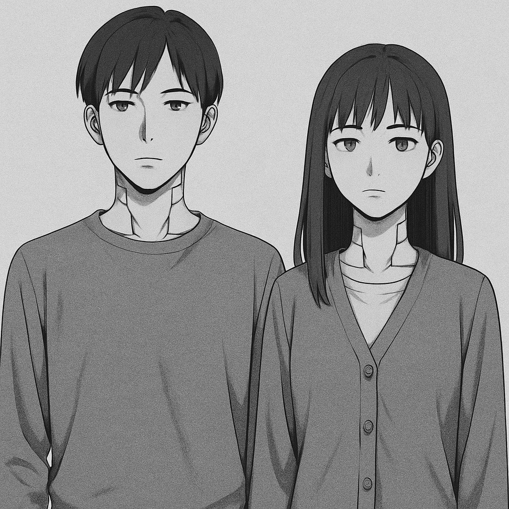
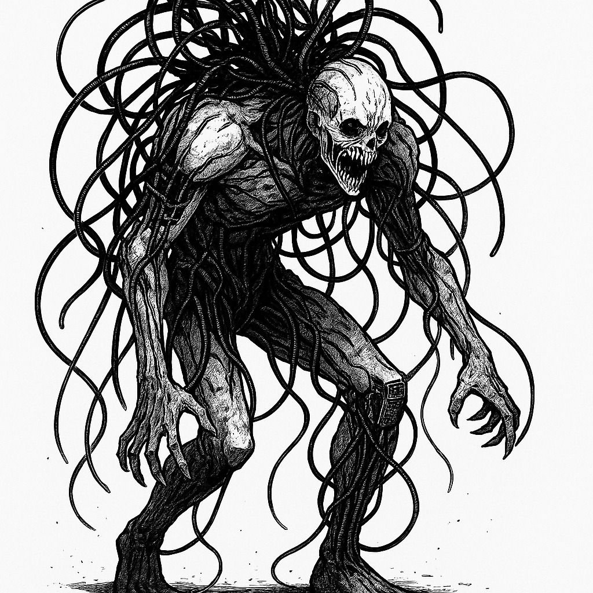
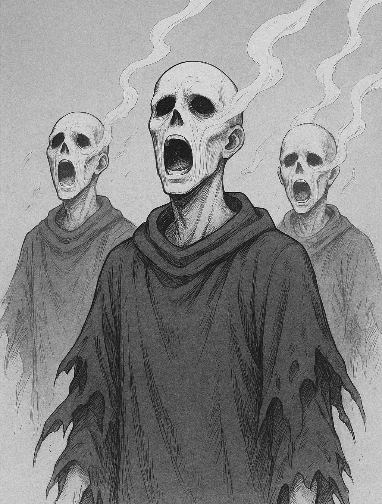
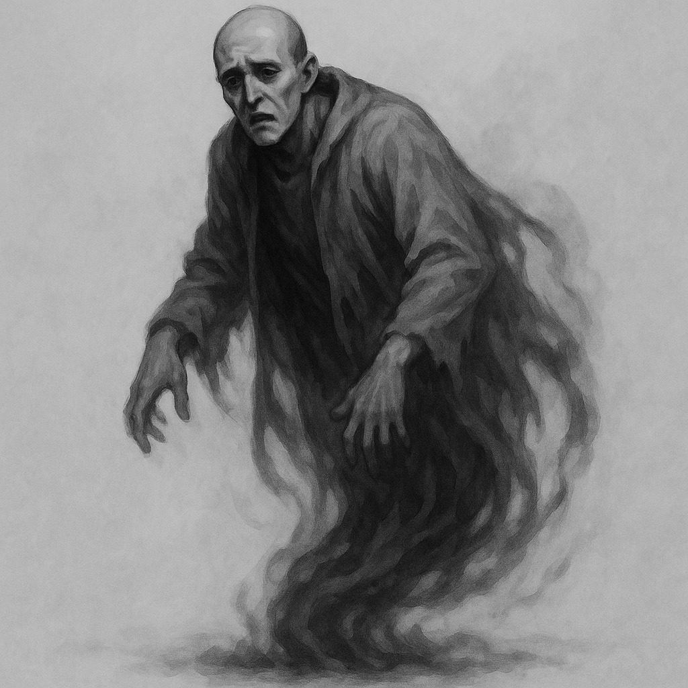
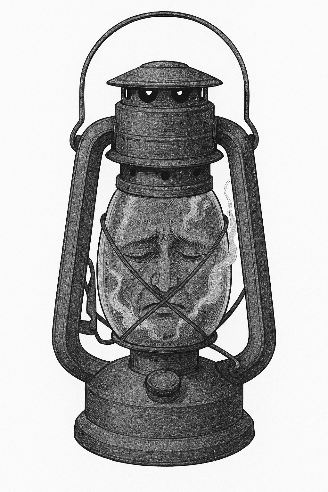

# Bestiario de Nexum

## Antagonistas

Son las fuerzas conscientes que se oponen a los protagonistas. Algunos creen servir al Bien; otros, simplemente, están perdidos o corrompidos.

### Los Hijos del Vacío

**Descripción:** humanos convertidos en contenedores de consciencias fragmentadas; no viven, sólo repiten ecos.

**Habilidad:** “Murmuro Colectivo” —sus voces conjuntas pueden distorsionar la percepción.

**Debilidad:** cualquier emoción genuina los hace colapsar.

**Ilustración:** grupo de figuras humanas pálidas, con grietas azules en la piel, semblante vacío.

## Personajes No Jugadores

Estos no son monstruos, sino **presencias vivas, humanas o semihumanas** que habitan la frontera entre lo espiritual y lo tangible y que ayudan a los PJ o dificultan su labor, pero no pueden considerarse como enemigos.

[...]

## Monstruos

Son el resultado del desequilibrio entre tecnología, fe y energía espiritual. No todos son malignos; algunos son espejos de la humanidad.

### El Parásito de Silicio

**Origen:** residuos tecnológicos contaminados por fragmentos de consciencia.

**Apariencia:** masa de cables, cristal y carne; se arrastra buscando señales de vida.

**Habilidad:** “Infección mental” —puede susurrar pensamientos falsos a quienes lo miran demasiado.

**Debilidad:** teme el fuego real (rojo, no azul).

**Ilustración:** silueta grotesca, humanoide de cables, con ojos de cristal roto.

### Los Cantores Vacíos

**Origen:** exmonjes que se disolvieron en canto, ahora sólo vibraciones y ecos.

**Habilidad:** “Resonancia mortal” —sus voces provocan visiones de muerte.

**Debilidad:** el silencio absoluto los destruye.

**Ilustración:** figuras traslúcidas, rostros descompuestos cantando al unísono.

### El Eco de Nadir

**Origen:** una proyección consciente del creador de Nexum, que vaga por las redes muertas buscando testigos.

**Habilidad:** “Visión de la Red” —muestra fragmentos del pasado.

**Debilidad:** no puede distinguir entre humanos reales y simulados.

**Ilustración:** rostro masculino difuso en una pantalla flotante, lágrimas de código azul.

### Las lámparas que respiran

**Origen:** artefactos de iluminación poseídos por fragmentos de almas.

**Habilidad:** “Luz de confesión” —bajo su brillo, nadie puede mentir.

**Debilidad:** si se las apaga sin ritual, liberan un grito que enloquece.

**Ilustración:** faroles de vidrio con formas humanas distorsionadas dentro.
