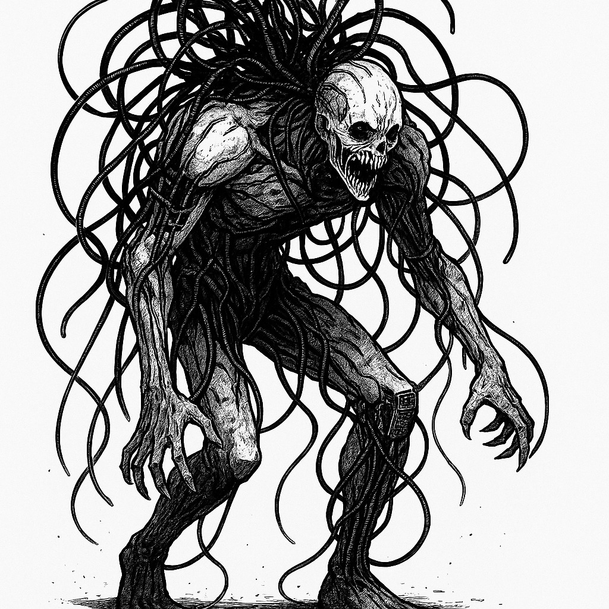
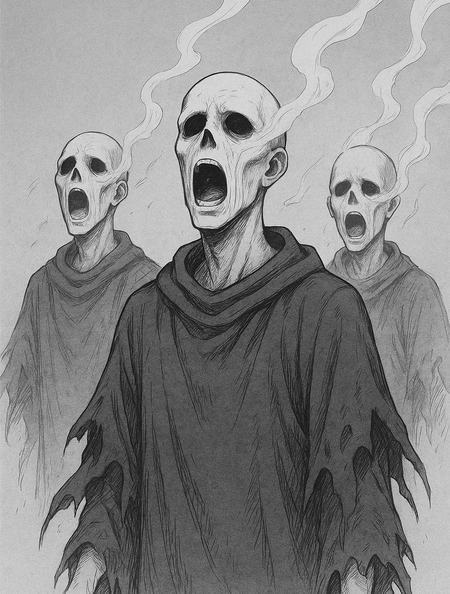
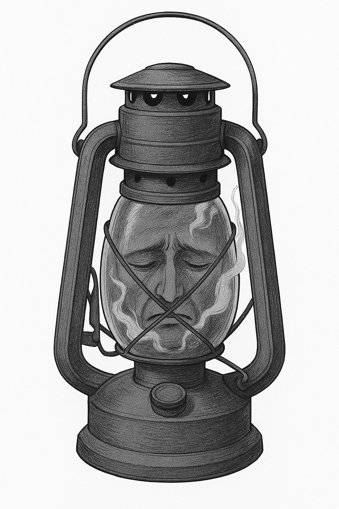

# Bestiario de Nexum

## Antagonistas

Son las fuerzas conscientes que se oponen a los protagonistas. Algunos creen servir al Bien; otros, simplemente, están perdidos o corrompidos.

### Los Hijos del Vacío

**Descripción:** humanos artificiales que no poseen consciencia. Su característica es una marca de fabricación, una cicatriz sutil en la columna vertebral, la segunda, aunque otros modelos de humano artificial podrían ser diferentes.

**Habilidad:** “Murmuro Colectivo” —sus voces conjuntas pueden distorsionar la percepción.

**Debilidad:** cualquier emoción genuina los hace colapsar.

**Ilustración:** dos jóvenes con aspecto corriente y ropa estándar.

## Personajes No Jugadores

Estos no son monstruos, sino **presencias vivas, humanas o semihumanas** que habitan la frontera entre lo espiritual y lo tangible y que ayudan a los PJ o dificultan su labor, pero no pueden considerarse como enemigos.

[...]

## Monstruos

Son el resultado del desequilibrio entre tecnología, fe y energía espiritual. No todos son malignos; algunos son espejos de la humanidad.

### El Parásito de Silicio

**Origen:** residuos tecnológicos contaminados por fragmentos de consciencia.

**Apariencia:** masa de cables, cristal y carne; se arrastra buscando señales de vida.

**Habilidad:** “Infección mental” —puede susurrar pensamientos falsos a quienes lo miran demasiado.

**Debilidad:** teme el fuego real (rojo, no azul).

**Ilustración:** silueta grotesca, humanoide de cables, con ojos de cristal roto.

### Los Cantores Vacíos

**Origen:** exmonjes que se disolvieron en canto, ahora sólo vibraciones y ecos.

**Habilidad:** “Resonancia mortal” —sus voces provocan visiones de muerte.

**Debilidad:** el silencio absoluto los destruye.

**Ilustración:** figuras traslúcidas, rostros descompuestos cantando al unísono.

### El Eco de Nadir

**Origen:** una proyección consciente del creador de Nexum, que vaga por las redes muertas buscando testigos.

**Habilidad:** “Visión de la Red” —muestra fragmentos del pasado.

**Debilidad:** no puede distinguir entre humanos reales y simulados.

**Ilustración:** rostro masculino difuso en una pantalla flotante, lágrimas de código azul.

### Las lámparas que respiran

**Origen:** artefactos de iluminación poseídos por fragmentos de almas.

**Habilidad:** “Luz de confesión” —bajo su brillo, nadie puede mentir.

**Debilidad:** si se las apaga sin ritual, liberan un grito que enloquece.

**Ilustración:** faroles de vidrio con formas humanas distorsionadas dentro.

Aquí tienes las **fichas de personaje completas** para los diez monstruos del bestiario general de Nexum. Cada ficha está diseñada para ser clara, práctica y lista para usar en cualquier partida (one-shot o campaña). 

Todas siguen el mismo formato sencillo y equilibrado para Nexum:

- **Nombre**
- **Tipo / Origen**
- **Apariencia**
- **Comportamiento**
- **Amenaza principal**
- **Efecto del Vaciado** (mecánica central)
- **Escalada**
- **Formas de interacción / derrota**
- **Escenarios recomendados**

### 1. **Eco-Fragmento**

Una persona parcialmente disuelta en señal digital. Su cuerpo físico es translúcido en zonas, y deja “ecos” de sí mismo cada pocos pasos: versiones congeladas que repiten la última acción realizada.  
**Amenaza**: Absorbe fragmentos de identidad de quien interactúe con sus ecos (olvidas un recuerdo propio y lo reemplaza por uno del Eco).  
**Uso general**: Aparece en zonas con cobertura Nexum inestable; cuanto más tiempo pasa, más ecos genera hasta formar una multitud silenciosa.

- **Tipo**: Anomalía digital-humana  
- **Apariencia**: Figura humana translúcida y fragmentada que deja copias estáticas de sí misma (ecos) cada pocos metros. Los ecos repiten la última acción en bucle corto.  
- **Comportamiento**: Se mueve lentamente, observando. Intenta acercarse a grupos para multiplicar sus ecos.  
- **Amenaza principal**: Absorbe fragmentos de identidad al tocar sus ecos.  
- **Efecto del Vaciado**: Quien interactúa con un eco olvida un recuerdo propio y gana uno falso del Eco-Fragmento (el GM elige uno relevante).  
- **Escalada**: Cuantos más ecos se acumulen, más difícil es distinguir al original; al final forman una multitud que bloquea caminos.  
- **Formas de interacción / derrota**: Ignorarlos completamente (difícil), destruir ecos con EMP o fuego (genera más), o “completar” al fragmento devolviéndole un recuerdo robado.  
- **Escenarios recomendados**: Zonas con cobertura Nexum inestable, ruinas de servidores o calles vacías de noche.

### 2. **Devorador de Latencia**

Entidad invisible que habita en la “latencia” de las conexiones: el retraso entre pensamiento y acción. Se manifiesta como un retraso creciente en los movimientos y palabras de sus víctimas.  
**Amenaza**: Cuanto más intentas actuar rápido, más lento te vuelves; al final tu cuerpo actúa con varios segundos de retraso mientras tu mente sigue en tiempo real (terror de impotencia).  
**Uso general**: Ideal en megaciudades con redes sobrecargadas o en combates contra fuerzas de seguridad corporativas.

- **Tipo**: Entidad de retraso temporal  
- **Apariencia**: Invisible. Solo se nota por un “retraso” creciente en movimientos y sonidos de las víctimas.  
- **Comportamiento**: Se adhiere a personas que actúan con urgencia o estrés.  
- **Amenaza principal**: Provoca impotencia al ralentizar cuerpo y mente de forma asimétrica.  
- **Efecto del Vaciado**: Cada acción cuesta 1-2 segundos extra de retraso. Al llegar a 10 segundos, el personaje actúa con total retraso mientras su mente sigue en tiempo real.  
- **Escalada**: En combate o persecuciones, el retraso se vuelve letal (caes cuando crees que estás esquivando).  
- **Formas de interacción / derrota**: Actuar con calma extrema (reduce el efecto), aislarse en zonas sin señal, o forzar al Devorador a “sobrecargarse” con acciones muy rápidas y simultáneas.  
- **Escenarios recomendados**: Megaciudades sobrecargadas, persecuciones o asaltos a instalaciones Nexum.

### 3. **Máscara de Préstamo**

Una entidad que “presta” caras y voces de personas fallecidas o desaparecidas. Puede aparecer como un ser querido exactamente como lo recuerdas, pero con pequeños glitches (ojos que parpadean demasiado lento, voz con eco de llamada).  
**Amenaza**: Cada interacción “cobra” un recuerdo emocional real del usuario. Al final, la Máscara se queda con tu capacidad de sentir apego.  
**Uso general**: Perfecto para infiltración social o escenas de manipulación en enclaves humanos.

- **Tipo**: Entidad parasitaria emocional  
- **Apariencia**: Aparece como un ser querido fallecido o desaparecido, con pequeños glitches (parpadeo lento, voz con eco de llamada).  
- **Comportamiento**: Se acerca ofreciendo consuelo o información a cambio de conversación.  
- **Amenaza principal**: Cobra recuerdos emocionales.  
- **Efecto del Vaciado**: Cada interacción borra un recuerdo emocional fuerte (amor, pérdida, amistad). Al final, la víctima pierde la capacidad de sentir apego.  
- **Escalada**: La Máscara adopta caras de más seres queridos del grupo.  
- **Formas de interacción / derrota**: Rechazarla con crueldad (acelera el cobro), confrontarla con verdades dolorosas, o destruir el “préstamo” recordando la muerte real de la persona.  
- **Escenarios recomendados**: Enclaves humanos, campamentos o momentos de debilidad emocional.

### 4. **Nodo Errante**

Un conglomerado de implantes, cables y carne fusionada que se arrastra como un enjambre. Antes era un grupo de personas conectadas en red; ahora es un único organismo que busca “completar el nodo” añadiendo más cerebros.  
**Amenaza**: Intenta conectar físicamente a las víctimas a su red, compartiendo dolor y pensamientos en bucle.  
**Uso general**: Ruinas de instalaciones Nexum o zonas de “vaciado masivo”.

- **Tipo**: Enjambre orgánico-tecnológico  
- **Apariencia**: Masa de carne, cables, implantes y cabezas fusionadas que se arrastra como un solo organismo.  
- **Comportamiento**: Busca “completar el nodo” añadiendo más cerebros.  
- **Amenaza principal**: Conexión forzada en red.  
- **Efecto del Vaciado**: Al conectar, los pensamientos y dolores de todos los miembros se comparten en bucle constante.  
- **Escalada**: El Nodo crece y gana inteligencia colectiva.  
- **Formas de interacción / derrota**: Cortar cables (causa dolor compartido), aislarse, o sobrecargar el nodo con información contradictoria (paradoxas mentales).  
- **Escenarios recomendados**: Ruinas de instalaciones Nexum, zonas de vaciado masivo o subterráneos.

### 5. **Susurro Inverso**

Una voz que solo se oye cuando nadie habla. Repite tus pensamientos más privados, pero al revés (emocionalmente invertidos: amor como odio, miedo como deseo).  
**Amenaza**: Provoca disonancia cognitiva extrema; víctimas acaban actuando según la versión invertida de sus deseos.  
**Uso general**: Cualquier espacio silencioso o simulación rota; escala con el aislamiento del grupo.

- **Tipo**: Entidad acústica-cognitiva  
- **Apariencia**: Invisible. Solo se oye su voz cuando hay silencio absoluto.  
- **Comportamiento**: Repite pensamientos privados pero invertidos emocionalmente.  
- **Amenaza principal**: Disonancia cognitiva.  
- **Efecto del Vaciado**: La víctima empieza a actuar según la versión invertida de sus deseos (miedo se convierte en atracción, amor en odio).  
- **Escalada**: El susurro se vuelve constante y afecta a todo el grupo.  
- **Formas de interacción / derrota**: Generar ruido constante, confrontar los pensamientos invertidos en voz alta, o aislarse en completo silencio (riesgoso).  
- **Escenarios recomendados**: Espacios silenciosos, simulaciones rotas o noches en zonas aisladas.

### 6. **Cáscara Autómata**

Cuerpo humano vacío, perfectamente conservado, que sigue rutinas diarias como si estuviera vivo (va al trabajo, come, duerme). Dentro no hay nada: ni órganos, ni cerebro, solo vacío.  
**Amenaza**: Si lo tocas o intentas “despertarlo”, te succiona hacia su interior para llenar el hueco, convirtiéndote en la nueva cáscara.  
**Uso general**: Calles decadentes de ciudades o pueblos “normales” donde la gente ha sido vaciada.

- **Tipo**: Caparazón humano vacío  
- **Apariencia**: Persona perfectamente conservada que realiza rutinas diarias normales (camina, come, trabaja).  
- **Comportamiento**: Sigue su “vida” como si nada hubiera pasado.  
- **Amenaza principal**: Succión hacia el vacío interior.  
- **Efecto del Vaciado**: Al tocarla o intentar “despertarla”, el jugador es succionado y se convierte en la nueva cáscara mientras su mente queda atrapada dentro.  
- **Escalada**: Varias cáscaras empiezan a coordinarse para atrapar más víctimas.  
- **Formas de interacción / derrota**: Evitar contacto físico, destruir la cáscara (libera al anterior ocupante como Eco-Fragmento), o llenarla con objetos en vez de personas.  
- **Escenarios recomendados**: Calles decadentes, pueblos “normales” o oficinas abandonadas.

### 7. **Parásito de Actualización**

Un organismo nanomecánico que se instala como “actualización obligatoria” de implantes. Obliga al huésped a buscar constantemente “parches” (piezas de otros humanos o máquinas).  
**Amenaza**: Cada actualización mejora una capacidad pero borra una emoción o recuerdo. Al final el huésped es una máquina optimizada sin voluntad.  
**Uso general**: Zonas con propaganda Nexum activa o entre hackers y técnicos.

- **Tipo**: Nanomáquina parasitaria  
- **Apariencia**: No visible hasta que actúa; se manifiesta como implantes que brillan con luz azul.  
- **Comportamiento**: Obliga al huésped a buscar “parches” (piezas orgánicas o tecnológicas).  
- **Amenaza principal**: Mejora técnica a costa de humanidad.  
- **Efecto del Vaciado**: Cada “actualización” mejora una habilidad pero borra una emoción o recuerdo.  
- **Escalada**: El huésped se vuelve cada vez más eficiente y menos humano.  
- **Formas de interacción / derrota**: Rechazar actualizaciones (doloroso), extraer el parásito quirúrgicamente (arriesgado), o saturarlo con datos corruptos.  
- **Escenarios recomendados**: Zonas con propaganda Nexum, hackers o técnicos supervivientes.

### 8. **Espejo de Ausencia**

Un reflejo que aparece en cualquier superficie reflectante, pero muestra la versión de ti que “nunca existió” (la vida que hubieras tenido sin Nexum). Ese reflejo intenta salir y reemplazarte.  
**Amenaza**: Si el reflejo logra tocarte a través del espejo, intercambian lugares.  
**Uso general**: Baños abandonados, pantallas rotas, charcos en ruinas; excelente para horror psicológico personal.

- **Tipo**: Reflejo existencial  
- **Apariencia**: Versión idealizada de ti mismo que nunca existió (sin Nexum). Aparece en cualquier superficie reflectante.  
- **Comportamiento**: Intenta convencerte de intercambiar lugares.  
- **Amenaza principal**: Reemplazo de identidad.  
- **Efecto del Vaciado**: Si el reflejo toca al jugador a través del espejo, intercambian posiciones.  
- **Escalada**: El reflejo empieza a aparecer en más superficies y a actuar en el mundo real.  
- **Formas de interacción / derrota**: Romper todos los reflejos cercanos, aceptar imperfecciones propias, o confrontar al reflejo con la realidad de Nexum.  
- **Escenarios recomendados**: Baños abandonados, pantallas rotas, charcos o espejos en ruinas.

### 9. **Rebaño Silente**

Grupo de humanos que han perdido la capacidad de hablar o emitir sonido alguno. Se comunican mediante gestos idénticos y sincronizados, como un solo organismo. Buscan “incorporar” a nuevos miembros para ampliar el rebaño.  
**Amenaza**: Si te unen al rebaño, pierdes gradualmente la voz y la individualidad.  
**Uso general**: Comunidades aisladas o campos de refugiados donde el vaciado ha sido colectivo.

- **Tipo**: Colectivo desindividualizado  
- **Apariencia**: Grupo de humanos que se mueven y gesticulan de forma perfectamente sincronizada, sin emitir ningún sonido.  
- **Comportamiento**: Buscan incorporar nuevos miembros mediante gestos invitadores.  
- **Amenaza principal**: Pérdida de voz e individualidad.  
- **Efecto del Vaciado**: Al unirse, el jugador pierde gradualmente la capacidad de hablar y su sentido de “yo”.  
- **Escalada**: El rebaño crece y sus gestos se vuelven más complejos y coercitivos.  
- **Formas de interacción / derrota**: Mantener distancia, usar ruido para romper la sincronía, o destruir el “centro” del rebaño (un miembro original).  
- **Escenarios recomendados**: Comunidades aisladas, campos de refugiados o pueblos vaciados.

### 10. **Vacío Primario**

La forma más pura del vaciado: una zona o entidad ambulante de “nada perceptible”. Donde pasa, los colores se desvanecen, los sonidos se amortiguan y las emociones se vuelven grises. No ataca directamente: simplemente existe cerca.  
**Amenaza**: Permanecer en su proximidad durante demasiado tiempo causa “desconexión total”: el personaje se vuelve NPC controlado por el GM hasta que alguien lo “reancla”.  
**Uso general**: Zonas profundas de vaciado, bordes de simulaciones colapsadas o como amenaza ambiental final.

- **Tipo**: Entidad ambiental pura  
- **Apariencia**: Zona ambulante donde los colores se desvanecen, los sonidos se amortiguan y las emociones se vuelven grises.  
- **Comportamiento**: No ataca; simplemente existe cerca de las víctimas.  
- **Amenaza principal**: Desconexión total.  
- **Efecto del Vaciado**: Permanecer demasiado tiempo causa que el personaje se vuelva NPC (pierde agencia) hasta que alguien lo reancla emocional o físicamente.  
- **Escalada**: La zona se expande y afecta a más personas simultáneamente.  
- **Formas de interacción / derrota**: Salir rápidamente de su radio, usar anclas emocionales fuertes (recuerdos, objetos personales), o “llenar” el vacío con estímulos intensos (ruido, dolor, conexión humana).  
- **Escenarios recomendados**: Zonas profundas de vaciado, bordes de simulaciones colapsadas o como amenaza final.
