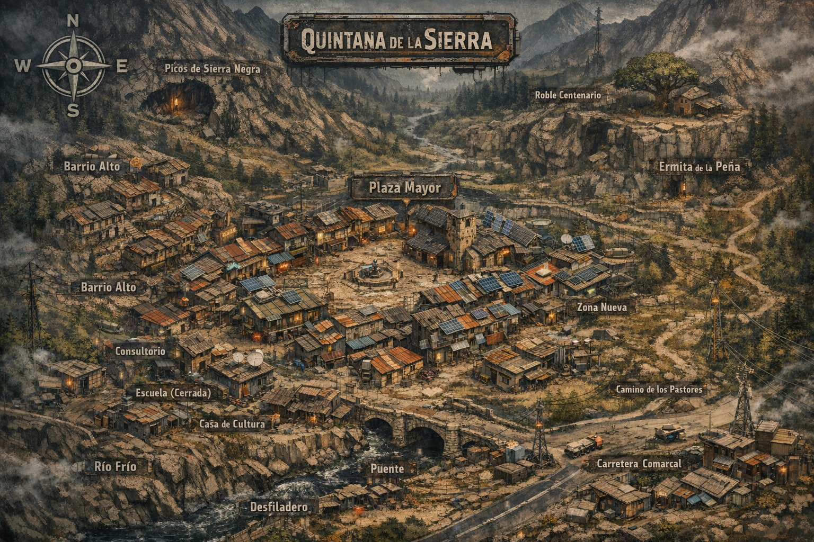

# Mapas

## Quintana de la sierra

Un pueblo burgalés de unos quinientos habitantes, rodeado de montañas. Tiene una biblioteca diminuta, un consultorio médico, una plaza bastante grande y una conexión a internet horrible.

### Zona centro

#### Plaza Mayor

- **Nodo de vigilancia pasiva**: varias cámaras antiguas (algunas ocultas) conectadas a un sistema municipal obsoleto… parcialmente reutilizado por alguien.

- **Interferencia extraña**: dispositivos electrónicos fallan más aquí que en otras zonas → posible punto de resonancia del “vaciado”.

- **Uso en partida**: lugar ideal para detectar que “algo no encaja” sin peligro inmediato.

#### Ayuntamiento

- **Archivo físico intacto**: documentos desde los años 70 sin digitalizar → registros de desapariciones “administrativamente inexistentes”.

- **Sótano sellado**: antigua sala de telecomunicaciones conectada a la antena de la montaña.

- **Uso**: investigación pura + descubrimiento de encubrimientos.

#### Iglesia de San Roque

- **Fenómeno recurrente**: la campana suena sin patrón claro, correlacionado con eventos del “vaciado”.

- **Confesiones alteradas**: gente cuenta experiencias que no recuerda después.

- **Uso**: terror suave (no Lovecraftiano), tensión espiritual y dudas morales.

#### Bar La Montañesa

- **Red informal de información**: Rosa filtra lo que cuenta según le convenga.

- **WiFi funcional → punto crítico**: único acceso estable a datos externos… pero monitorizado.

- **Uso**: conseguir pistas + introducir vigilancia invisible.

#### Calle Real

- **Zona de tránsito “normalizado”**: aquí la gente actúa más “correcta” de lo habitual.

- **Testigos silenciosos**: muchas ventanas, pocas intervenciones.

- **Uso**: escenas de paranoia social (¿quién observa?).

### Barrios

#### Barrio Alto

- **Memoria fragmentada**: ancianos recuerdan cosas que no encajan con la historia oficial.

- **Casas conectadas**: antiguas bodegas subterráneas interconectadas parcialmente.

- **Uso**: investigación + acceso a rutas ocultas.

#### Barrio Bajo

- **Agua contaminada sutilmente**: no mata, pero afecta a la percepción.

- **Actividad nocturna**: luces en huertos cuando no debería haber nadie.

- **Uso**: pistas físicas + primeras anomalías tangibles.

#### Zona Nueva

- **Infraestructura moderna degradada**: placas solares parcheadas, baterías defectuosas.

- **Habitantes “desconectados”**: algunos teletrabajadores muestran signos tempranos de vaciado.

- **Uso**: introducir el conflicto Nexum directamente.

## Comercios y servicios

#### El Colmado

- **Centro logístico real**: aquí llegan paquetes que no figuran en ningún sistema.

- **Manolo sabe más de lo que dice**.

- **Uso**: pista sobre suministro externo o intervención de Nexum.

#### Consultorio

- **Registros médicos inconsistentes**: pacientes con síntomas neurológicos sin causa.

- **Lucía observa patrones** pero no los entiende.

- **Uso**: diagnóstico del fenómeno sin explicarlo del todo.

#### Escuela (Cerrada)

- **Uso nocturno**: reuniones no oficiales.

- **Equipamiento antiguo**: ordenadores desconectados… excepto uno.

- **Uso**: base de facción, culto o nodo tecnológico.

#### Casa de Cultura

- **Eventos “fallidos”**: proyecciones o luces que no corresponden al material reproducido.

- **Espacio de reunión neutral**.

- **Uso**: escenas colectivas donde algo se manifiesta.

## Entorno natural

#### Río Frío

- **Comportamiento anómalo**: el sonido del agua cambia según la hora.

- **Objetos arrastrados**: aparecen cosas que no deberían estar ahí.

- **Uso**: pistas físicas y ambientales.

#### Desfiladero

- **Punto de bloqueo perfecto**: cualquier salida puede controlarse aquí.

- **Eco extraño**: sonidos que no corresponden a lo emitido.

- **Uso**: emboscadas o escenas de aislamiento.

#### Picos de Sierra Negra

- **Zona sin cobertura total**: ni tecnología ni señal Nexum estable.

- **Refugio… o punto ciego peligroso**.

- **Uso**: escapatoria o zona de verdad sin filtrar.

#### Camino de los Pastores

- **Ruta segura “de siempre”**… salvo últimamente.

- **Desapariciones no registradas**.

- **Uso**: transición a eventos más graves.

## Lugares de interés

#### Mina Abandonada

- **Actividad reciente**: alguien ha vuelto a entrar.

- **Posible nodo profundo**: conexión con infraestructura antigua (pre-Nexum).

- **Uso**: dungeon principal.

#### Roble Centenario

- **Punto de estabilidad**: aquí el fenómeno es más débil.

- **La gente se calma sin saber por qué**.

- **Uso**: refugio narrativo o lugar de revelación.

#### Ermita de la Peña

- **Apariciones interpretables**: pueden ser divinas… o glitches de consciencia.

- **Espacio liminal**: entre lo espiritual y lo artificial.

- **Uso**: decisiones morales fuertes.

## Infraestructura

#### Puente

- **Cuello de botella absoluto**

- **Lugar ideal para “eventos inevitables”**

- **Uso**: confrontaciones clave.

#### Carretera Comarcal

- **Salida ilusoria**: aunque salgas, el problema puede seguirte.

- **Accesos monitorizados esporádicamente**.

- **Uso**: falsa esperanza o inicio de escalada.

## Clave de diseño

Este pueblo funciona muy bien si lo interpretas así:

- **Centro (Plaza)** → anomalía suave

- **Barrios** → síntomas

- **Periferia** → verdad

- **Montaña/Mina** → origen

## Bilbao
