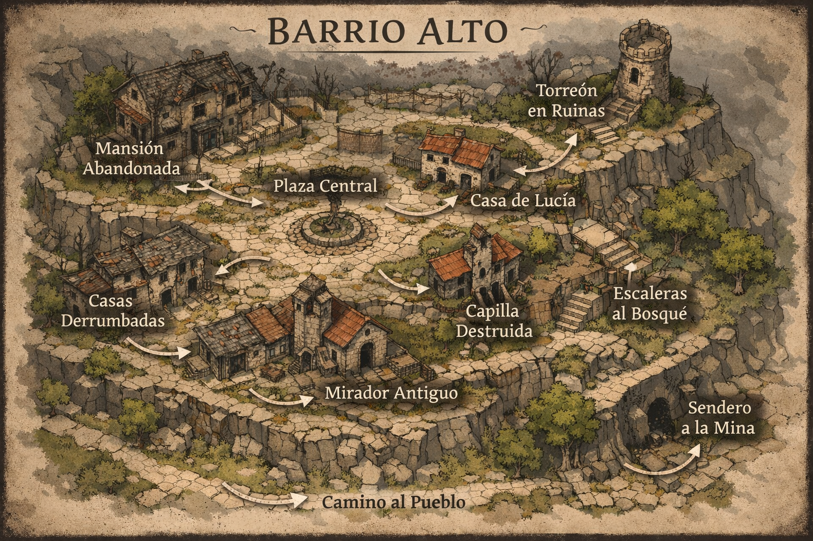

# BARRIO ALTO — **Zona de Memoria Fragmentada**

## Descripción para narrar

El Barrio Alto se eleva sobre el resto del pueblo, encajado en la ladera.

- Calles estrechas, empedradas y en pendiente

- Casas de piedra antiguas, muchas en mal estado

- Silencio más denso que en el resto del pueblo

El viento sopla… pero de forma irregular.

> A veces mueve cosas que no debería… y otras no mueve nada.

La sensación general no es de abandono total, sino de **tiempo detenido a medias**.

## Estructura general del barrio

El mapa muestra un espacio **no lineal pero conectado**:

- Una **plaza central elevada**

- Caminos circulares

- Varias rutas alternativas entre edificios

- Desniveles constantes (escaleras, muros, bordes)

→ Ideal para:

- exploración libre

- persecuciones cortas

- escenas fragmentadas

## Zonas clave (interpretadas para juego)

### 1. Plaza Central

- Antiguo punto de reunión

- Fuente o elemento central deteriorado

- Rodeado de casas

**Elemento Nexum:**

- aquí los recuerdos son más intensos

- un jugador puede “recordar” una escena que nunca vivió

**Uso:**

- escena social

- aparición de recuerdos falsos

### 2. Mansión Abandonada

- Edificio grande, parcialmente derrumbado

- Interior accesible

**Elemento Nexum:**

- habitaciones que “no encajan” con el exterior

- distribución ligeramente distinta cada vez

**Uso:**

- mini-dungeon

- pistas sobre el pasado del pueblo

### 3. Casas Derrumbadas

- Ruinas abiertas

- restos de vida cotidiana

**Elemento Nexum:**

- objetos que cambian de posición entre visitas

- marcas de uso reciente sin habitantes

**Uso:**

- exploración ligera

- pistas ambientales

### 4. Casa de Lucía

- Vivienda habitada

- aparentemente normal

**Elemento Nexum:**

- detalles inconsistentes:
  
  - fotos diferentes
  
  - objetos duplicados

- Lucía puede no recordar conversaciones recientes

**Uso:**

- escena narrativa fuerte

- contacto humano clave

### 5. Torreón en Ruinas

- Punto elevado

- vista de todo el pueblo

**Elemento Nexum:**

- desde aquí:
  
  - el pueblo parece “estable”… pero no del todo coherente

- pequeñas repeticiones visibles a distancia

**Uso:**

- momento de comprensión parcial

- observación estratégica

### 6. Capilla Destruida

- Antigua estructura religiosa

- parcialmente colapsada

**Elemento Nexum:**

- símbolos alterados

- inscripciones que cambian ligeramente

**Uso:**

- interpretación espiritual del fenómeno

- contraste con la mina

### 7. Mirador Antiguo

- Punto al borde del acantilado

- vistas abiertas

**Elemento Nexum:**

- sensación de déjà vu muy fuerte

- un jugador puede sentir que “ya tomó una decisión aquí”

**Uso:**

- decisiones narrativas

- escenas introspectivas

### 8. Escaleras al Bosque

- Camino descendente

- parcialmente cubierto por vegetación

**Elemento Nexum:**

- si se baja:
  
  - la sensación de anomalía disminuye

- zona más “real”

**Uso:**

- contraste

- posible escape

### 9. Sendero a la Mina

- Camino estrecho

- poco transitado

**Elemento Nexum:**

- huellas inconsistentes

- trayecto más largo o corto según el momento

**Uso:**

- transición hacia el dungeon principal

## Elementos globales del Barrio Alto

### 1. Memoria alterada (clave)

- la gente recuerda versiones distintas de eventos

- pero nadie lo cuestiona abiertamente

### 2. Espacio ligeramente inestable

- distancias inconsistentes

- caminos que “parecen” más largos o cortos

### 3. Actividad invisible

- cosas que han pasado… pero no dejan rastro claro

- sensación constante de “llegar tarde a algo”

## Evento recomendado

### “La conversación repetida”

Un PNJ:

- habla con los jugadores

- se va

- vuelve…

- y repite la conversación con cambios mínimos

## Función en la aventura

El Barrio Alto sirve para:

- introducir el fenómeno sin tecnología

- reforzar el tono de Nexum desde lo humano

- preparar emocionalmente la bajada a la mina

## Clave de dirección

Aquí los jugadores deben sentir:

> “Esto no está roto… pero tampoco está bien.”

No hay peligro directo.

Hay incomodidad persistente.
