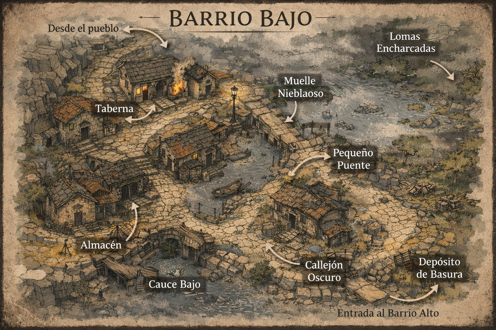

# BARRIO BAJO — **Zona de Realidad Inestable**

## Descripción para narrar

El terreno desciende hacia el río, y todo cambia.

- El suelo está húmedo, irregular

- Hay barro, agua estancada, zonas resbaladizas

- Las casas son más bajas, más prácticas, menos cuidadas

El aire es distinto:

- más frío

- más pesado

- con olor a humedad constante

> Aquí no parece que el tiempo esté roto…  
> parece que la realidad no termina de encajar.

## Estructura general

El barrio es más caótico que el Alto:

- Calles que no siguen patrón claro

- Caminos que bordean el agua

- Pequeños puentes y pasos improvisados

- Espacios abiertos interrumpidos por construcciones

→ Ideal para:

- movimiento táctico irregular

- emboscadas

- escenas físicas (no solo narrativas)

## Zonas clave

### 1. Taberna

- Punto social del barrio bajo

- Ambiente más áspero que el bar de la plaza

**Elemento Nexum:**

- conversaciones que “se desincronizan”

- alguien responde a algo que aún no se ha dicho

**Uso:**

- obtener información cruda

- escenas de tensión social

### 2. Almacén

- Espacio de trabajo y almacenamiento

- herramientas, sacos, materiales

**Elemento Nexum:**

- objetos que pesan más o menos de lo esperado

- cajas que no suenan igual al moverlas

**Uso:**

- interacción física

- pistas sobre distorsión de la realidad

### 3. Muelle Nieblaoso

- Zona junto al agua

- siempre con ligera niebla

**Elemento Nexum:**

- visibilidad inconsistente

- figuras que parecen estar… pero no están

**Uso:**

- escenas inquietantes

- apariciones ambiguas

### 4. Pequeño Puente

- Paso estrecho sobre agua

**Elemento Nexum:**

- sensación de que el puente es más largo al cruzarlo

- pasos que no coinciden con la distancia real

**Uso:**

- tensión

- control de movimiento

### 5. Callejón Oscuro

- Estrecho, entre casas

- mal iluminado

**Elemento Nexum:**

- sombras que no corresponden a los cuerpos

- movimientos en visión periférica

**Uso:**

- escenas de suspense

- encuentros inesperados

### 6. Depósito de Basura

- Zona descuidada

- restos acumulados

**Elemento Nexum:**

- objetos que aparecen sin origen claro

- cosas que no pertenecen al pueblo

**Uso:**

- pistas extrañas

- conexión con algo externo

### 7. Cauce Bajo

- Parte más cercana al río

- agua lenta, oscura

**Elemento Nexum:**

- reflejos incorrectos:
  
  - muestran cosas que no están
  
  - o no reflejan lo que sí está

**Uso:**

- escenas visuales potentes

- revelaciones simbólicas

### 8. Lomas Encharcadas

- Terreno blando, irregular

**Elemento Nexum:**

- huellas que desaparecen o cambian

- trayectorias imposibles

**Uso:**

- seguimiento

- pérdida de rastro

### 9. Entrada al Barrio Alto

- Punto de transición

**Elemento Nexum:**

- cambio claro de “tipo de anomalía”:
  
  - abajo → físico
  
  - arriba → mental

**Uso:**

- marcar contraste narrativo

## Elementos globales del Barrio Bajo

### 1. Física inconsistente

- peso, distancia, sonido… no siempre funcionan igual

### 2. Percepción engañosa

- lo que ves no siempre coincide con lo real

- pero no es ilusión total: es sutil

### 3. Presencia latente

- sensación de que algo está “usando” el entorno

- no visible directamente

## Evento recomendado

### “El reflejo equivocado”

En el agua:

- un jugador se mira

- su reflejo hace algo distinto

(no agresivo, pero claro)

## Función en la aventura

El Barrio Bajo:

- acerca el fenómeno a lo físico

- prepara la transición hacia la mina

- introduce incomodidad corporal, no solo mental

## Clave de dirección

Aquí los jugadores deben sentir:

> “No puedo confiar en lo que percibo.”
