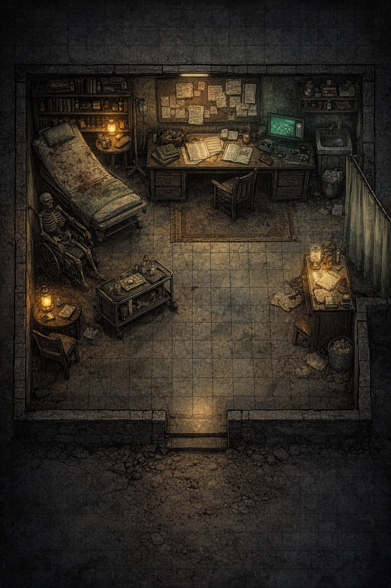

# Consultorio

# Sala de Atención y Observación

## Descripción para narrar

El consultorio es una única sala amplia, adaptada de forma improvisada.

- Las paredes son de piedra, con humedad visible

- El suelo es antiguo, con baldosas desgastadas

- La iluminación mezcla:
  
  - una lámpara cálida (doméstica)
  
  - una pantalla fría (ordenador viejo)

El aire está cargado:

- huele a desinfectante… pero también a cerrado

- hay una sensación de **abandono funcional**, no total

> Aquí se sigue trabajando… pero con lo mínimo.

## Distribución de la sala (clave para juego táctico)

### 1. Zona de exploración (camilla)

- Camilla médica antigua

- Sábanas manchadas (no necesariamente sangre reciente)

- Equipo básico alrededor

→ Lugar donde se manifiestan los síntomas

### 2. Escritorio médico

- Papeles acumulados

- Cuadernos escritos a mano

- Ordenador antiguo encendido

→ Centro de información

### 3. Estanterías

- Medicación variada

- Material sanitario básico

- Algunos frascos vacíos o mal etiquetados

→ Recursos y pistas

### 4. Zona lateral (biombo)

- Área improvisada de privacidad

- Mal iluminada

→ Perfecta para escenas tensas o descubrimientos

### 5. Entrada

- Puerta simple

- Ligera corriente de aire del exterior

→ Punto de transición con el pueblo

## Elementos Nexum (clave de la sala)

Aquí el fenómeno se presenta como **problema médico inexplicable**

### 1. Registros inconsistentes

En los cuadernos:

- Pacientes con síntomas neurológicos

- Fechas que no encajan

- Casos repetidos… con variaciones

Ejemplo:

> “Paciente estable. No recuerda episodio.”  
> (misma línea repetida varias veces con ligeros cambios)

### 2. El ordenador

Pantalla encendida con datos simples:

- historiales incompletos

- archivos corruptos

- nombres duplicados

Si investigan:

→ detectan que algunos registros parecen **reescritos varias veces**

### 3. Sensación en la camilla

Si un jugador se sienta o tumba:

- siente una breve desconexión

- como si hubiese estado ahí antes

### 4. Carro médico

Objetos movidos recientemente… pero:

- no hay nadie que los haya movido

- o no coinciden con la memoria de quien esté presente

## Elemento narrativo potente

### “El paciente ausente”

Hay evidencia clara de que:

- alguien fue tratado aquí hace poco

- pero no hay rastro de esa persona

Ni nombre consistente  
Ni salida registrada

## Evento opcional (muy recomendable)

### “Diagnóstico imposible”

Si los jugadores revisan bien:

- encuentran una nota:

> “No están enfermos.  
> Están siendo corregidos.”

## Interacciones jugables

### 1. Revisar notas

- Revela patrón Nexum sin nombrarlo

### 2. Usar el ordenador

- Acceso parcial a datos

- Introduce concepto de iteración

### 3. Inspeccionar medicación

- Tratamientos sintomáticos inútiles

### 4. Permanecer en silencio

Después de unos segundos:

- se oye un sonido

- como alguien respirando

Pero no hay nadie más

## Función dentro de la aventura

Esta sala:

- conecta lo abstracto con lo humano

- muestra consecuencias reales

- prepara emocionalmente para la mina

## Clave de dirección

Aquí los jugadores deben pensar:

> “Esto le está pasando a la gente… y nadie lo entiende.”

No es miedo.  
Es inquietud clínica.

# 
