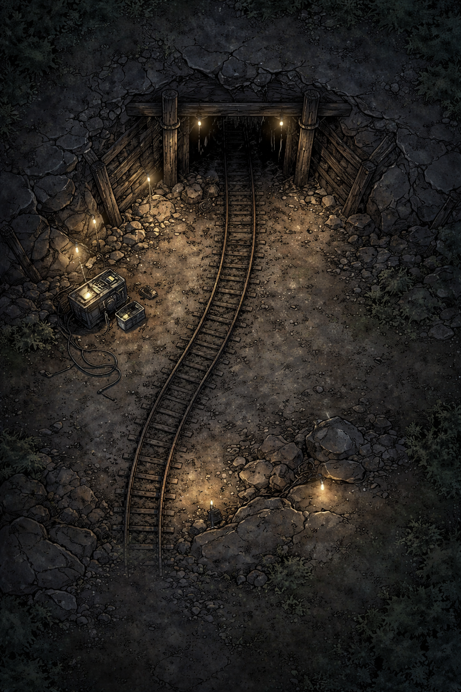
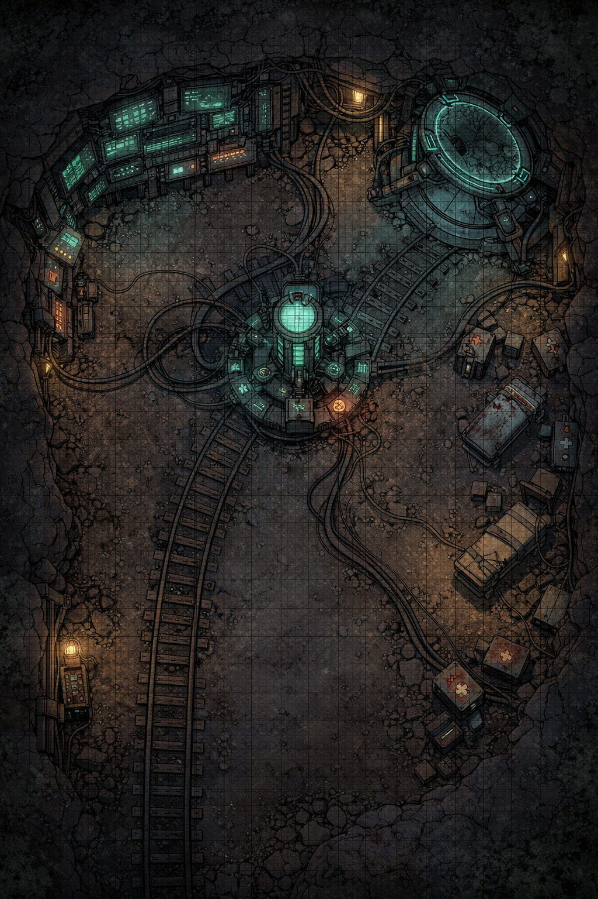
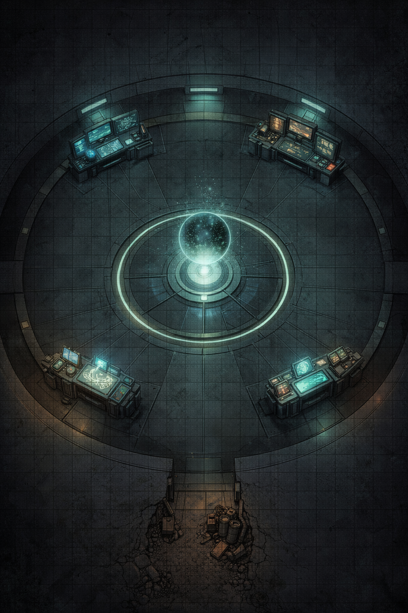

# Boca de la Mina (Entrada Principal)

## Descripción visual (para narrar)

Un corte irregular en la roca, reforzado con vigas de madera podrida y restos de metal oxidado.

El acceso está parcialmente cubierto por un **derrumbe antiguo**, pero alguien ha despejado un paso estrecho.

- El aire es frío y seco

- Huele a polvo… pero también a **ozono leve** (esto es importante)

- Hay un silencio raro: no hay viento, no hay insectos

La luz natural entra solo unos metros. Más allá: oscuridad total.

## Elementos físicos clave

- **Vías mineras antiguas** (semi enterradas)

- **Señales de uso reciente**:
  
  - Huellas (botas modernas)
  
  - Marcas de arrastre

- **Cableado improvisado**:
  
  - Grapado a la roca
  
  - No industrial → alguien lo ha montado a mano

- **Caja eléctrica portátil**
  
  - Alimenta algo más profundo
  
  - Baterías no estándar

## Elementos Nexum (no obvios)

- **Interferencia perceptiva leve**
  
  - Si un jugador mira fijamente la entrada desde dentro…  
    → tiene la sensación de que está *más lejos de lo que debería*

- **Sonido imposible**
  
  - A ratos, se oye un eco…
  
  - Pero no corresponde a ningún ruido generado por los jugadores

- **Tiempo subjetivo**
  
  - Un PJ puede sentir que ha pasado más tiempo del real (sin efectos mecánicos aún)

## Interacciones posibles

### 1. Examinar huellas

- Conclusión:
  
  - Al menos **2-3 personas han entrado recientemente**
  
  - Una de ellas **no vuelve a salir** (huellas unidireccionales)

### 2. Revisar cableado

- Detectan:
  
  - Energía activa
  
  - Flujo irregular (como pulsos, no constante)

→ pista directa de que **esto no es solo una mina abandonada**

### 3. Apagar la caja eléctrica

- Resultado:
  
  - La luz (si la hay) en zonas posteriores parpadea
  
  - Se escucha un **“ajuste” profundo**, como si algo recalibrara

→ ya introduces el concepto de sistema activo.

### 4. Quedarse en silencio

- Si lo hacen:
  
  - Describe un eco de pasos… que no son los suyos

## Evento opcional (muy recomendable)

**“La repetición sutil”**

Uno de los jugadores:

- Tropieza ligeramente al entrar

- Avanza

- Y segundos después…  
  **siente exactamente el mismo tropiezo otra vez**

Sin causa física.

## Función de la sala en la aventura

Esta sala NO es peligrosa. Es clave para:

- Cambiar el tono → de rural a Nexum

- Introducir:
  
  - intervención humana reciente
  
  - sistema activo
  
  - anomalías suaves

## Conexiones

Desde aquí salen:

- **Sala 2 → Galería principal (descendente)**

- **Túnel secundario colapsado (bloqueado)**

- **Conducto estrecho lateral (explorable más tarde)**

## Nota de dirección (importante)

No expliques nada aún.  
Esta sala funciona si los jugadores piensan:

> “Aquí hay algo… pero no sabemos el qué.”

Perfecto, subimos un nivel: aquí ya empieza la presión real.

# SALA 2 — **Galería Principal (Descenso)**

## Descripción para narrar

El túnel desciende suavemente desde la entrada, siguiendo las antiguas vías mineras.

- Las paredes están más trabajadas (excavación antigua bien hecha)

- Las vigas de soporte son más frecuentes… y algunas están reforzadas recientemente

- La oscuridad es **total** a pocos metros

- El aire es más denso, ligeramente metálico

El sonido cambia:

- Cada paso genera eco…

- Pero el eco **llega con un pequeño retraso incorrecto**, como si el espacio no midiera lo mismo todo el tiempo

## Estructura de la sala (para juego táctico)

- **Pasillo largo (20–30 metros)**

- Anchura: 2–3 casillas (estrecho → obliga a ir en fila o en pares)

- Ligera pendiente descendente

- Curva suave hacia la derecha (rompe línea de visión)

## Elementos físicos clave

- **Vías mineras completas** (funcionales)

- **Carro volcado** (mitad del pasillo)

- **Cableado activo** siguiendo el techo

- **Lámparas improvisadas** (algunas encendidas, otras no)

## Elementos Nexum (aquí ya son más claros)

### 1. Desfase espacial leve

- Un jugador puede jurar que el túnel es más largo… o más corto… dependiendo del momento

- Si miden (pasos, cuerda, etc.) → inconsistencias pequeñas

### 2. Eco “anticipado”

- A veces el eco llega **antes del sonido original**

- Muy sutil, pero inquietante

### 3. Zona de “repetición débil”

En un punto concreto del túnel:

- Si un jugador realiza una acción simple (mirar atrás, tocar pared…)  
  → puede repetirla automáticamente 1–2 segundos después

Sin control.

## Interacciones jugables

### 1. El carro minero

- Puede usarse como cobertura

- Al moverlo:
  
  - Hace ruido exagerado
  
  - Activa una respuesta más profunda (ruido metálico lejano)

### 2. Cableado

- Lleva energía hacia abajo

- Si se corta:
  
  - Oscuridad total progresiva
  
  - Se incrementan anomalías

### 3. Lámparas

- Algunas parpadean en patrón…

- Ese patrón es repetitivo → pista de sistema

## Evento clave de la sala

### “El desajuste”

En mitad del túnel:

- Un jugador avanza

- Los demás lo ven avanzar normal

- Pero durante un instante…  
  **parece estar medio metro más atrás de donde debería**

Como si hubiera dos posiciones superpuestas.

## Función de la sala

Aquí el jugador ya debe entender:

- Esto NO es solo psicológico

- Hay un sistema afectando espacio/tiempo local

Es transición de:  
→ misterio  
→ fenómeno activo

## Conexiones

- **Atrás → Sala 1 (entrada)**

- **Adelante → Sala 3 (Cámara técnica / nodo intermedio)**

- **Pequeño nicho lateral (opcional)**:
  
  - hueco en pared con herramientas antiguas
  
  - posible escondite / pista

Ahora sí: esta sala ya es **núcleo Nexum**. Aquí los jugadores dejan de dudar y pasan a **interpretar lo que está ocurriendo**.

# SALA 3 — **Cámara Técnica / Nodo Intermedio**

## Descripción para narrar

El túnel se abre de repente en una cámara amplia, irregular, excavada en la roca.

- El espacio es antinatural para una mina → demasiado limpio en ciertas zonas

- La iluminación no es uniforme:
  
  - tonos fríos verdosos (núcleo)
  
  - parpadeos cálidos (instalación improvisada)

- El aire vibra ligeramente, como si hubiese una corriente eléctrica constante

El sonido desaparece parcialmente.

> Tus pasos suenan… pero no llenan el espacio.

## Estructura de la sala (clave para combate/exploración)

Zona dividida en **4 áreas funcionales**:

### 1. Núcleo central (EL NODO)

- Estructura circular

- Elevación leve (1 escalón)

- Rodeado de cableado convergente

→ Es el “corazón” de la sala

### 2. Consolas técnicas (pared izquierda)

- Pantallas antiguas reutilizadas

- Interfaces no uniformes

- Datos parcialmente comprensibles

→ Punto de interacción tecnológica

### 3. Plataforma secundaria (derecha)

- Estructura más avanzada

- Superficie circular tipo “escáner” o “lector”

- No completamente activa

→ Zona de experimento / transferencia

### 4. Área improvisada (abajo derecha)

- Camillas, cajas médicas, herramientas

- Restos de intervención humana reciente

- Señales de uso apresurado

→ Punto narrativo humano

## Elementos Nexum (aquí ya claros)

### 1. Sincronización incompleta

- Algunos elementos están “ligeramente fuera de fase”:
  
  - cables que parecen vibrar sin moverse
  
  - luces que no iluminan donde deberían

### 2. Latencia de acciones

- Un jugador interactúa con algo…

- y la respuesta ocurre **medio segundo tarde**

### 3. Doble estado

- Un objeto puede parecer:
  
  - intacto
  
  - y roto  
    al mismo tiempo (dependiendo del ángulo)

## Interacciones clave

### 1. Núcleo central

Si se acercan:

- sienten presión leve en la cabeza

- pensamientos repetitivos (ecos mentales)

Si lo tocan:

- reciben una “impresión”:
  
  - escenas del pueblo
  
  - repetidas con variaciones

→ No es visión clara, es sensación

### 2. Consolas

Pueden descubrir:

- Registro parcial de “iteraciones”

- Parámetros:
  
  - corrección
  
  - desviación
  
  - estabilidad

Una línea clave (ideal para leer en voz alta):

> “Iteración local inestable. Reajuste en curso.”

### 3. Plataforma secundaria

Si alguien entra:

- siente desorientación inmediata

- durante 1–2 segundos…  
  **no sabe si ya ha estado ahí antes**

### 4. Zona médica

Descubren:

- alguien ha estado tratando a personas afectadas

- notas incompletas:
  
  - “no recuerdan el error”
  
  - “pero el sistema sí”

## Evento de la sala (muy potente)

### “Solapamiento”

Durante la escena:

- durante 2–3 segundos

- la sala cambia ligeramente:
  
  - posición de objetos distinta
  
  - luces en otro sitio

Luego vuelve.

Los jugadores **lo perciben todos a la vez**.

## Función narrativa

Esta sala revela:

- Hay intervención tecnológica

- No es limpia ni controlada

- Está intentando corregir algo… pero falla

## Decisiones que puedes forzar

Aquí puedes provocar:

- ¿Interaccionar con el núcleo o no?

- ¿Cortar energía?

- ¿Investigar o avanzar rápido?

## Conexiones

- Entrada → Galería (Sala 2)

- Salida → **Sala 4 (núcleo profundo / origen real)**

## Nota de dirección (muy importante)

Aquí debes provocar esta sensación:

> “Esto tiene lógica… pero no la entendemos del todo.”

No expliques Nexum.  
Deja que los jugadores construyan su propia interpretación.

Ahí ya cierras el one-shot con fuerza.

Perfecto. Aquí rematas el one-shot. Esta sala no es solo un “final boss”: es **decisión moral + comprensión incompleta + consecuencias**.

# SALA 4 — **Núcleo Profundo / Iterador Local**

## Descripción para narrar

El paso desde la sala 3 no es normal.

- No hay puerta clara

- Simplemente… el espacio cambia

El túnel se estrecha unos metros y desemboca en una cámara casi **perfectamente circular**.

Pero no parece excavada.

- Las paredes son lisas, como pulidas por algo no humano

- No hay vigas

- No hay marcas de herramientas

La iluminación no viene de focos.

> La propia sala emite una luz tenue, fría, constante.

El aire es más pesado.

Silencio absoluto.

## Estructura de la sala

Diseñada como un espacio **simbólico y mecánico a la vez**:

### 1. Núcleo suspendido (centro)

- Esfera o estructura flotante (o apoyada en un soporte mínimo)

- Emite pulsos de luz suaves

- Cada pulso coincide con una “micro-sensación” en los jugadores

→ Es el verdadero sistema

### 2. Anillo perimetral

- Plataforma circular alrededor del núcleo

- Se puede rodear completamente

- Tiene puntos de interacción (3–4 nodos menores)

### 3. Tres terminales (o estaciones)

Distribuidas alrededor:

- **Terminal de control**

- **Terminal de registro**

- **Terminal de ajuste**

No están etiquetadas claramente → los jugadores deben interpretar

### 4. Zona de acceso (entrada)

- El único punto “irregular”

- Restos de instalación humana intentando conectar con el sistema

## Elementos Nexum (máximo nivel)

### 1. Percepción alterada colectiva

- Todos los jugadores sienten lo mismo:
  
  - déjà vu constante
  
  - sensación de haber estado aquí

### 2. Tiempo no lineal (ligero)

- Un jugador puede:
  
  - empezar una frase
  
  - y otro la termina… sin saber por qué

### 3. Recuerdos que no son suyos

- Breves flashes:
  
  - habitantes del pueblo
  
  - escenas cotidianas
  
  - errores corregidos

## Interacciones clave

### 1. Núcleo

Al acercarse:

- sienten calma… y amenaza a la vez

- como si el sistema “los evaluara”

Si alguien lo toca:

→ recibe una “comprensión parcial”:

- el sistema:
  
  - detecta errores humanos
  
  - repite eventos
  
  - intenta optimizar resultados

Pero:

- cada iteración degrada algo:
  
  - memoria
  
  - identidad
  
  - coherencia

### 2. Terminal de registro

Muestra:

- múltiples “versiones” del pueblo

- pequeñas variaciones:
  
  - alguien no muere
  
  - alguien no discute
  
  - alguien no se va

Pero nunca es perfecto.

### 3. Terminal de control

Permite:

- pausar (temporalmente)

- forzar iteración

→ peligroso: puede provocar una repetición inmediata

### 4. Terminal de ajuste

Aquí está la decisión real.

Opciones implícitas (no rotuladas):

- aumentar corrección

- reducir intervención

- apagar sistema

## Evento clave (clímax)

### “Iteración en vivo”

Mientras están en la sala:

- el sistema lanza una iteración

- los jugadores ven una escena del pueblo:

Ejemplo:

- alguien muere

- alguien discute

- alguien toma una decisión

La escena se repite… con variación

Y entienden:

> esto está ocurriendo ahora mismo

## Decisión final (forzada)

Los jugadores deben elegir:

### OPCIÓN A — Apagar el sistema

Resultado:

- el pueblo deja de repetirse

- pero:
  
  - algunas personas quedan “rotas”
  
  - recuerdos inconsistentes
  
  - consecuencias reales

Tono: **libertad imperfecta**

### OPCIÓN B — Ajustarlo (optimizar)

Resultado:

- el pueblo mejora superficialmente

- menos conflictos

- menos errores

Pero:

- menos libre

- más “estable”

Tono: **orden artificial**

### OPCIÓN C — No intervenir

Resultado:

- el sistema sigue degradándose

- iteraciones más agresivas

Tono: **decadencia inevitable**

## Última escena (cierre)

Vuelven al pueblo.

Todo parece normal.

Pero introduces UNA grieta:

- alguien repite una acción

- una frase cambia

- un jugador siente que ya ha vivido esto

## Función en el one-shot

Esta sala:

- cierra la investigación

- plantea el conflicto filosófico de Nexum

- deja consecuencias abiertas

## Nota de dirección (muy importante)

No expliques el sistema completamente.

Si los jugadores preguntan:

> “¿Qué es esto exactamente?”

La respuesta correcta es:

> “Algo que intenta hacer las cosas mejor… sin entenderlas del todo.”

Si quieres, puedo rematar esto con:

- mapa táctico de esta sala (muy potente visualmente)

- o sistema de tiradas concreto para jugarlo ya

- o consecuencias detalladas según la decisión que tomen

Aquí ya tienes un final sólido de sesión.
