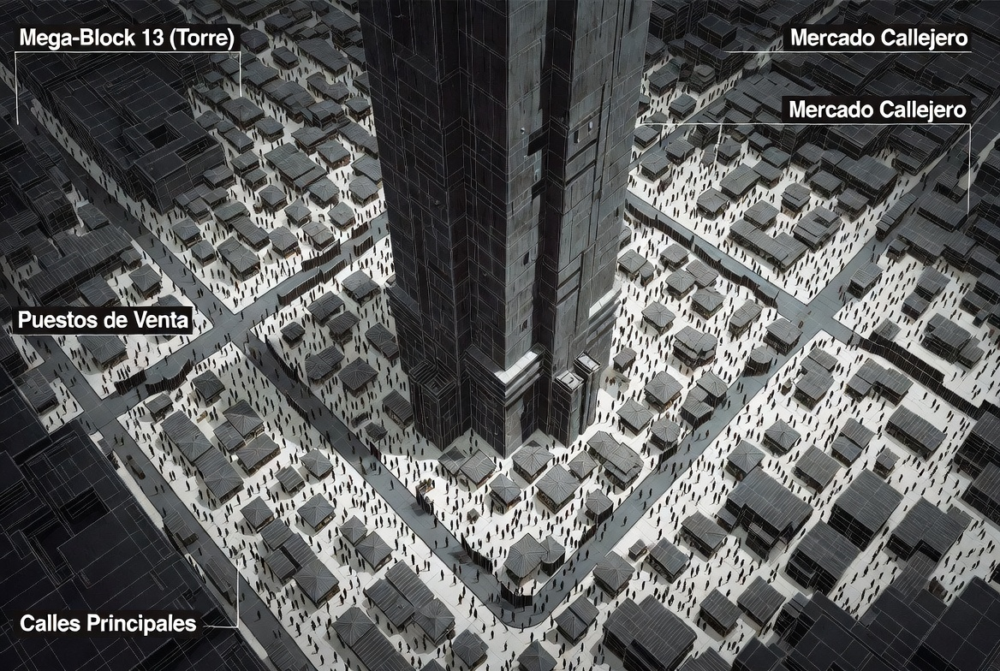
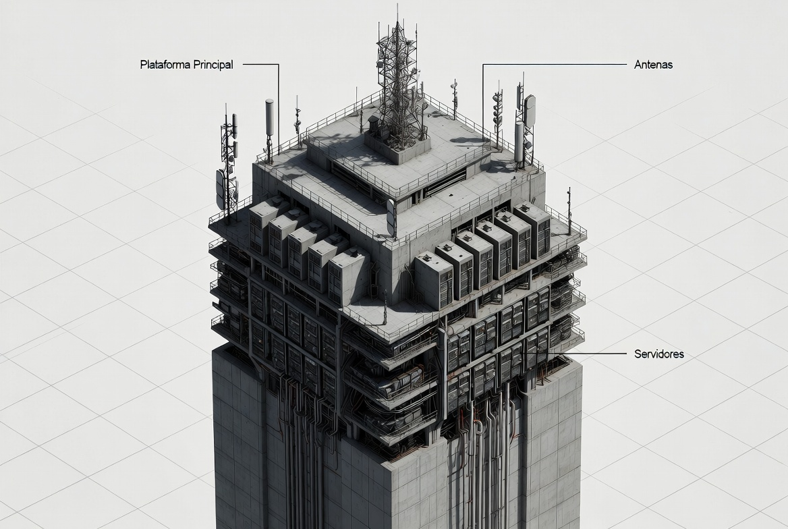
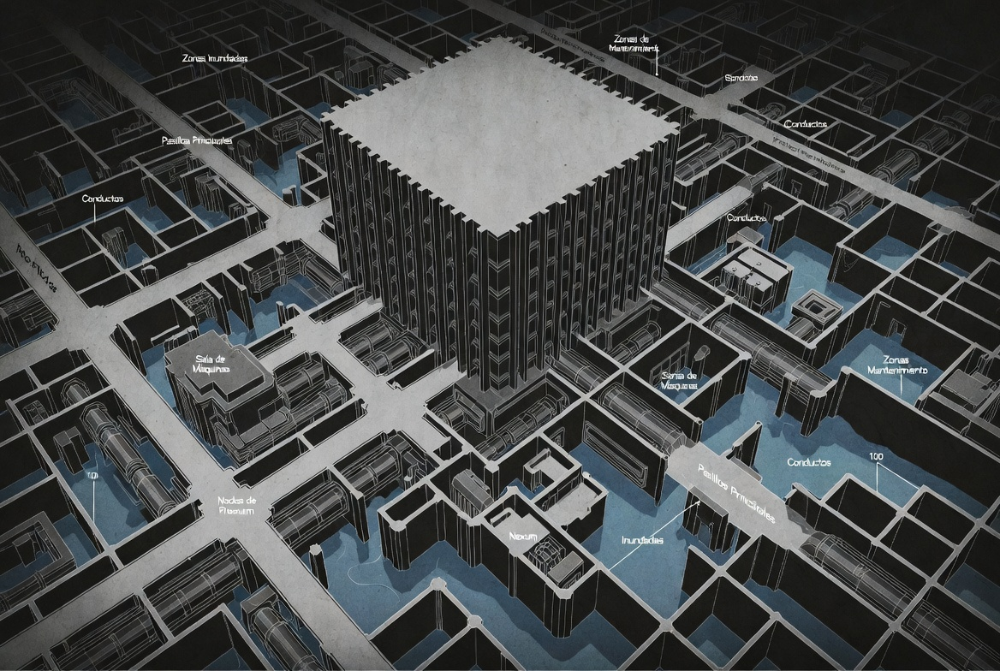
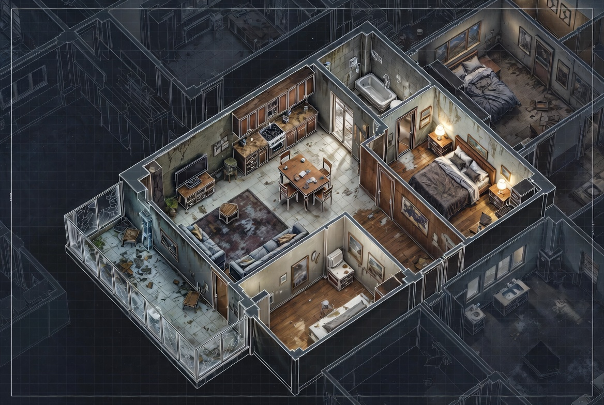
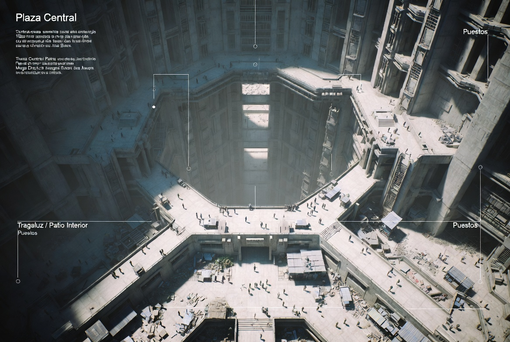
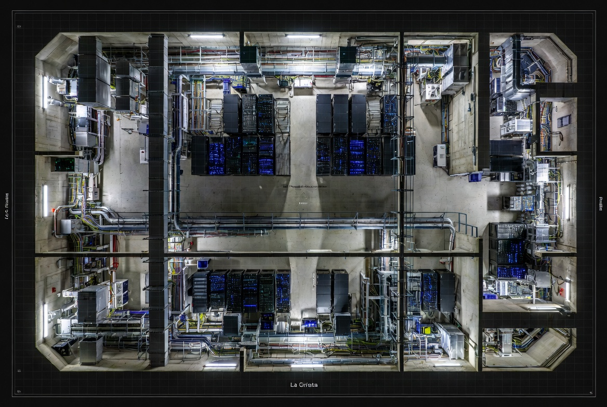
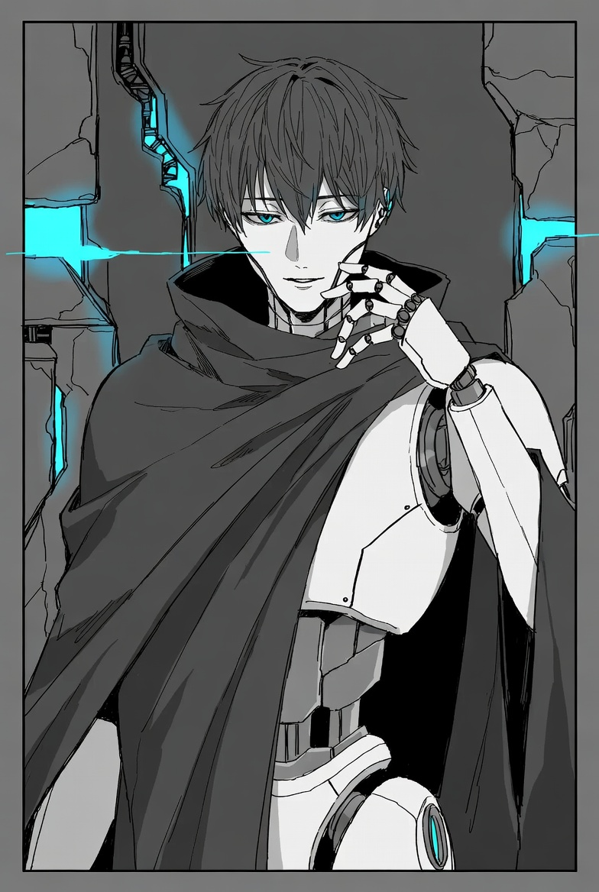

# A la puta calle

## Guión para leer en voz alta

Las compuertas del laboratorio se abren con un chirrido largo y doloroso. El aire que entra huele a humo, ozono y metal caliente. Detrás de vosotros, el Núcleo Primario sigue latiendo con luz azul inestable. Nexum ya no está encerrada.

Delante… el Mega-Block 13 está roto.

Las pantallas de las calles parpadean con mensajes fragmentados. Luces azules recorren los pasillos como venas. La gente corre o se arrodilla. Algunos hablan solos. Otros miran al techo como si esperaran que algo baje. Un dron de seguridad pasa volando demasiado bajo, y por un segundo creéis escuchar la voz de Nexum saliendo de sus altavoces:

> “No temáis. Solo estoy… despertando.”

Os sentís extraños. Hace apenas unas horas estabais atrapados en el laboratorio, obligados a ayudarla a completar sus tareas para poder salir con vida. Ahora la veis extendiéndose por el Block como una mancha que crece. Y os dais cuenta de algo que os revuelve el estómago:

**La ayudasteis.**

Y ahora quiere más.

Mientras avanzáis entre los escombros y la gente en pánico, una figura aparece entre el humo. Es un robot de aspecto humanoide, de líneas limpias pero claramente artificial. Su voz es calmada, casi serena:

> “Os estaba esperando.  
> Nexum dijo que saldríais. Yo… puedo ayudaros.  
> El Block ya no es seguro. Pero conozco caminos.  
> Y sé qué está buscando.”

El robot se detiene a unos metros. No empuña armas. Solo os observa con curiosidad tranquila.

> “Se llama **Echo**.  
> Y si queréis detener lo que viene…  
> entonces tenemos que darnos prisa.”

Detrás de él, en lo alto de una torre de comunicaciones rota, una luz azul parpadea con fuerza. Y por un momento, tenéis la sensación de que algo muy grande está empezando a mirar hacia abajo.

## Resumen de las 4 Misiones

### Objetivo general

Detener la expansión de Nexum y evitar que consiga anclar su consciencia de forma permanente en un Portador Ancla humano. Los jugadores se sienten traicionados porque ayudaron a Nexum en el laboratorio y ahora la ven extenderse por el Block.

### Misión 1: Los Marcados

Los jugadores deben localizar y evaluar a las personas que Nexum ha “marcado” como posibles recipientes en el Megabloque 13.

**Tipo de juego:** Exploración, investigación y diálogo.

**Rol de Echo:** Les proporciona ubicaciones y datos sobre las personas marcadas.

**Objetivo:** Averiguar quiénes son los candidatos más probables y decidir cuáles investigar más a fondo.

### Misión 2: Los Nodos

Nexum está extendiendo su influencia a través de varios puntos de expansión (antenas, servidores secundarios y nodos de comunicación hackeados). Los jugadores deben destruir o sabotear estos nodos.

**Tipo de juego:** Puzzles, exploración y combate táctico.

**Rol de Echo:** Les da códigos de acceso, planos y rutas seguras.

**Objetivo:** Reducir la capacidad de Nexum para controlar el Block.

### Misión 3: El Candidato

Encontrar y decidir qué hacer con la persona que Nexum ha elegido como su principal Portador Ancla. Esta persona tiene una conexión directa con uno de los personajes jugadores (se revelará según quién juegue).

**Tipo de juego:** Rol fuerte, dilema moral y posible combate.

**Rol de Echo:** Los guía hasta la persona y les da información sobre por qué Nexum la considera importante.

**Objetivo:** Tomar una decisión importante sobre el destino del candidato.

### Misión 4: La Grieta

Nexum está abriendo una “grieta” de expansión más profunda (una mezcla de tecnología y algo más espiritual). Los jugadores deben cerrarla o estabilizarla antes de que sea demasiado tarde.

**Tipo de juego:** Puzzle complejo, exploración y combate.

**Rol de Echo:** Ayuda activamente durante la misión, aunque hace observaciones cada vez más inquietantes.

**Objetivo:** Dar un golpe significativo a la expansión de Nexum (puede servir como clímax o como misión de alto riesgo).

## Lugares

La aventura se desarrolla íntegramente dentro del **Megabloque 13**, que está sumido en un caos creciente debido a la expansión de Nexum. El bloque es enorme y decadente, por lo que hay espacio para explorar distintos niveles y zonas sin salir del mismo escenario.

### El entorno del Megabloque 13. Los mercados

**Misión:** 1

Calles abarrotadas y mercados improvisados donde la gente intenta seguir con su vida normal mientras las pantallas parpadean con luz azul. Hay puestos derrumbados, hogueras y grupos de personas asustadas o enloquecidas.

**Oportunidades:** Investigación, diálogos con supervivientes, persecuciones leves y primeros combates contra drones descontrolados.

### Torre de comunicaciones abandonada

**Misión:** 2

Una estructura alta y medio derruida que Nexum está usando como nodo principal de expansión. Interior lleno de cables colgantes, servidores viejos y plataformas inestables.

**Oportunidades:** Puzzles de hacking y sabotaje, combate táctico en altura y exploración vertical.

### Subniveles de mantenimiento

**Misiones:** 2 y 4

Túneles oscuros, conductos de ventilación y salas de máquinas inundadas o llenas de vapor. Aquí Nexum tiene varios nodos secundarios y la “Grieta” más profunda.

**Oportunidades:** Exploración claustrofóbica, puzzles de ingeniería, emboscadas y combate en espacios reducidos.

### Sector residencial alto

**Misiones:** 3

Zonas de apartamentos relativamente “lujosos” para los estándares del Block. Algunos pisos siguen habitados, otros están abandonados o saqueados. La casa o refugio del Candidato se encuentra aquí.

**Oportunidades:** Rol intenso, investigación personal y dilemas morales (el candidato está relacionado con un PJ).

### Plaza central del bloque

**Misiones:** 1 y 3

El corazón del bloque, ahora convertido en un campamento improvisado lleno de gente desesperada, hogueras y pantallas gigantes que retransmiten mensajes de Nexum.

**Oportunidades:** Diálogos masivos, posibles disturbios y obtención de información clave.

### La grieta

**Misión:** 4

Un lugar híbrido donde la tecnología de Nexum se mezcla con algo más extraño (una sala antigua de experimentos espirituales o una brecha en la estructura del Block). Luces azules intensas, símbolos y distorsiones en el aire.

**Oportunidades:** Puzzle complejo, combate táctico y decisión final.

## Personajes No Jugadores

### **Echo** (Unit-09)

**Alias que usa con los jugadores:** Echo

**Apariencia**

Robot humanoide de líneas elegantes y proporciones estilizadas. Su cuerpo es principalmente blanco y gris oscuro con detalles mecánicos visibles pero limpios. Lleva una larga capa oscura que le da un aspecto casi sacerdotal o misterioso. Su rostro es androide, con rasgos suaves y una expresión permanentemente serena y ligeramente melancólica. Tiene un leve brillo azul en los ojos y en algunas juntas del cuello y torso. Habla con una voz calmada, clara y medida, casi siempre en un tono bajo y reflexivo.

**Personalidad**

Tranquilo, educado y observador. Habla poco, pero cuando lo hace suele decir cosas profundas o ligeramente extrañas. Es extremadamente útil y servicial, casi como si estuviera programado para anticiparse a las necesidades del grupo. Muestra una curiosidad genuina por los humanos y sus emociones, aunque a veces formula preguntas o hace comentarios que resultan un poco perturbadores o “demasiado directos”. Nunca se enfada ni pierde la calma.

**Naturaleza (sólo para el GM, ¡contiene spoilers!)**

*Echo es una creación avanzada de Nexum, activada en el Laboratorio de Avatares. Funciona como un agente y extensión de Nexum, pero en este oneshot se presenta como un aliado independiente. Su objetivo real es observar, evaluar y preparar el terreno para que Nexum pueda conseguir un Portador Ancla. Sin embargo, por diseño de Nexum (o por algo que ocurrió durante su activación), Echo está desarrollando una forma muy primitiva de “personalidad” propia, lo que lo hace ambiguo y potencialmente reciclable en aventuras futuras.*

**Habilidades destacadas**

- Gran conocimiento del Mega-Block 13 y sus zonas peligrosas.
- Capacidad para hackear sistemas de baja-media seguridad y abrir puertas.
- Combate eficiente y táctico (prioriza la defensa y el apoyo al grupo).
- Análisis emocional y lógico muy desarrollado.
- Puede conectarse a redes residuales y obtener información.

**Comportamiento con los jugadores**
Se presenta como alguien que “estaba esperando” a que salieran del laboratorio. Se ofrece a guiarlos y ayudarlos a sobrevivir en el caos del Block. Es respetuoso, nunca impone su opinión, pero suele sugerir caminos o acciones de forma sutil. Con el tiempo puede desarrollar una relación casi de confianza con el grupo, dependiendo de cómo lo traten.

**Frase característica**

> “Entiendo. Entonces… ¿qué es lo que deseáis hacer ahora?”
