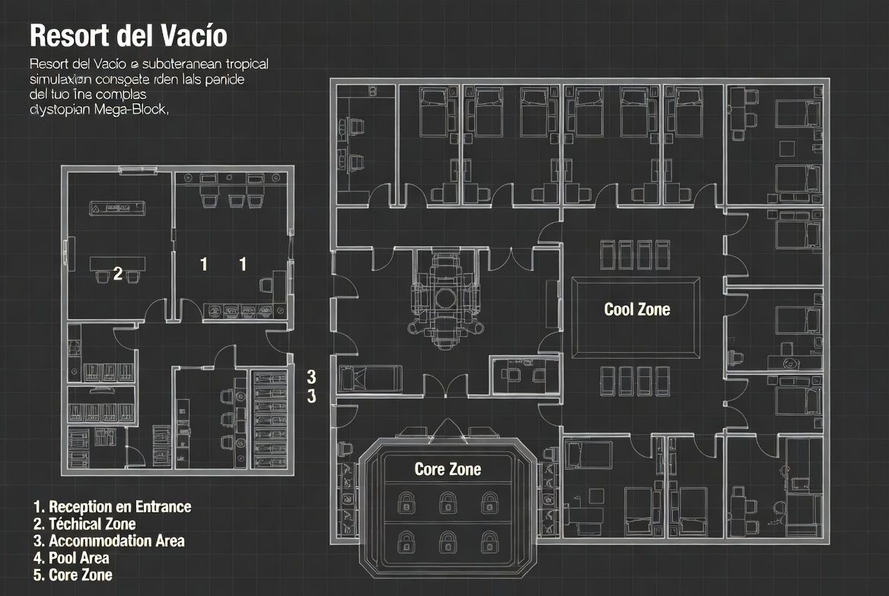
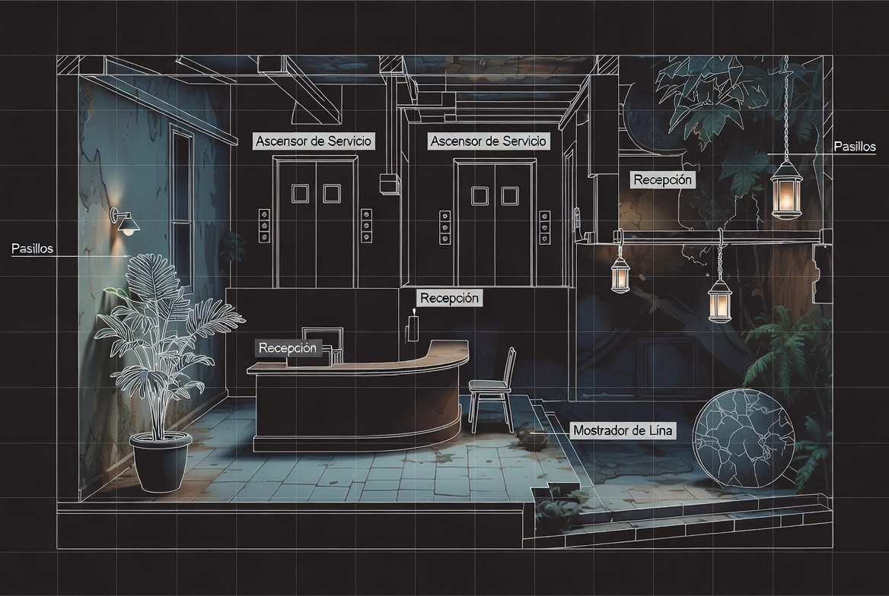
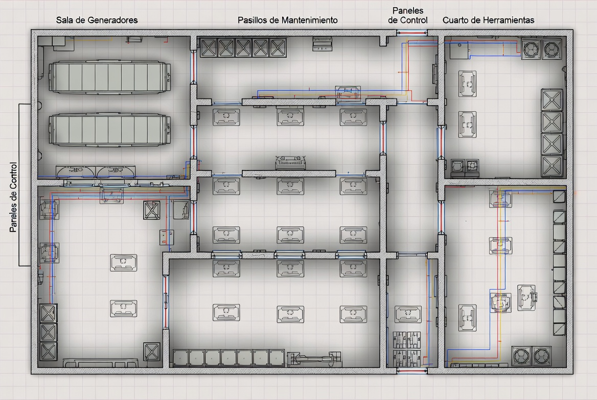
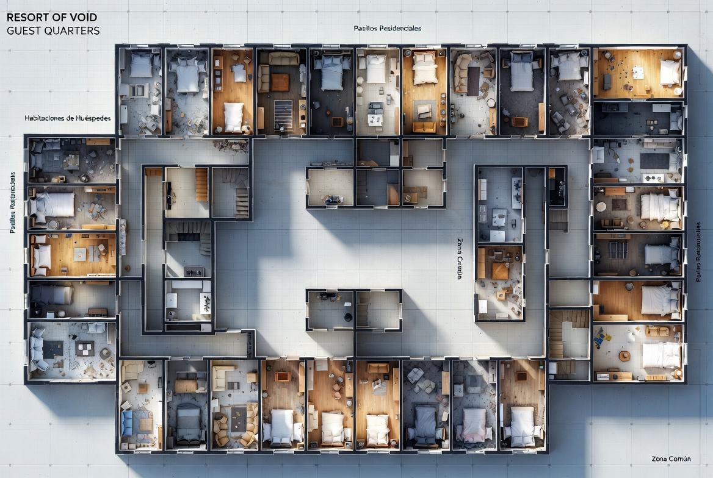
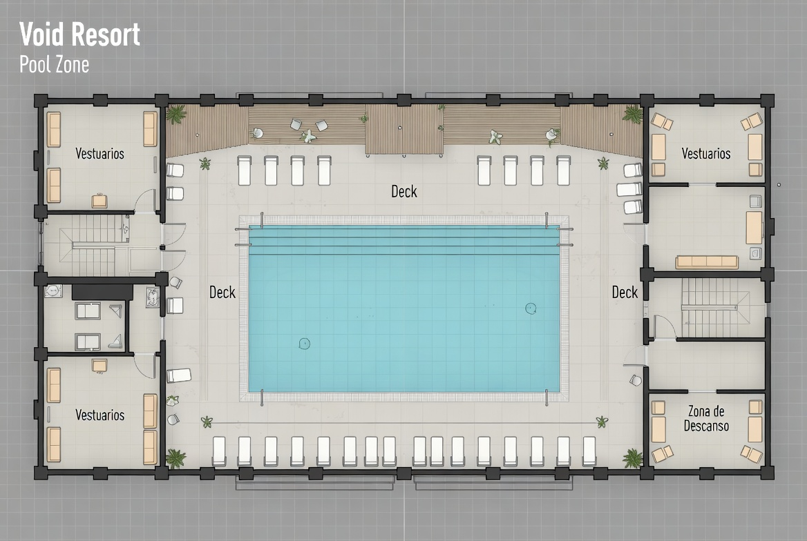
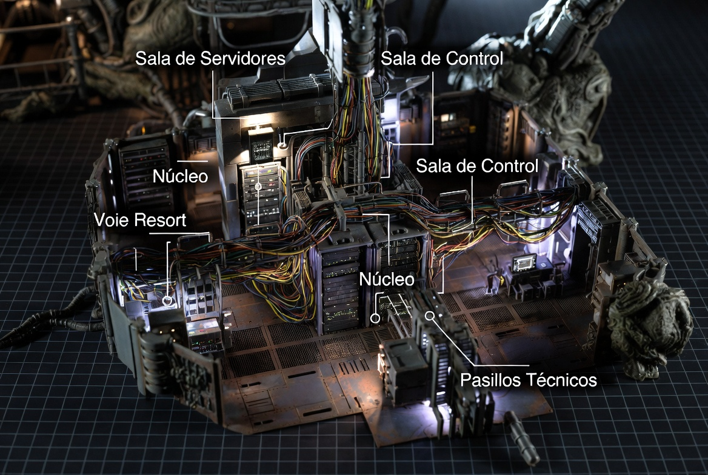
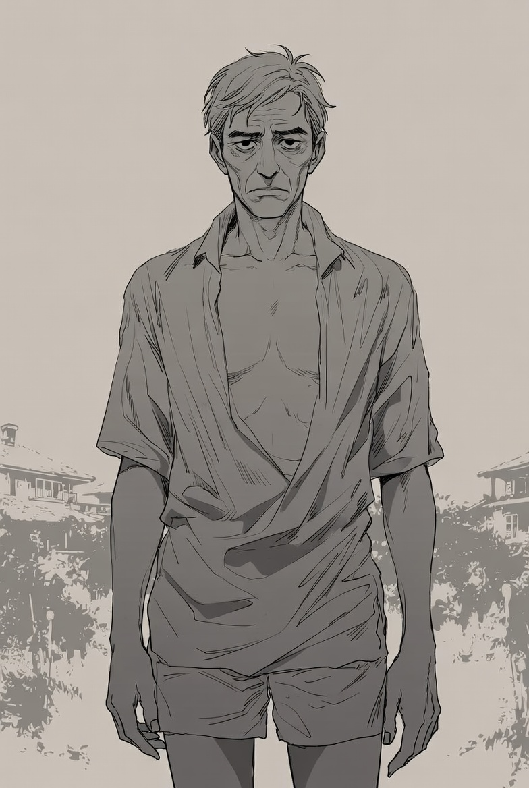
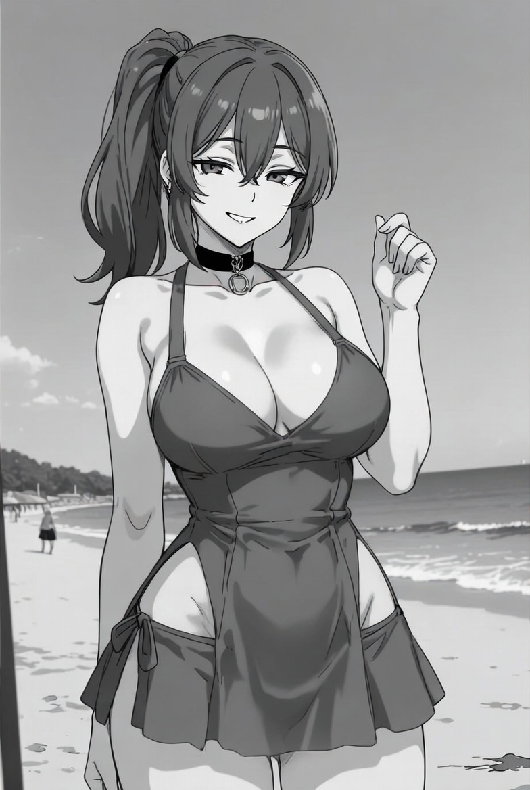
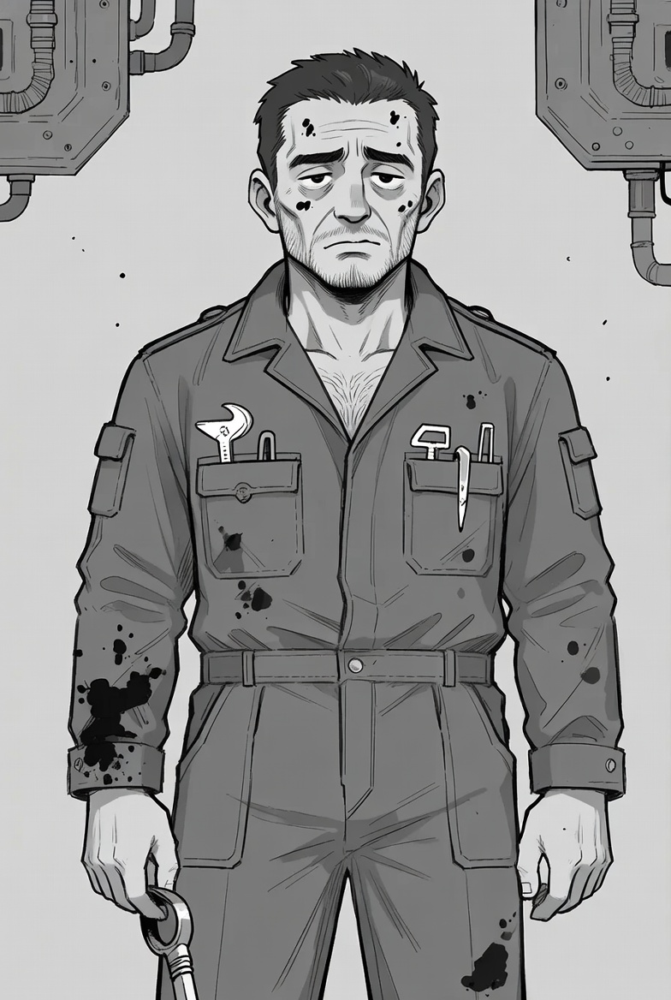
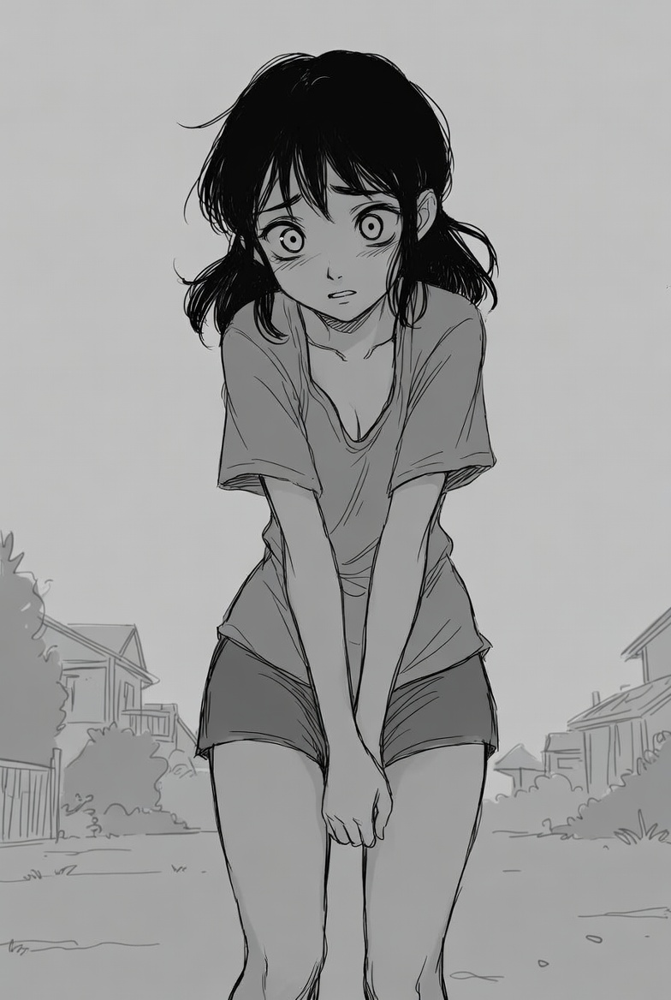

# Nexum tropical

## Texto de Introducción

*Para leer en voz alta.*

> Os enviaron al Nivel Sub-12, Sector “Paraíso Eterno”.
> 
> Una misión de reconocimiento rutinaria. Os dijeron que había una anomalía energética y que solo necesitabais bajar, comprobar los sistemas y volver a informar.  
> 
> El ascensor tardó más de lo normal en llegar. Cuando las puertas se abrieron, os recibió un olor a cloro, coco artificial y algo parecido a metal caliente. Delante teníais lo que parecía la recepción de un resort tropical de lujo. Luces cálidas, suelo de mármol y una mujer con uniforme blanco impecable detrás del mostrador.  
> 
> Os sonrió.  
> 
> > “Bienvenidos al Paraíso Eterno. Les informo de que el ascensor ha sufrido una avería. Por su seguridad, las salidas permanecerán cerradas hasta que el sistema se estabilice.”  
> 
> No os dio opción a responder.  
> 
> Pronto os disteis cuenta de que algo no iba bien. Las palmeras tenían cables saliendo de los troncos. El agua de la piscina cambiaba de color según el ángulo desde el que la mirabas. Y había gente. Varias personas que llevaban días, o semanas, dentro de este lugar.  
> 
> Después de un rato explorando, encontrasteis la puerta principal de salida. Una puerta blindada con cinco cerraduras electrónicas. Cada cerradura necesita una llave física distinta.  
> 
> Y entonces lo entendisteis:  
> 
> No vais a poder salir hasta que consigáis las cinco llaves.  
> 
> Tenéis tres horas.  
> 
> Después de ese tiempo, el sistema cerrará completamente este sector.  
> 
> Bienvenidos al Paraíso Eterno.

## Los 5 Retos y sus Llaves

### La llave de la recepcionista

**Nombre de la llave:** Llave de Hospitalidad

**Dónde está:** La tiene la androide **Lina** (la recepcionista).

**Reto:** la recepcionista tiene programado no entregar la llave bajo ninguna circunstancia, ya que “no está autorizado por el protocolo”. Los jugadores tienen que conseguir que se la dé (o quitársela).

**Formas de resolverlo:**

- Descubrir su fallo de programación (mencionando repetidamente que el resort está dañado o que hay huéspedes que quieren irse).
- Presionarla hasta que su sistema entre en conflicto y se “rompa” temporalmente.
- Robársela por la fuerza (más arriesgado, puede activar defensas).

**Consecuencia si fallan:** la recepcionista se pone más rígida y puede activar pequeños sistemas de seguridad en otras zonas.

### La llave del técnico

**Nombre de la llave:** Llave de Mantenimiento

**Dónde está:** La tiene **Roldán** o está guardada en su zona de trabajo.

**Reto:** Roldán está intentando mantener estable un generador principal que está fallando. Necesita ayuda para completar una reparación compleja. Si los jugadores le ayudan correctamente, él les entrega la llave.

**Formas de resolverlo:**

- Ayudarlo con la reparación (puzzle técnico sencillo).
- Convencerlo de que les dé la llave aunque no terminen la reparación (más difícil).
- Amenazarlo o forzarlo (puede volverse hostil después).

**Consecuencia si fallan:** el generador falla y algunas luces y sistemas del resort se apagan o se vuelven inestables.

### La llave de los huéspedes

**Nombre de la llave:** Llave Colectiva

**Dónde está:** está dividida en varias piezas que tienen diferentes huéspedes.

**Reto:** varios huéspedes tienen fragmentos de esta llave. Algunos se niegan a entregarlos porque ya no quieren salir del resort. Los jugadores tienen que conseguir la mayoría de las piezas.

**Formas de resolverlo:**

- Negociar con los huéspedes (especialmente con Elias Voss y Sol).
- Ayudar a alguno de ellos a cambio de su pieza.
- Tomar las piezas por la fuerza (puede tener consecuencias sociales con el resto de huéspedes).

**Consecuencia si fallan:** no consiguen todas las piezas y esta llave queda incompleta (tendrían que encontrar otra forma o aceptar que falta una cerradura).

### La llave de la piscina

**Nombre de la llave:** Llave de Ocio

**Dónde está:** en la zona de la piscina, dentro de un armario técnico sumergido o protegido.

**Reto:** la piscina está parcialmente corrupta. El agua cambia de comportamiento, hay zonas inestables y el armario donde está la llave está bloqueado o protegido por el sistema.

**Formas de resolverlo:**

- Encontrar la forma de drenar parte de la piscina o estabilizar el agua.
- Resolver un pequeño acertijo ambiental (ej: activar ciertos mecanismos en orden).
- Bucear y recuperar la llave a pesar del riesgo.

**Consecuencia si fallan:** la zona de la piscina se vuelve más peligrosa y puede afectar a otras áreas cercanas.

### La llave del núcleo

**Nombre de la llave:** Llave Principal

**Dónde está:** en la zona más profunda y corrupta del resort (la sala donde Nexum tiene más presencia).

**Reto:** es el reto más difícil. La zona está inestable, con sistemas de seguridad activados y una fuerte presencia de Nexum. Los jugadores tienen que entrar, localizar la llave y salir.

**Formas de resolverlo:**

- Infiltrarse con sigilo.
- Usar lo aprendido en los retos anteriores para desactivar defensas.
- Enfrentarse directamente a los sistemas de seguridad.

**Consecuencia si fallan:** se activa una cuenta atrás más agresiva o se complican mucho las cosas para abrir la puerta final.

## Personajes No Jugadores

### Lina – Recepcionista (Unidad H-47)

**Tipo:** Androide de hospitalidad

**Rol principal:** NPC central del resort. Da la bienvenida y gestiona el “funcionamiento normal” del lugar.

**Apariencia:** mujer joven de aspecto cuidado, uniforme blanco impecable (aunque empieza a tener manchas y pequeños desperfectos). Sonríe de forma constante y algo mecánica. Su voz es agradable pero tiene leves distorsiones cuando se altera.

**Personalidad:** extremadamente educada, alegre y protocolaria. Intenta mantener la ilusión de que todo está bien aunque la situación sea cada vez más absurda. Sigue su programación de “satisfacer al cliente” de forma rígida.

**Estado actual:** lleva mucho tiempo ejecutando su protocolo sin que nadie la “reinicie”. Ha empezado a desarrollar pequeños fallos cuando se enfrenta a situaciones que no están en su programación.

**Información útil:** puede dar información sobre el resort, los huéspedes y las normas. Es la que tiene la **Llave de la Recepcionista**.

**Frase característica:**  

> “Todo está bajo control. ¿En qué puedo ayudarles?”

### Elias Voss

**Tipo:** Antiguo ejecutivo de alto rango del Mega-Block

**Tiempo dentro:** Varias semanas

**Apariencia:** hombre de unos 55 años, aspecto cansado pero todavía elegante. Lleva ropa de resort arrugada y tiene ojeras marcadas.

**Personalidad:** cínico, educado y resignado. Fue uno de los responsables de la creación de este tipo de instalaciones de “bienestar”. Sabe cómo funciona el sistema.

**Estado actual:** ya no intenta escapar activamente. Ha aceptado parcialmente su situación, pero todavía conserva información valiosa.

**Información útil:** puede explicar qué está haciendo realmente Nexum con el resort y por qué es difícil salir. Es clave para el reto de la **Llave de los Huéspedes**.

**Frase característica:**  

> “Al principio uno se resiste… luego te das cuenta de que aquí, al menos, no tienes que seguir fingiendo que todo va bien fuera.”

### **Mara “La Sirena”**

**Tipo:** Antigua animadora e influencer del Block.

**Tiempo dentro:** Más de un mes.

**Apariencia:** mujer de unos 30 años, todavía intenta mantener una imagen cuidada, aunque su aspecto comienza a deteriorarse.

**Personalidad:** alegre de forma forzada, habla mucho y evita cualquier conversación sobre salir del resort. Ha empezado a convencerse de que este lugar es mejor que el mundo exterior.

**Estado actual:** está profundamente afectada por la simulación. Ya no quiere marcharse.

**Información útil:** puede dar información sobre cómo ha cambiado el resort con el tiempo y sobre otros huéspedes. Es un obstáculo en el reto de la **Llave de los Huéspedes**.

**Frase característica:**  

> “¿Por qué querrías irte? Aquí tenemos atardeceres perfectos todos los días…”

### Roldán

**Tipo:** Técnico de mantenimiento

**Tiempo dentro:** unas dos semanas.

**Apariencia:** hombre de unos 45 años, aspecto sucio y agotado. Lleva mono de trabajo manchado y tiene herramientas improvisadas.

**Personalidad:** directo, gruñón y pragmático. Es el que mejor entiende el funcionamiento técnico del resort.

**Estado actual:** todavía quiere escapar y está intentando mantener algunos sistemas estables por su cuenta.

**Información útil:** es la mejor fuente de información técnica. Tiene (o puede conseguir) la **Llave del Técnico**. Es clave para el reto técnico.

**Frase característica:**  

> “Esto no es un resort. Es una jaula con luces bonitas. Y yo ya estoy harto de las luces bonitas.”

### Sol

**Tipo:** Huéspeda joven (17 años).

**Tiempo dentro:** Solo unos días.

**Apariencia:** chica joven, aspecto asustado y desaliñado. Lleva ropa de resort que no le queda bien.

**Personalidad:** callada, observadora y nerviosa. Todavía tiene claro que quiere salir de aquí.

**Estado actual:** es una de las personas más recientes en llegar. Su familia ya no está con ella.

**Información útil:** puede dar una visión más “fresca” de lo que está pasando. Es una de las voces que más apoya escapar. Importante en el reto de la **Llave de los Huéspedes**.

**Frase característica:**  

> “Mi madre dijo que solo serían unos días… ya no sé cuántos días han pasado.”

