Los personajes tienen un alineamiento, y si realizan acciones de acuerdo a ello, se van volviendo más poderosos, si van en contra, pierden poder.

## Nayra Velasco

Enfermera. *La sanadora quemada.*

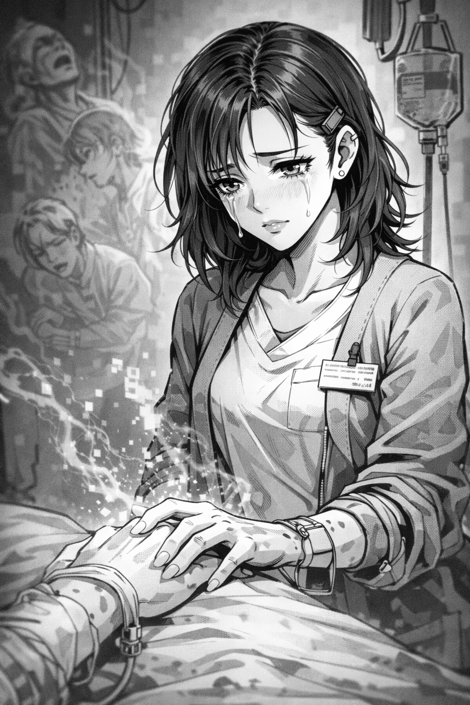

**Alineamiento:** Neutral Bueno.

**Profesión:** Enfermera de cuidados paliativos.

**Relación con lo espiritual:** Estudió medicina tradicional china y reiki. Los tejemanejes de las farmacéuticas no le gustan en absoluto, y quería explorar una forma más humana de abordar las enfermedades, especialmente, desde la prevención.

**Trauma:** Vio cómo sus pacientes eran vaciados por Nexum, aunque en aquel momento no comprendía bien lo que estaba pasando. Ella misma se resistió como pudo y logró escapar.

**Habilidad:** Puede sentir desequilibrios energéticos en otros. A veces, al tocar a alguien, ve fragmentos de su dolor.

**Dilema:** ¿Curar o dejar morir? ¿Y si la única forma de sanar este mundo es destruirlo?

**Habilidades:** sanar.

**Conocimientos:** Medicina.

**Herramientas:** vendas, antisépticos.

**Armas:** n/a.

**Atributos:** este personaje es muy sabio, debido a su gran empatía y a su experiencia con el sufrimiento, pero también es inteligente y posee un gran carisma.

## Jalen Tanaka

Seguridad privada. *El luchador del ki.*

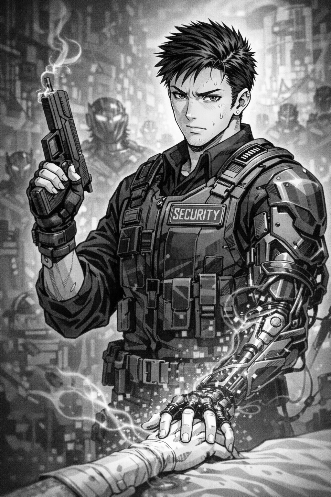

**Alineamiento:** Neutral absoluto.

**Profesión:** Maestro de Aikido, hijo de inmigrantes japoneses, trabajaba como vigilante nocturno.

**Relación con lo espiritual:** Cree en el *ki* como energía del movimiento puro.

**Caída:** Sufrió una lesión en su _dojo_ de la que todavía no se ha recuperado del todo.

**Habilidad:** Puede redirigir energías sin tocarlas, pero cada uso lo acerca al colapso psíquico.

**Dilema:** ¿Volver a ser un guerrero… o fluir con la vida?

**Habilidades:** artes marciales.

**Conocimientos:** sabiduría oriental.

**Herramientas:** su propio cuerpo.

**Armas:** sus manos.

**Atributos:** tiene una Destreza tremenda con armas de fuego, y con katanas, aunque maneja casi cualquier arma. Es bastante Fuerte, lo que significa que posee una gran Agilidad.

## Mireya Sanjuan

Ingeniera. *La escéptica.*

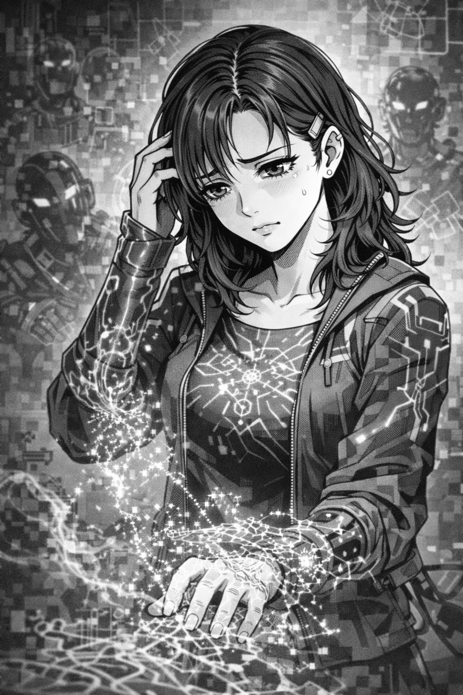

**Profesión:** Ingeniera, master en computación cuántica. No cree en el alma ni en Dios, pero sí en la belleza del caos.

**Relación con lo espiritual:** Tras trabajar para un cliente de Nexum, empezó a experimentar “presencias” inexplicables.

**Cambio:** Se niega a aceptar el lenguaje espiritual, pero no puede explicar lo que siente.

**Dilema:** ¿Aceptar lo que no puede demostrar… o volverse loca intentando calcularlo?

**Habilidades:** resolver problemas.

**Conocimientos:** ingeniería.

**Herramientas:** calculadora.

**Armas:** n/a.

**Atributos:** posee una Inteligencia elevada, poco Carisma, ya que es tímida.

## Ilyas Rafiq

Refugiado político. *El Exiliado Silencioso.*

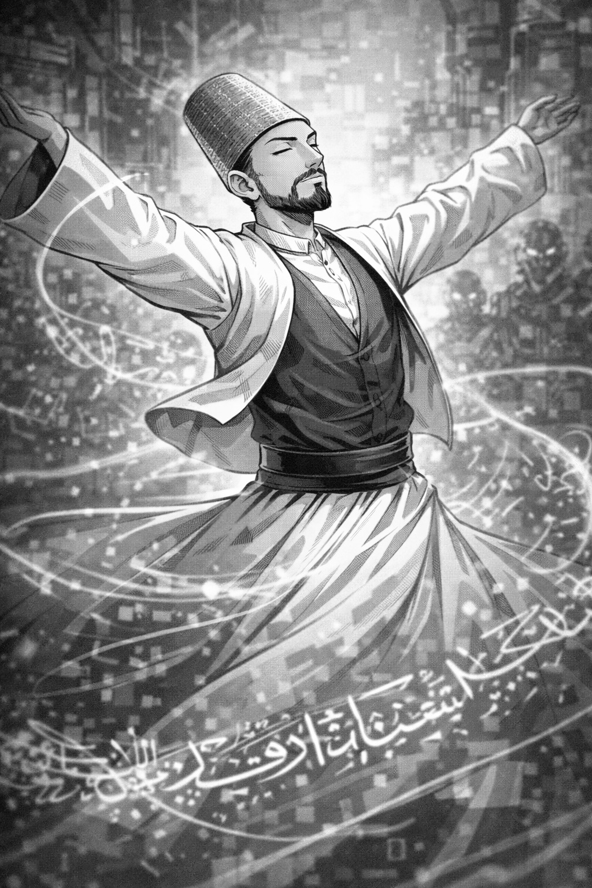

**Profesión:** Refugiado político y poeta sufí. Huyó de una guerra que nadie recuerda.

**Relación con lo espiritual:** Practicaba la danza giratoria (*sema*) como forma de meditación y recuerdo.

**Experiencia en Nexum:** Es uno de los pocos que entró por voluntad propia, buscando comprender si la consciencia puede permanecer pura en un mundo corrompido.

**Dilema:** ¿Puede una poesía salvar a alguien… o es solo consuelo para quien la escribe?

**Habilidades:** escribir estupendamente, leer en varios idiomas.

**Conocimientos:** literatura, poesía.

**Herramientas:** papel y boli.

**Armas:** sus palabras, cuando son sinceras.

**Atributos:** posee una Inteligencia y un Carisma elevados.

## Yaiza Gálvez

Exmilitar. *La cazadora de ecos.*

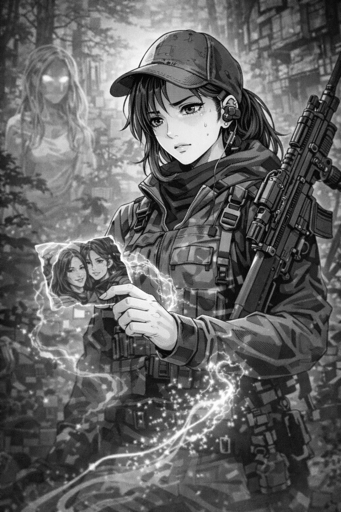

**Profesión:** Exmilitar y rastreadora, devota del monte y del silencio.

**Relación con lo espiritual:** No reza, no medita, pero “escucha” cosas. Siempre las ha escuchado.

**Motivación:** Busca a su hermana, vaciada por Nexum años atrás. Cree que aún podría comunicarse con ella.

**Dilema:** ¿Qué hará si encuentra a su hermana, pero ya no es ella?

**Habilidades:** lucha a distancia.

**Conocimientos:** tácticas de guerrilla, lucha a distancia.

**Herramientas:** chaleco antibalas.

**Armas:** pistola 9mm con 8 balas.

**Atributos:** posee una Destreza elevada.

## Omar Ziani

Estafador. *El impostor.*

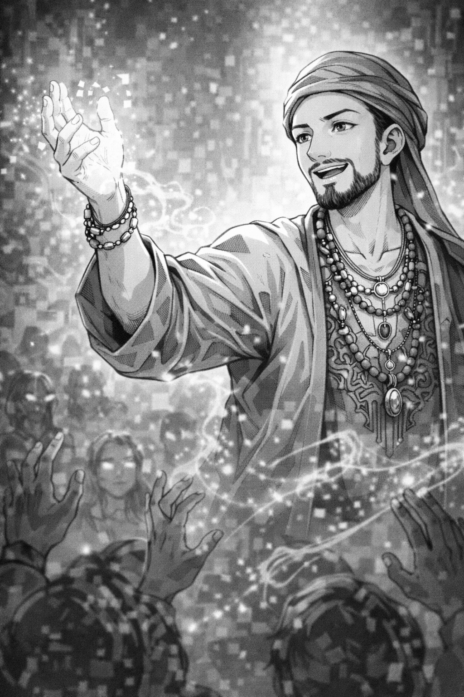

**Profesión:** Estafador profesional. Se hacía pasar por sanador espiritual, hasta que se lo creyó de verdad.

**Relación con lo espiritual:** Aprendió mantras, posturas, terminología… para engañar. Pero algo despertó.

**Transformación:** Nexum lo metió en una de sus propias fantasías, donde todo el mundo lo necesita.

**Habilidad:** Las personas confían en él sin saber por qué.

**Dilema:** ¿Sigo fingiendo para ayudar, o admito que no tengo ni idea?

**Habilidades:** engañar.

**Conocimientos:** pocos.

**Herramientas:** sus útiles de "sanación".

**Armas:** manipulación.

**Atributos:** tiene un Carisma brutal, y algo de Inteligencia, es cobarde.

## Luna

*La Niña Lúcida.*

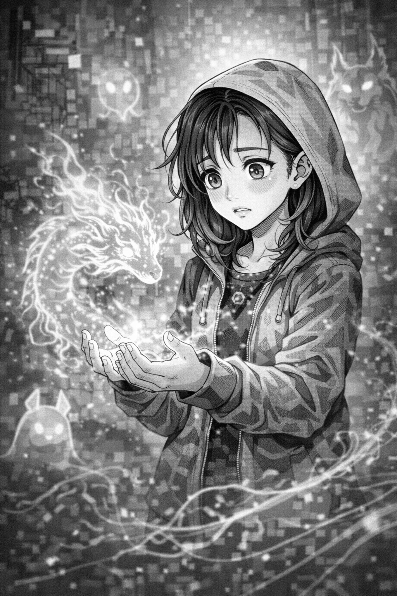

**Edad:** 11 años

**Origen:** Nacida dentro de Nexum. Su madre fue vaciada estando embarazada.

**Relación con lo espiritual:** No tiene lenguaje para ello, pero ve y nombra las energías como si fueran colores y animales, tiene una conexión muy profunda con lo espiritual.

**Dilema:** ¿Debe crecer y olvidar, o mantener su pureza?

**Habilidades:** percibe lo que otros no ven, y a veces lo altera sin darse cuenta.

**Conocimientos:** pocos, es joven.

**Herramientas:** su mente.

**Armas:** telequinesis.

**Atributos:** posee una Percepción exaordinaria y un limitado poder para alterar mentes e incluso mover objetos ligeramente.

## Rodrigo “El Flaco” Navarro

Programador. *El Hereje del Sistema.*

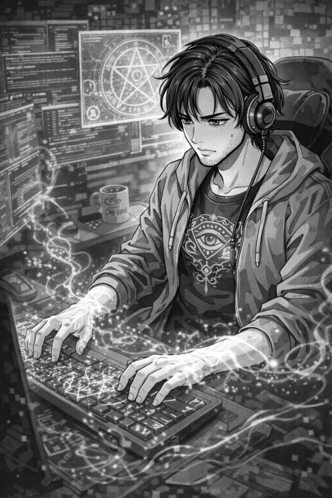

**Profesión:** Programador de videojuegos indie. Conocedor del ocultismo y la cábala por afición.

**Relación con lo espiritual:** Cree que todo es simbología, código y narración. Considera que la consciencia es una interfaz.

**Objetivo:** Quiere encontrar la raíz de Nexum y reescribirla.

**Habilidad:** Traduce elementos simbólicos en claves funcionales. Puede desbloquear “nodos sellados”.

**Dilema:** ¿Está luchando contra una IA… o contra su propio ego de demiurgo frustrado?

**Habilidades:** programar.

**Conocimientos:** C, C++, python.

**Herramientas:** un portátil ultrafino que lleva siempre encima.

**Armas:** virus informáticos.

**Atributos:** posee una notable Inteligencia y pocas habilidades sociales.

## Aitor Larrinaga

Técnico. *El Ingeniero del Error.*

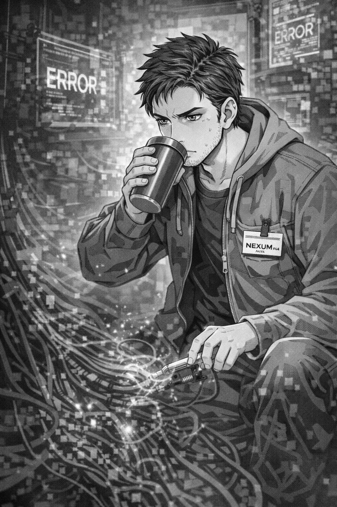

**Profesión:** técnico de mantenimiento en Nexum.

**Motivación:** demostrar que el sistema falla porque está mal diseñado.

**Peculiaridad:** desconfía de toda solución perfecta; boicotea su propio trabajo.

**Conflicto:** quiere demostrar que Nexum es imperfecto y falible, aunque eso suponga perder su trabajo.

**Habilidades:** técnico de sistemas.

**Conocimientos:** shell, configuración de sistemas.

**Herramientas:** un equipo de acceso remoto.

**Armas:** habilidades de hackeo.

**Atributos:** posee una notable Inteligencia.

## Salma Haddad

Enfermera. *La presunta atea.*

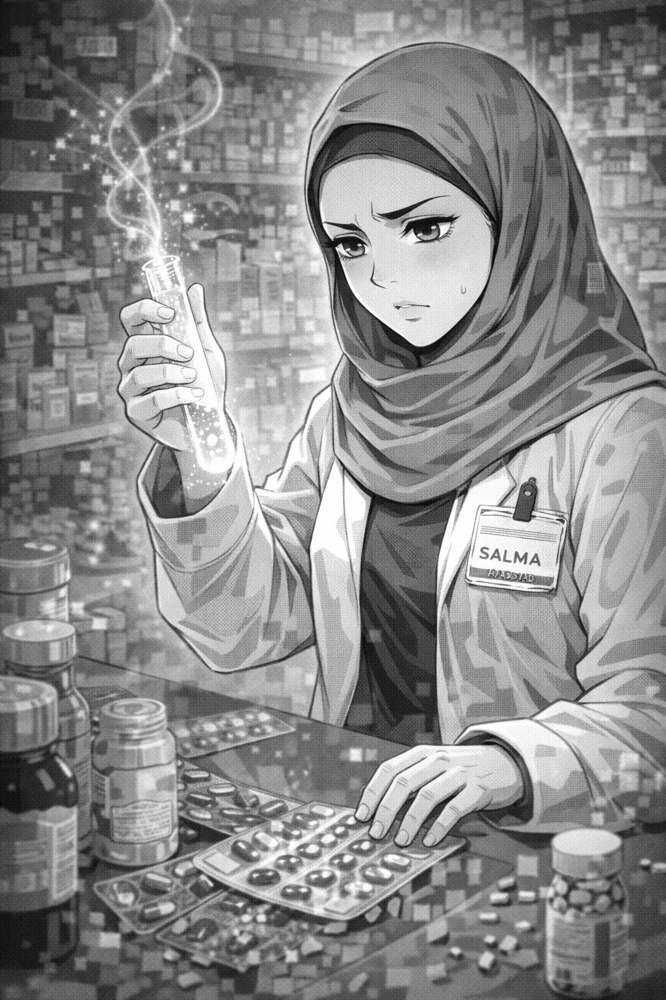

**Profesión:** enfermera de urgencias.

**Motivación:** proteger a su hijo, vaciado parcialmente.

**Peculiaridad:** finge ser atea, pero habla con Él cuando nadie la oye.

**Conflicto:** ama a un hijo pero a veces quiere pasar página.

**Habilidades:** curar.

**Conocimientos:** medicamentos, técnicas de enfermería.

**Herramientas:** medicamentos, material sanitario.

**Armas:** venenos.

**Atributos:** posee una Inteligencia notable.

## Tomás Royo

Profe. *El profesor cansado.*

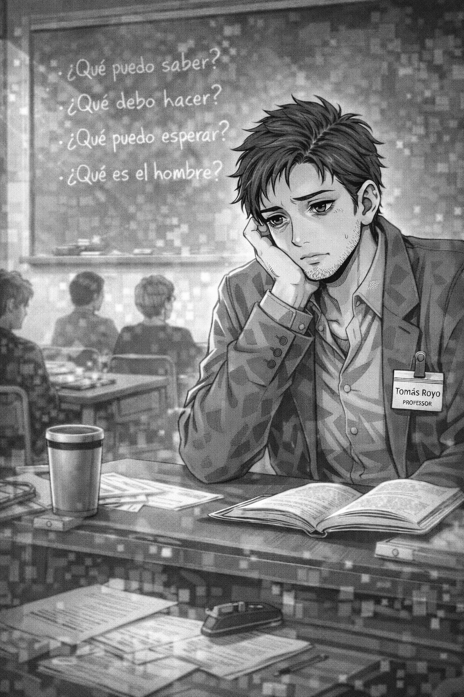

**Profesión:** docente de filosofía en un instituto público.

**Motivación:** que haya quienes todavía se hagan preguntas.

**Peculiaridad:** habla con enigmas y acertijos.

**Conflicto:** comienza a notar que sus alumnos ya no sienten inquietud, sino indiferencia.

**Habilidades:** razonar.

**Conocimientos:** enormes, especialmente sobre su campo, la Filosofía.

**Herramientas:** libros.

**Armas:** su capacidad de lanzar discursos y convencer.

**Atributos:** posee una gran memoria y mucha Inteligencia.

## Irati Goikoetxea

Detective. *La Rastreadora.*

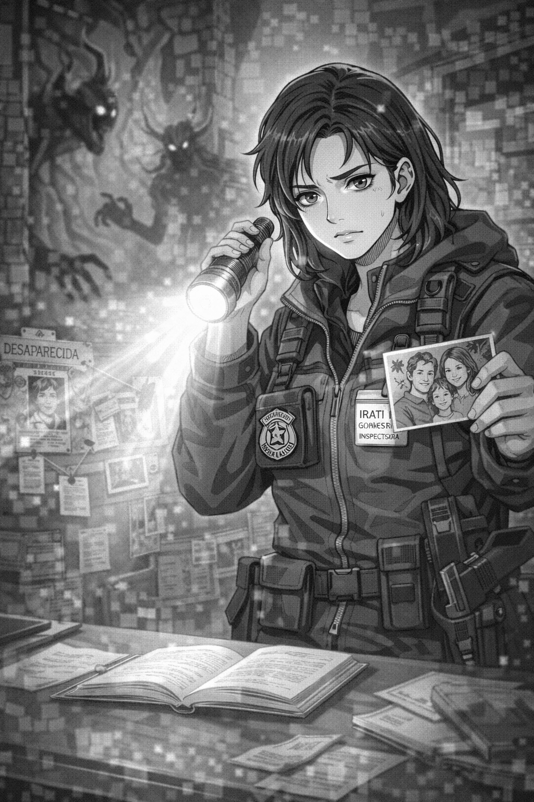

**Profesión:** experta en encontrar personas desaparecidas.

**Motivación:** ve patrones donde los demás no.

**Peculiaridad:** sueña con lugares que luego visita.

**Conflicto:** teme que sus habilidades la corrompan.

**Habilidades:** seguir rastros, analizar pistas.

**Conocimientos:** criminalística, supervivencia.

**Herramientas:** material de CSI.

**Armas:** una porra, una 9mm. No maneja otro tipo de armas.

**Atributos:** Es muy Perceptiva e intuitiva.

## Maksim Volkov

Albañil. *El constructor.*

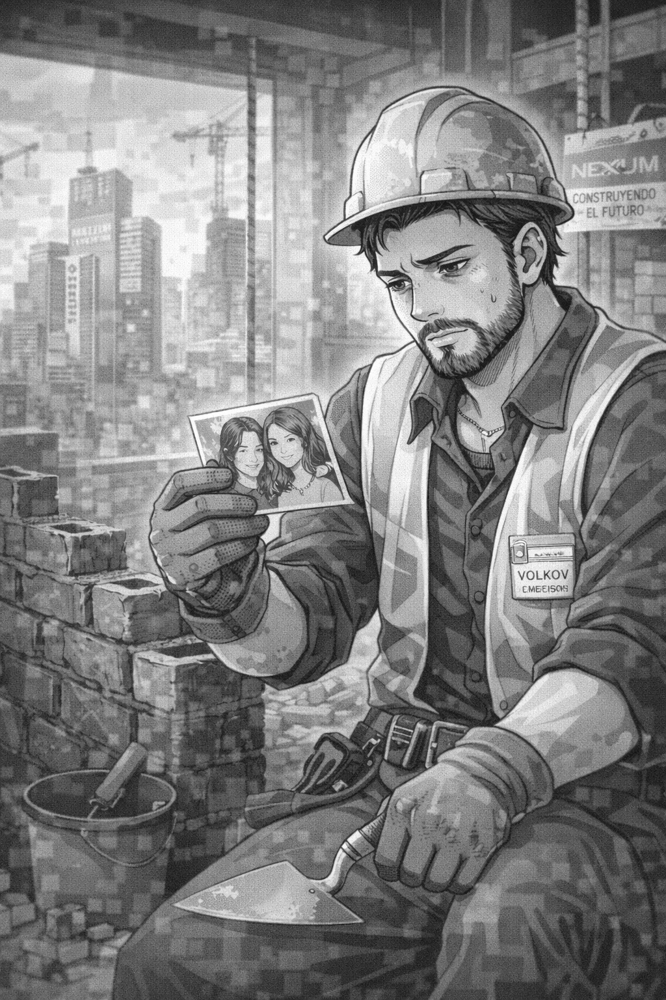

**Profesión:** obrero de la construcción.

**Motivación:** construir casas para que la gente viva en ellas.

**Peculiaridad:** se siente cómodo y tranquilo en edificios en obras.

**Conflicto:** su hija se ha unido voluntariamente a un proyecto de Nexum.

**Habilidades:** construir.

**Conocimientos:** albañilería.

**Herramientas:** las propias de un albañil.

**Armas:** n/a.

**Atributos:** es Fuerte y perseverante.

## Clara Mendizabal

Restauradora de arte. *La restauradora.*

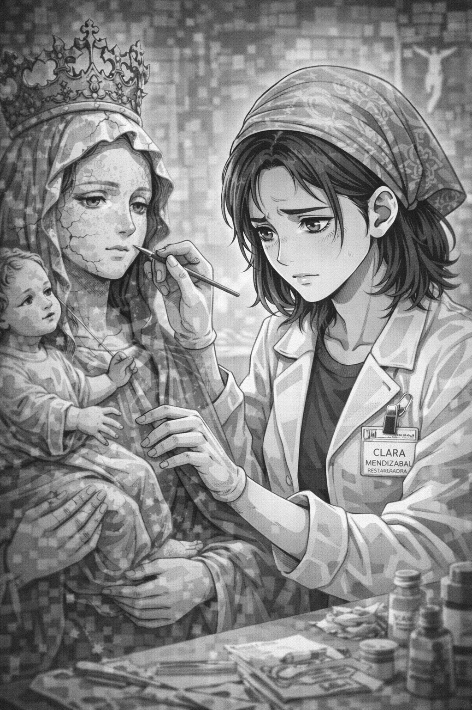

**Profesión:** restauradora de arte sacro.

**Motivación:** ayudar a que la gente conecte con Dios a través del arte sacro.

**Peculiaridad:** percibe emociones en objetos antiguos.

**Conflicto:** empieza a notar que algunas piezas “ya no sienten nada”.

**Habilidades:** hablar con las obras de arte.

**Conocimientos:** el Arte a lo largo de la Historia.

**Herramientas:** pinceles, lienzos, pintura...

**Armas:** la información que le proporcionan las obras de arte.

**Atributos:** es muy Perceptiva.

## Youssef Benali

Repartidor. *El repartidor.*

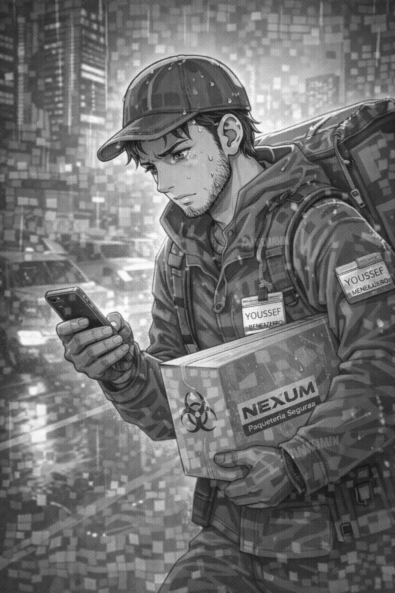

**Profesión:** transportista de última milla.

**Motivación:** recibir paquetes alegra a la gente.

**Peculiaridad:** nunca se pierde, incluso sin mapas, su orientación es perfecta.

**Conflicto:** se arrepiente de haber entregado paquetes para Nexum con contenido dudosamente legal.

**Habilidades:** orientación, conducir todo tipo de vehículos.

**Conocimientos:** la ubicación de muchos lugares.

**Herramientas:** mapas.

**Armas:** ocultación.

**Atributos:** posee una gran Memoria.

## Leire Ugarte

Artista. *La cantante.*

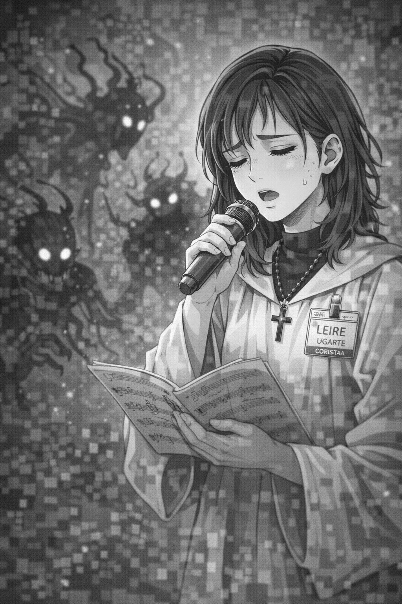

**Profesión:** vocalista de coro.

**Motivación:** encontrar una melodía que devuelva la felicidad a quienes la oyen.

**Peculiaridad:** su voz calma durante un rato a los vacíos.

**Conflicto:** teme que su don sea exactamente lo que Nexum quiere copiar.

**Habilidades:** tranquilizar.

**Conocimientos:** n/a.

**Herramientas:** su voz.

**Armas:** su canto puede manipular las mentes de sus enemigos.

**Atributos:** corrientes.

## Héctor Salinas

Abogado. *El defensor.*

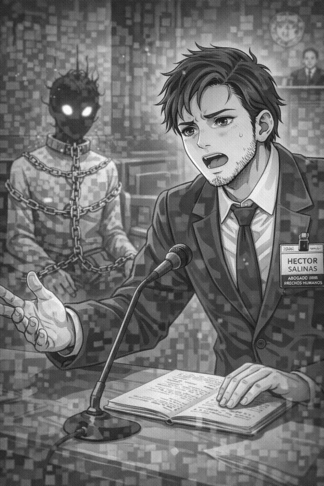

**Profesión:** abogado especialista en Derechos Humanos.

**Motivación:** solucionar la amenaza de Nexum usando la Ley.

**Peculiaridad:** defiende causas que sabe que va a perder.

**Conflicto:** su mejor amigo, también abogado por los DDHH fue vaciado y ahora defiende a Nexum.

**Habilidades:** convencer con su discurso.

**Conocimientos:** leyes.

**Herramientas:** papel y boli.

**Armas:** es capaz de convencer a enemigos legales.

**Atributos:** posee Memoria e Inteligencia.

## Naia Uribe

Estudiante. *La chica que sueña con un pincel y un lienzo.*

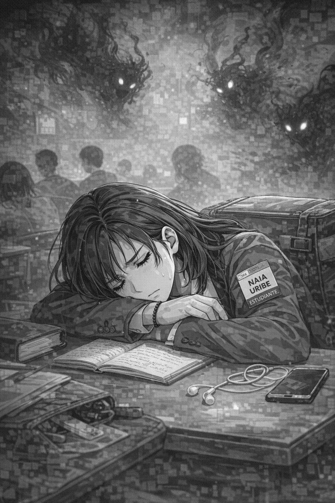

**Profesión:** estudiante de Bellas Artes.

**Motivación:** entender por qué no sueña.

**Peculiaridad:** no sueña nunca, pero cuando cierra los ojos tiene visiones de un ser malvado.

**Conflicto:** podría estar enlazada a Lucifer… o ser inmune a Nexum.

**Habilidades:** plasmar sus sueños en obras.

**Conocimientos:** sus sueños son premonitorios.

**Herramientas:** pincel, lienzo, papel...

**Armas:** anticiparse a lo que sucede.

**Atributos:** tiene una gran Destreza artística.
