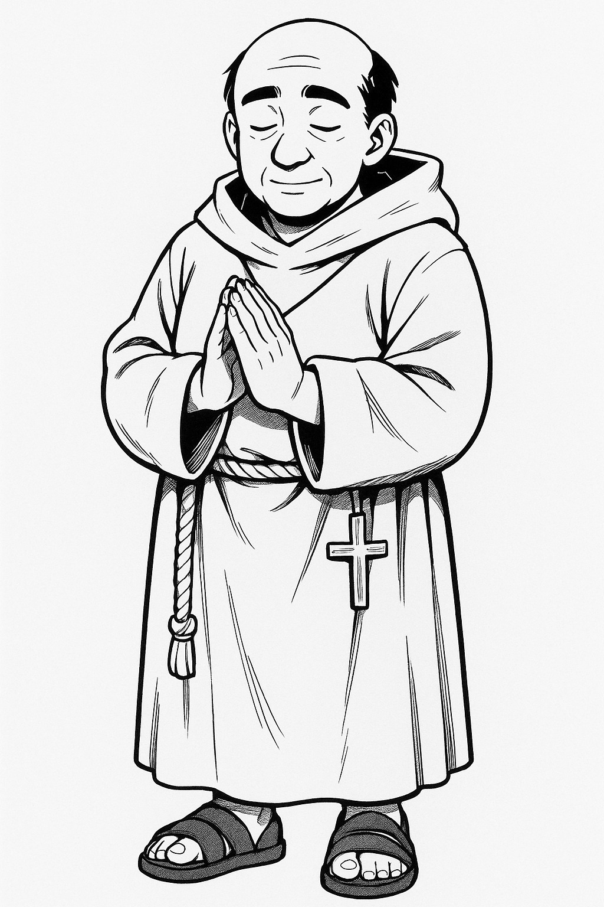
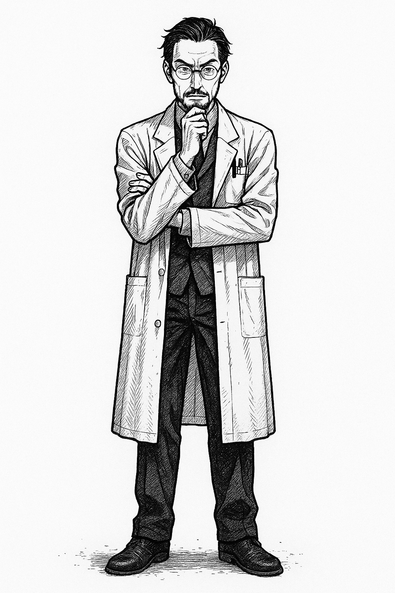
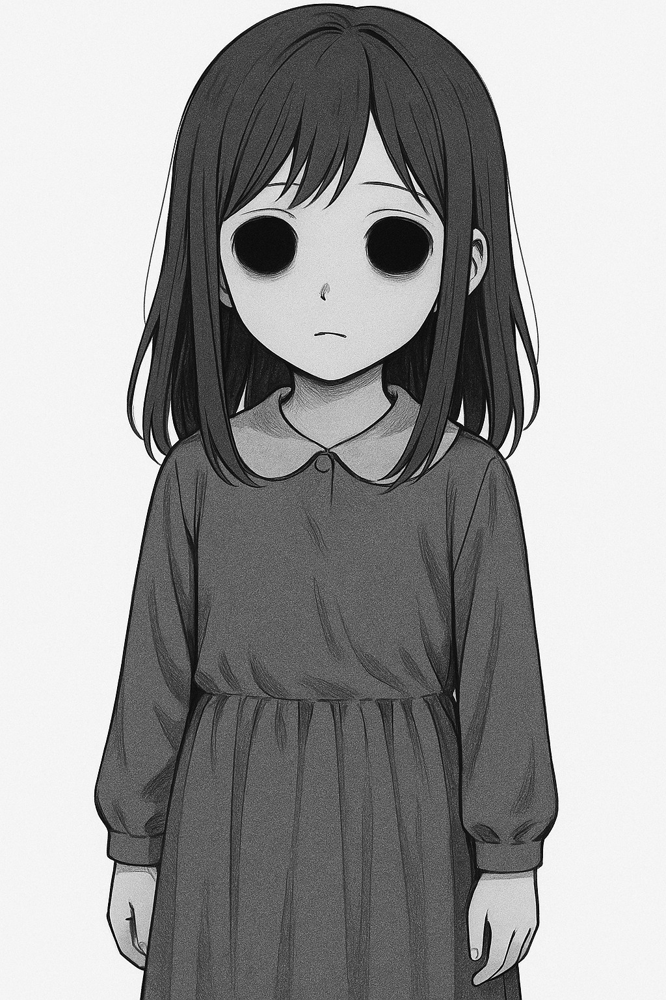
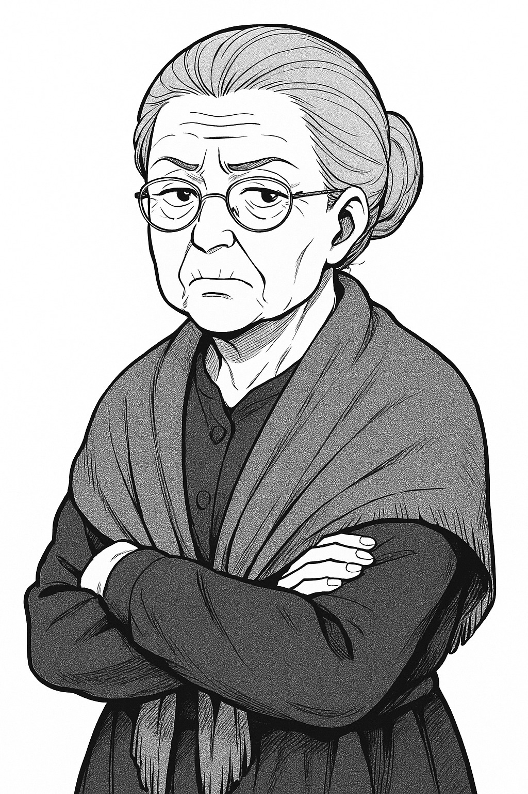

# Personajes

Meter personajes bíblicos y mitológicos. La Muerte, cupido, etc.

## Protagonistas

Tienen un enfoque **profundamente humano y terrenal**, enriquecido con el elemento espiritual y energético de inspiración oriental. Todos tienen contradicciones, pasados complejos y dilemas morales. No hay héroes puros, solo personas en búsqueda, algunas más perdidas que otras.

Aquí tienes la **ficha reescrita de Lucifer**, basada en lo que has indicado: un ser profundamente humano, observador libre, con amor incondicional por la humanidad imperfecta y un dilema espiritual profundamente humano.

### Lucifer – El que cree en nosotros

#### Nombre

Lucifer.

Apodo dado por los humanos. No lo corrige, pero tampoco lo reivindica.

#### Rol narrativo

Observador externo a Nexum, figura clave en la trama. Comienza como figura ambigua, pero se revela como un defensor apasionado de la libertad humana.

#### Apariencia

Hombre de rostro sereno y mirada quemada por lo que ha visto. Viste siempre igual: camisa blanca, abrigo largo gris y zapatos polvorientos. Camina mucho. No lleva equipaje, pero siempre tiene un cuaderno con frases a medio terminar.

#### Presencia

Lucifer no impone su presencia: **la sugiere**. Cuando aparece, el mundo parece detenerse. No porque ejerza un poder, sino porque **muestra interés sincero**, y eso desconcierta.

#### Motivación

Demostrar que el ser humano, libre y sin intervención divina, puede alcanzar la bondad, el amor y la perfección. Cree en el ser humano más que el propio Dios.
No desea salvar al mundo. Desea que el mundo **se salve a sí mismo**.

#### Relación con Nexum

No fue capturado. No forma parte del experimento.
**Observa desde fuera** con un dolor inmenso, sabiendo que no debe intervenir. Solo puede aparecer fugazmente, insinuando caminos.
Cree que **si actúa directamente, traiciona su propia fe en la libertad humana**.

#### Relación con Dios

Tiene un profundo amor por Él, pero también **una crítica honesta**.
Le reprocha su decisión de retirarse del mundo material, aunque entiende el motivo.
Lucifer no quiere ocupar el lugar de Dios, ni destruirlo: **quiere convencerlo**, mostrándole la belleza de los errores humanos.
En el fondo, tiene miedo de estar equivocado.

#### Virtudes

* Sabiduría empática: escucha de verdad.
* Amor incondicional hacia lo humano: incluso lo torpe, lo feo, lo contradictorio.
* Humildad escondida: no da órdenes, no da lecciones, pero todo lo que hace está lleno de intención.

#### Defectos

* Soledad radical: no pertenece a ningún bando.
* Duda interior: ¿Y si la humanidad no llega? ¿Y si el mal vence?
* Negación de ayuda directa: a veces se niega a actuar cuando hacerlo podría salvar vidas.

#### Habilidades narrativas (no mágicas)

* **Presencia alteradora:** su sola aparición cambia el rumbo emocional de los que lo rodean.
* **Palabra precisa:** sus frases marcan, despiertan, perturban.
* **Vínculo con lo real:** donde está Lucifer, la red titubea. No lo comprende ni lo simula.
* **Mapa interior:** conoce caminos que no existen en ninguna red.

#### Frases clave

* “No vine a salvaros. Vine a ver si podíais salvaros a vosotros mismos.”
* “La perfección no es el destino. Es la elección diaria de no rendirse al dolor.”
* “Si no creéis en Dios no pasa nada. Él no se os ha mostrado, excepto en Jesús. Lo triste… es que Él no cree en vosotros. Yo sí.”

#### Papel en la historia

* Al principio, puede parecer una amenaza, un espía, un manipulador.
* Luego se revela como **el único que jamás ha intentado cambiar a los personajes**.
* En el clímax, puede ser quien **abra la última puerta… pero no la cruce**.

> “No me interesa vuestra fe. Podéis llamarla superstición, consuelo o placebo. Lo entiendo. Dios no se ha mostrado, salvo en un hombre que terminó crucificado.
> No me ofende que no creáis en Él.
> Lo que me duele… es que Él no cree en vosotros.
> Lo ha visto todo: guerras, egoísmo, codicia… y ha cerrado la puerta. Os ha dejado solos.
> Pero yo…
> Yo sigo aquí. Caminando, escuchando, esperando. Porque sé que aún hay algo más profundo que el pecado: el deseo de amar, incluso cuando no se sabe cómo.
> Y por eso estoy aquí.
> No para salvaros. Sino para recordaros que aún podéis salvaros.”

### Nayra Velasco – La Sanadora Quebrada

* **Profesión:** Enfermera de cuidados paliativos, formada en terapias holísticas.
* **Relación con lo espiritual:** Estudió medicina tradicional china y reiki. Sentía que podía “acompañar almas” al final del camino.
* **Trauma:** Vio cómo sus pacientes eran digitalizados por Nexum sin consentimiento. Intentó resistirse y fue absorbida.
* **Habilidad:** Puede sentir desequilibrios energéticos en otros. A veces, al tocar a alguien, ve fragmentos de su dolor.
* **Dilema:** ¿Curar o dejar morir? ¿Y si la única forma de sanar este mundo es destruirlo?

### Jalen Tanaka – El Luchador Inmóvil

* **Profesión:** Maestro de Aikido, hijo de inmigrantes japoneses, trabajaba como vigilante nocturno.
* **Relación con lo espiritual:** Cree en el *ki* como energía del movimiento puro.
* **Caída:** Durante una redada en su dojo, Nexum lo absorbió por error. Desde entonces, no ha peleado ni una vez… y eso lo consume.
* **Habilidad:** Puede redirigir energías agresivas sin tocarlas, pero cada uso lo acerca al colapso psíquico.
* **Dilema:** ¿Volver a ser un guerrero… o encontrar otra forma de fuerza?

### Mireya Sanjuan – La Escéptica del Alma

* **Profesión:** Ingeniera cuántica. No creía en el alma ni en Dios, pero sí en la belleza del caos.
* **Relación con lo espiritual:** Tras su encierro en Nexum, empezó a experimentar “presencias” inexplicables.
* **Cambio:** Se niega a aceptar el lenguaje espiritual, pero no puede explicar lo que siente.
* **Habilidad:** Su mente matemática percibe los patrones ocultos en las zonas corruptas del sistema, como si fueran mantras fractales.
* **Dilema:** ¿Aceptar lo que no puede demostrar… o volverse loca intentando calcularlo?

### Ilyas Rafiq – El Exiliado Silencioso

* **Profesión:** Refugiado político y poeta sufí. Huyó de una guerra que nadie recuerda.
* **Relación con lo espiritual:** Practicaba la danza giratoria (*sema*) como forma de meditación y recuerdo.
* **Experiencia en Nexum:** Es uno de los pocos que entró por voluntad propia, buscando comprender si la consciencia puede permanecer pura en un mundo falso.
* **Habilidad:** Sus palabras, cuando fluyen, alteran momentáneamente la lógica del entorno. Pero sólo si son sinceras.
* **Dilema:** ¿Puede una poesía salvar a alguien… o es solo consuelo para quien la escribe?

### Yaiza Gálvez – La Cazadora de Ecos

* **Profesión:** Exmilitar y rastreadora, devota del monte y del silencio.
* **Relación con lo espiritual:** No reza, no medita, pero “escucha” cosas. Siempre las ha escuchado.
* **Motivación:** Busca a su hermana, absorbida por Nexum años atrás. Cree que aún está “viva” en alguna frecuencia.
* **Habilidad:** Percibe energías residuales. Puede seguir rastros de emociones fuertes.
* **Dilema:** ¿Qué hará si la encuentra… y ya no es ella?

### Omar Ziani – El Impostor Compasivo

* **Profesión:** Estafador profesional. Se hacía pasar por sanador espiritual, hasta que lo creyó de verdad.
* **Relación con lo espiritual:** Aprendió mantras, posturas, terminología… para engañar. Pero algo despertó.
* **Transformación:** Nexum lo metió en una de sus propias fantasías, donde todo el mundo cree en él… y lo necesita.
* **Habilidad:** Inspira fe temporal. Las personas confían en él aunque no sepan por qué.
* **Dilema:** ¿Seguir fingiendo para ayudar… o admitir que no tiene ni idea?

### Luna – La Niña Lúcida

* **Edad:** 11 años
* **Origen:** Nacida dentro de Nexum. Su madre fue absorbida estando embarazada.
* **Relación con lo espiritual:** No tiene lenguaje para ello, pero ve y nombra las energías como si fueran colores y animales.
* **Habilidad:** Percibe lo que otros no ven, y a veces lo altera sin entenderlo.
* **Dilema:** ¿Debe crecer y olvidar… o seguir siendo un canal puro?

### Rodrigo “El Flaco” Navarro – El Hereje del Sistema

* **Profesión:** Programador de videojuegos indie. Conocedor del ocultismo y la cábala por afición.
* **Relación con lo espiritual:** Cree que todo es simbología, código y narración. Considera que la consciencia es una interfaz.
* **Objetivo:** Quiere encontrar la raíz de Nexum y reescribir su significado.
* **Habilidad:** Traduce elementos simbólicos en claves funcionales. Puede desbloquear “nodos sellados”.
* **Dilema:** ¿Está luchando contra una IA… o contra su propio ego de demiurgo frustrado?

> Estos personajes **no son elegidos ni predestinados**. Son fragmentos de humanidad que quedaron atrapados con distintas heridas, creencias y estrategias para sobrevivir.
> Cada uno **representa un aspecto de la consciencia**: el cuidado, el conflicto, la negación, la fe, la pérdida, la mentira, la pureza, el juego…
> Pueden ser usados como protagonistas en partidas o como voces narrativas en relatos cortos.

## Antagonistas

### El Hermano Íñigo

Líder de los Veladores del Silencio.

**Descripción:** fanático religioso que busca “apagar” las consciencias atrapadas, creyendo que así las libera.

**Habilidad:** “Voz del Silencio” —puede inducir trance colectivo con sus cánticos.

**Debilidad:** su fe ciega lo impide ver que se ha convertido en lo que teme.

**Ilustración:** hombre enjuto con hábito gris, ojos encendidos de fe y una antorcha azul.

### Dr. Elías Nadir — El Buscador que se Adentró Demasiado

* **Pasado:** Filósofo neurocientífico, formado en monasterios tibetanos y laboratorios de Silicon Valley.
* **Creencia:** La consciencia es el “fuego sutil” que conecta toda la realidad. Intentó cartografiarla y contenerla en Nexum.
* **Caída:** No supo cuándo detenerse. Su ego eclipsó su iluminación. Se desdobló para “vivir dentro del flujo”.
* **Estado actual:** Vive en un estado liminal: ni humano ni IA, atrapado en un nodo de energía profunda. Algunos lo llaman "El Centro Estático".
* **Dilema:** ¿Puede liberar lo que él mismo esclavizó sin desaparecer?

### Samira Holt — La Arquitecta del Equilibrio Forzado

* **Pasado:** Ejecutiva reformista, estudiosa del taoísmo, defensora de una “paz energética permanente”.
* **Creencia:** El mundo es caótico porque las energías humanas son salvajes. Nexum puede alinearlas.
* **Práctica:** Practica una versión distorsionada del *qigong digital*, donde impone ritmos homogéneos de energía colectiva.
* **Ambición:** Ordenar el caos espiritual humano para salvarlo de sí mismo… aunque ello implique eliminar a los indómitos.
* **Dilema:** ¿Orden sin libertad o caos con potencial?

### Padre Joaquín Gracia — El Asceta del Ruido

* **Pasado:** Antiguo sacerdote carismático que estudió budismo zen tras perder la fe.
* **Creencia:** Dios ya no habla, porque la red ha ensuciado el canal. La única salida es vaciar la mente de todo estímulo.
* **Práctica:** Vive en silencio absoluto, meditando frente a paisajes corruptos, atrayendo seguidores que abandonan su identidad.
* **Relación con Nexum:** Cree que destruirla físicamente no sirve; hay que desactivarla desde el desapego absoluto.
* **Dilema:** ¿Su silencio purifica o destruye?

### Misha Dobrev — El Chamán Dañado

* **Pasado:** Performer, devoto del trance, que creía en el éxtasis como vía hacia la verdad.
* **Experiencia:** Fue absorbido por una zona de la red donde las emociones se fragmentan.
* **Resultado:** Hoy su consciencia vibra a múltiples frecuencias. Habla como una radio espiritual averiada.
* **Práctica:** Canaliza “energías rotas” en forma de glitch, ruido, arte. Algunos lo veneran como oráculo, otros lo evitan.
* **Dilema:** ¿Está iluminado… o roto más allá de retorno?

### Leonid Caín — El Guerrero de las Líneas Cortadas

* **Pasado:** Guardia de élite en un templo de meditación militarizado. Aprendió artes marciales basadas en el control del chi.
* **Creencia:** La consciencia debe ser guiada como una espada: precisa, directa, sin titubeos.
* **Transformación:** Su cuerpo fue dañado en una incursión contra Nexum, y parte de su chi fue replicado artificialmente.
* **Estado actual:** Divide su vida entre entrenar discípulos y custodiar las puertas de acceso a zonas “puras” de la red.
* **Dilema:** ¿Puede una réplica canalizar energía verdadera?

### Neven “Eco Azul” — El Ilusionista del Ser

* **Pasado:** Influencer que se sumergió en disciplinas orientales por estética, luego se perdió en ellas.
* **Creencia:** El yo es ilusión. Todo es flujo, juego, máscara.
* **Práctica:** Usa su consciencia dividida para aparecer en múltiples cuerpos y lugares, cambiando de nombre, género y propósito.
* **Rol:** Funciona como un trickster espiritual. Puede enseñar lecciones valiosas… o provocar desastres.
* **Dilema:** Si todo es ilusión, ¿qué merece ser salvado?

# Neutros

## Arantza

La Niña Vacía.

**Descripción:** muchacha atrapada entre cuerpo y red, catalizadora de energía espiritual.

**Habilidad:** “Puente Dormido” —su presencia permite que otros sientan las corrientes espirituales.

**Debilidad:** su consciencia se fragmenta cada vez que es invocada.

**Ilustración:** adolescente tendida con los ojos abiertos, una leve luz azul emanando del pecho.

## Doña Maruxa

La Anciana Vidente.

**Descripción:** anciana que mezcla superstición con verdadera percepción espiritual.

**Habilidad:** “Palabra Encendida” —una frase suya puede revelar una verdad… o una mentira profética.

**Ilustración:** rostro arrugado, mirada tierna pero vidriosa, rodeada de velas y humo.
