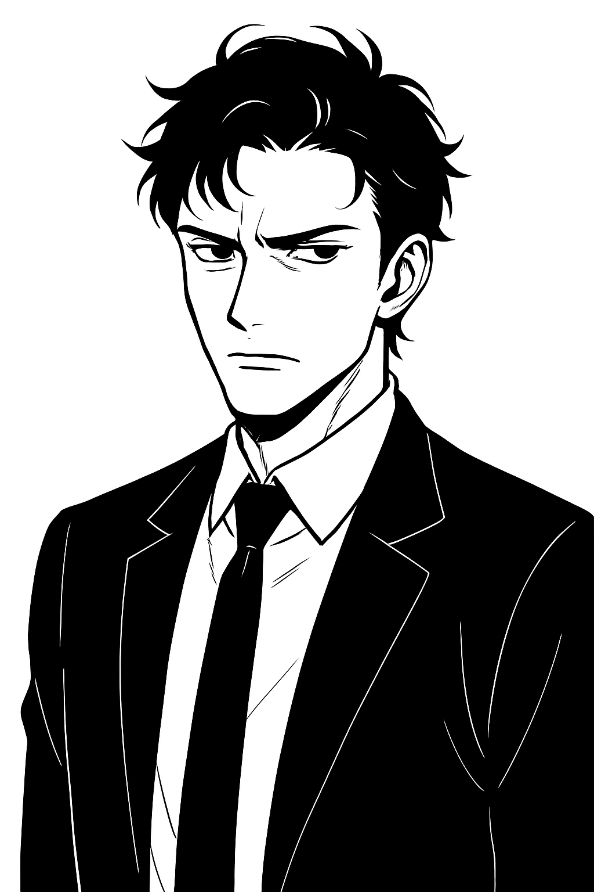

# Personajes

Meter personajes bíblicos y mitológicos. La Muerte, cupido, etc.

## Razas

### Humanos de Puerto Gris

- **Procedencia:** Ciudades portuarias decadentes, donde el comercio y los trenes eran el corazón de la vida.

- **Características:** Resistentes, curtidos por la pobreza, prácticos en todo lo que hacen.

- **Habilidades:**
  
  - **Supervivientes urbanos:** +1 al adaptarse en ciudades y mercados.
  
  - **Instinto pragmático:** siempre encuentran la forma de comerciar, improvisar o regatear.

- **Defecto:** desconfían de lo espiritual; tienden a ignorar lo invisible.

### Errantes de la Llama Azul

- **Procedencia:** Viajeros sin hogar, que siguen las señales del fuego azul por todo el mundo.

- **Características:** Peregrinos obsesivos, siempre al borde de la locura mística.

- **Habilidades:**
  
  - **Detector espiritual:** sienten cuándo un lugar vibra con energía sobrenatural.
  
  - **Resistencia física:** habituados a hambre, frío y largas caminatas.

- **Defecto:** obsesión peligrosa; ven señales en todas partes.

### Hijos del Silencio

- **Procedencia:** Monasterios aislados que veneran el silencio como forma de comunión.

- **Características:** Espirituales, disciplinados, austeros.

- **Habilidades:**
  
  - **Resistencia mental:** inmunes a la manipulación básica de recuerdos o emociones.
  
  - **Presencia calmante:** reducen tensiones y disputas con solo estar presentes.

- **Defecto:** dificultad para comunicarse; su cultura evita las palabras.

### Nómadas de Ruina

- **Procedencia:** Desiertos, páramos y viejas autopistas derruidas. Viven del saqueo y la búsqueda de chatarra.

- **Características:** Duros, desconfiados, expertos en supervivencia.

- **Habilidades:**
  
  - **Recolección de restos:** saben dónde encontrar piezas útiles.
  
  - **Conocimiento de ruinas:** reconocen trampas, grietas y estructuras inestables.

- **Defecto:** marginados; las ciudades los ven como ladrones.

### Vástagos de la Red Muerta

- **Procedencia:** Hijos de comunidades que vivieron cerca de nodos corrompidos. Algunos nacieron con mutaciones extrañas.

- **Características:** Humanos con rasgos peculiares: ojos fosforescentes, piel marcada, voces dobles.

- **Habilidades:**
  
  - **Sensibilidad espiritual:** perciben fragmentos de consciencia atrapados en objetos.
  
  - **Visión de corrientes:** ven patrones de energía invisible.

- **Defecto:** rechazados por miedo, vistos como monstruos o herejes.

### Guardianes del Chi

- **Procedencia:** Valles y bosques donde la energía vital sigue fluyendo. Custodian enclaves sagrados.

- **Características:** Armoniosos, disciplinados, conectados con la naturaleza.

- **Habilidades:**
  
  - **Canalización de energía:** redirigen ataques físicos o emocionales.
  
  - **Curación básica:** restauran vitalidad con prácticas espirituales.

- **Defecto:** fuera de sus enclaves, pierden gran parte de su poder.

### Hermanos del Fragmento

- **Procedencia:** Sectas urbanas que adoran los mensajes corrompidos de la antigua red.

- **Características:** Visionarios, fanáticos, obsesionados con símbolos.

- **Habilidades:**
  
  - **Interpretar fragmentos:** encuentran patrones en mensajes incompletos.
  
  - **Inspirar fe:** mueven masas con su creencia en el “lenguaje roto”.

- **Defecto:** confunden la superstición con la verdad; pueden arrastrar a otros al error.

### Forjados de Metal

- **Procedencia:** Individuos que usaron implantes tecnológicos para sobrevivir, pero ahora la tecnología está corroída y se funde con sus cuerpos.

- **Características:** Híbridos entre carne y metal, supervivientes extremos.

- **Habilidades:**
  
  - **Resistencia mecánica:** partes de su cuerpo aguantan golpes o cortes.
  
  - **Conexión residual:** sienten cuando una máquina antigua se “despierta”.

- **Defecto:** sufren dolores constantes, y las comunidades los consideran aberraciones.

## Profesiones

### Profesiones tecnológicas y del mundo decadente

#### Ingeniero de Ruinas

- **Descripción:** Heredero de un conocimiento a medias. No entiende toda la ciencia antigua, pero sabe reparar lo que otros han abandonado, improvisando con piezas que ya no existen.

- **Rasgos:** práctico, obstinado, con dedos siempre manchados de grasa.

- **Habilidades:**
  
  - **Reparar chatarra:** consigue que máquinas casi muertas funcionen un poco más.
  
  - **Improvisación:** puede sustituir piezas con materiales insólitos.
  
  - **Ojo clínico:** distingue enseguida lo útil de lo inútil en un montón de desechos.

- **Debilidad:** nunca arregla nada del todo; lo que funciona hoy puede fallar mañana.

#### Cartógrafo de Redes Muertas

- **Descripción:** Explora nodos, terminales y túneles donde aún laten fragmentos de datos antiguos. Sus mapas son mitad técnicos, mitad místicos.

- **Rasgos:** solitario, curioso, obsesionado con símbolos y líneas.

- **Habilidades:**
  
  - **Mapeo residual:** reconoce patrones de energía en cables, pantallas o ruinas.
  
  - **Lectura de datos corruptos:** descifra mensajes incompletos o dañados.
  
  - **Orientación digital:** nunca se pierde en estructuras tecnológicas.

- **Debilidad:** su obsesión por los mapas lo hace perder de vista lo inmediato.

#### Restaurador de Autómatas

- **Descripción:** Intenta devolver a la vida máquinas, drones y robots olvidados. Sus creaciones funcionan, pero siempre con un toque extraño, como si estuvieran “poseídas”.

- **Rasgos:** excéntrico, coleccionista, con cicatrices de accidentes pasados.

- **Habilidades:**
  
  - **Reparación avanzada:** puede devolver movimiento a máquinas inertes.
  
  - **Reprogramación rudimentaria:** da nuevas órdenes a viejos sistemas.
  
  - **Acompañante autómata:** suele llevar un robot defectuoso con funciones limitadas.

- **Debilidad:** los autómatas nunca son fiables; a menudo generan problemas inesperados.

#### Recolector de Chatarra Viva

- **Descripción:** Busca y comercia con restos de máquinas que parecen conservar un pulso extraño, como si tuvieran consciencia residual.

- **Rasgos:** codicioso, supersticioso, con buen olfato para lo raro.

- **Habilidades:**
  
  - **Instinto de hallazgo:** sabe dónde encontrar piezas valiosas.
  
  - **Extracción rápida:** desmonta estructuras sin destruir lo esencial.
  
  - **Detección de “vida”:** reconoce objetos que vibran con energía extraña.

- **Debilidad:** se arriesga demasiado por tesoros tecnológicos, aunque sean peligrosos.

#### Archivista Errante

- **Descripción:** Vaga por comunidades recopilando fragmentos de saber: discos, códices, documentos incompletos. Su mochila es un archivo vivo.

- **Rasgos:** culto, misterioso, con un aire de maestro o profeta.

- **Habilidades:**
  
  - **Memoria férrea:** recuerda textos enteros tras leerlos una vez.
  
  - **Comparación de fuentes:** encuentra patrones y contradicciones en documentos.
  
  - **Acceso social:** muchos lo respetan por su conocimiento.

- **Debilidad:** guarda demasiados secretos; no siempre distingue la verdad de la superstición.

#### Falsificador de Identidades

- **Descripción:** Manipula registros, credenciales y recuerdos para dar nuevas vidas a los demás… o a sí mismo.

- **Rasgos:** persuasivo, cínico, siempre con una sonrisa.

- **Habilidades:**
  
  - **Documentos creíbles:** crea papeles, carnés o marcas que engañan a la mayoría.
  
  - **Actuación convincente:** interpreta el rol de otra persona sin dudar.
  
  - **Hackeo menor:** altera registros básicos en terminales aún activos.

- **Debilidad:** si alguien investiga a fondo, la mentira se derrumba.

#### Vigilante de Generadores

- **Descripción:** Controla uno de los pocos puntos de energía que siguen activos. La comunidad depende de él para tener luz, calor o agua.

- **Rasgos:** autoritario, desconfiado, protector de su territorio.

- **Habilidades:**
  
  - **Mantenimiento eléctrico:** mantiene en marcha viejos generadores.
  
  - **Control de recursos:** puede cortar o dar energía a quien quiera.
  
  - **Negociador duro:** su poder le da ventaja en tratos.

- **Debilidad:** es temido pero no amado; si pierde su puesto, pierde todo.

### Profesiones espirituales

#### Tejedor de Sueños

- **Descripción:** Practicantes de la ensoñación lúcida y la vigilia alterada. Acompañan a otros en sus sueños o acceden a memorias enterradas.

- **Rasgos:** introspectivo, enigmático, habla en metáforas.

- **Habilidades:**
  
  - **Interpretar símbolos oníricos:** descubre verdades ocultas en los sueños.
  
  - **Sueño compartido:** puede entrar en trance con otro y compartir visiones.
  
  - **Resistencia a ilusiones:** distingue entre realidad y engaño espiritual.

- **Debilidad:** a veces queda atrapado en sus propios sueños, confundiendo lo vivido con lo soñado.

#### Portador de Mantras

- **Descripción:** Viajeros y místicos que coleccionan frases, cantos y vibraciones que alteran el flujo de energía en un lugar.

- **Rasgos:** apasionado, magnético, con voz poderosa.

- **Habilidades:**
  
  - **Recitar mantras:** calma o enciende las emociones de quienes escuchan.
  
  - **Invocar resonancia:** refuerza la energía positiva o rompe bloqueos espirituales.
  
  - **Protección rítmica:** los cantos protegen de la influencia de corrientes corruptas.

- **Debilidad:** depende de la voz y la concentración; si se interrumpe, el efecto se disipa.

#### Guardabosques del Chi

- **Descripción:** Protectores de enclaves donde aún fluye energía vital. Viven en bosques, montañas o ruinas donde lo espiritual aún respira.

- **Rasgos:** disciplinado, austero, conectado con la naturaleza.

- **Habilidades:**
  
  - **Sentir corrientes vitales:** detecta zonas de energía pura o corrompida.
  
  - **Canalización marcial:** redirige ataques o tensiones con su propio flujo.
  
  - **Sanación física básica:** usa la energía de los lugares puros para acelerar recuperación.

- **Debilidad:** fuera de sus enclaves pierde fuerza y confianza.

#### Oráculo de Silencio

- **Descripción:** Ascetas que viven en completo silencio, escuchando lo que otros no oyen. Sus gestos y miradas transmiten tanto como sus visiones.

- **Rasgos:** callado, misterioso, paciente.

- **Habilidades:**
  
  - **Escucha profunda:** percibe emociones ocultas en los demás.
  
  - **Visiones repentinas:** anticipa breves fragmentos del futuro.
  
  - **Presencia calma:** reduce tensiones y hostilidad a su alrededor.

- **Debilidad:** se expresa con dificultad; otros interpretan sus silencios según convenga.

#### Sanador de Corrientes

- **Descripción:** No cura heridas físicas, sino las distorsiones de la consciencia: traumas, bloqueos, cuerpos atrapados entre vida y red.

- **Rasgos:** compasivo, dedicado, con mirada firme.

- **Habilidades:**
  
  - **Equilibrar energías:** restaura la calma interior en otros.
  
  - **Conectar con atrapados:** contacta con personas en estado de “cuerpo vacío”.
  
  - **Resistencia espiritual:** soporta la influencia de energías hostiles durante más tiempo.

- **Debilidad:** absorber el dolor de otros lo consume, provocando agotamiento o crisis personales.

#### Encantador de Espíritus Digitales

- **Descripción:** Nómadas que creen que fragmentos de consciencia atrapada en máquinas pueden ser convencidos, calmados o utilizados.

- **Rasgos:** arriesgado, carismático, ambiguo.

- **Habilidades:**
  
  - **Hablar con fragmentos:** interpreta las frases incoherentes de sistemas corruptos.
  
  - **Negociación espiritual:** calma a consciencias atrapadas, evitando su colapso.
  
  - **Invocar ecos:** despierta recuerdos residuales en objetos tecnológicos.

- **Debilidad:** cada contacto lo marca; puede llevar consigo voces que no sabe si son propias o ajenas.

### Profesiones religiosas

#### Monje del Eco

- **Descripción:** Creen que cada palabra, cada sonido, queda resonando para siempre en la realidad. Dedican su vida a escuchar y repetir los ecos de oraciones antiguas.

- **Rasgos:** contemplativo, ritualista, obsesionado con la memoria oral.

- **Habilidades:**
  
  - **Eco ritual:** repitiendo una frase sagrada, puede reforzar la voluntad de los demás.
  
  - **Memoria oral:** recuerda textos, cantos y discursos enteros.
  
  - **Escucha resonante:** capta palabras o murmullos que otros pasan por alto.

- **Debilidad:** si pierde la voz o es interrumpido, pierde su fuerza y confianza.

#### Custodio de Reliquias

- **Descripción:** Guardián de restos antiguos —tecnológicos o simbólicos— que la gente venera como milagros. A menudo cree sinceramente en su poder, aunque no los entienda.

- **Rasgos:** protector, supersticioso, terco.

- **Habilidades:**
  
  - **Uso de reliquias:** activa de manera rudimentaria dispositivos antiguos.
  
  - **Autoridad sagrada:** inspira respeto por portar objetos venerados.
  
  - **Protección ritual:** puede sellar o bendecir lugares con los símbolos que custodia.

- **Debilidad:** depende de objetos externos; sin ellos pierde influencia.

#### Predicador del Fin Azul

- **Descripción:** Líder carismático que asegura que la llama azul es señal de un apocalipsis o de la llegada de un nuevo dios oculto. Puede levantar multitudes con sus palabras.

- **Rasgos:** fanático, persuasivo, magnético.

- **Habilidades:**
  
  - **Oratoria:** arrastra a masas con su discurso.
  
  - **Intimidación moral:** usa la fe para doblegar la voluntad de otros.
  
  - **Detectar debilidad:** reconoce las dudas espirituales de las personas.

- **Debilidad:** necesita público; sin seguidores, se derrumba como un hombre vacío.

#### Hermanas del Velo

- **Descripción:** Congregación femenina que vela a los “cuerpos vacíos”, rezando y cuidando de ellos como si aún estuvieran vivos. Algunas creen que pueden devolverles el alma.

- **Rasgos:** compasivas, ritualistas, severas.

- **Habilidades:**
  
  - **Cuidado de cuerpos vacíos:** saben mantener vivos a los atrapados.
  
  - **Protección espiritual:** crean un entorno de calma y fe que reduce el miedo.
  
  - **Red de apoyo:** sus conventos están presentes en muchas comunidades.

- **Debilidad:** su fe a veces las hace inmóviles; prefieren rezar antes que actuar.

#### Exorcista de Nexum

- **Descripción:** Figuras híbridas entre sacerdote y técnico. Usan rituales de oración mezclados con descargas eléctricas y símbolos para “liberar” consciencias atrapadas.

- **Rasgos:** intenso, obsesivo, austero.

- **Habilidades:**
  
  - **Ritual de liberación:** puede desconectar temporalmente a un cuerpo vacío.
  
  - **Conocimiento técnico rudimentario:** sabe usar energía y símbolos eléctricos.
  
  - **Disciplina férrea:** resiste la corrupción espiritual mejor que otros.

- **Debilidad:** sus métodos son peligrosos y pueden dañar a la víctima.

#### Sacerdote de los Fragmentos

- **Descripción:** Líderes de templos donde se adoran mensajes corruptos de viejas redes como si fueran escrituras divinas. Interpretan cada fragmento como una profecía.

- **Rasgos:** visionario, ambiguo, con un aire de iluminado.

- **Habilidades:**
  
  - **Interpretar fragmentos:** descifra mensajes incompletos en clave profética.
  
  - **Inspirar fe:** da sentido al caos y la incertidumbre.
  
  - **Conexiones sociales:** sus templos atraen a pobres, desesperados y buscadores.

- **Debilidad:** sus interpretaciones son arbitrarias; puede llevar a otros a error mortal.

### Profesiones de magia y brujería

#### Brujo de las Sombras

- **Descripción:** Usa símbolos pintados, tatuajes y marcas en la piel para alterar la percepción del entorno y manipular miedos.

- **Rasgos:** inquietante, ambiguo, nocturno.

- **Habilidades:**
  
  - **Marcas protectoras:** dibuja símbolos que crean calma o miedo.
  
  - **Manipulación de sombras:** altera la luz para confundir o intimidar.
  
  - **Presencia oscura:** genera desconfianza, pero también respeto.

- **Debilidad:** depende de la fe de los demás en sus símbolos; sin miedo, su poder se disuelve.

#### Alquimista de Ondas

- **Descripción:** Mezcla sustancias, sonidos y vibraciones para alterar estados emocionales y espirituales.

- **Rasgos:** excéntrico, obsesionado con las frecuencias.

- **Habilidades:**
  
  - **Elixires sensoriales:** pociones que alteran percepciones o provocan trances.
  
  - **Resonancia sonora:** usa tambores, cuencos o instrumentos para influir en las energías.
  
  - **Control del ambiente:** puede calmar una multitud o provocar euforia.

- **Debilidad:** sus mezclas son inestables; pueden volverse veneno o causar locura.

#### Caminante de Espíritus

- **Descripción:** Afirma poder abandonar su cuerpo y recorrer otros planos espirituales o digitales, aunque siempre a riesgo de no volver.

- **Rasgos:** solitario, misterioso, de mirada perdida.

- **Habilidades:**
  
  - **Proyección espiritual:** su consciencia viaja fuera del cuerpo por instantes.
  
  - **Exploración de planos ocultos:** capta detalles que otros no ven.
  
  - **Conexión con atrapados:** puede acercarse a quienes quedaron entre vida y red.

- **Debilidad:** su cuerpo queda indefenso; si lo hieren en trance, puede morir sin despertar.

#### Medium de Resonancias

- **Descripción:** Actúa como puente entre vivos y fragmentos de consciencias atrapadas en viejas máquinas o cuerpos vacíos.

- **Rasgos:** sensible, vulnerable, crédulo.

- **Habilidades:**
  
  - **Comunicación con fragmentos:** transmite mensajes de consciencias atrapadas.
  
  - **Lectura de vibraciones:** reconoce energías en objetos y lugares.
  
  - **Canalización involuntaria:** a veces habla con voces ajenas.

- **Debilidad:** corre el riesgo de perder su propia identidad si acoge demasiadas voces.

#### Herbolario de Flujos

- **Descripción:** Mezcla hierbas, raíces y sustancias con rituales de respiración y energía. Sus remedios alteran la consciencia y el cuerpo.

- **Rasgos:** práctico, campesino, enraizado en lo ancestral.

- **Habilidades:**
  
  - **Pócimas de visión:** brebajes que abren la percepción espiritual.
  
  - **Ungüentos de energía:** alivian dolor y fatiga.
  
  - **Rituales con humo:** purifican o contaminan ambientes.

- **Debilidad:** depende de ingredientes raros y de temporada; sus remedios nunca son permanentes.

#### Lector de Cicatrices

- **Descripción:** Cree que el cuerpo guarda la historia del alma en cada marca, herida o pliegue de la piel.

- **Rasgos:** observador, inquietante, directo.

- **Habilidades:**
  
  - **Interpretar marcas:** revela traumas, destinos o secretos de las cicatrices.
  
  - **Empatía corporal:** conecta con el dolor físico y lo calma.
  
  - **Lectura energética:** las heridas recientes revelan influencias invisibles.

- **Debilidad:** su obsesión puede llevarlo a ver presagios donde no los hay.

#### Nigromante de Memorias

- **Descripción:** Especialista en recuperar recuerdos borrados o fragmentados, aunque siempre distorsionados.

- **Rasgos:** melancólico, intenso, cargado de culpa.

- **Habilidades:**
  
  - **Restauración parcial:** revive recuerdos olvidados en una persona o máquina.
  
  - **Invocación de memorias:** muestra imágenes del pasado en un lugar marcado.
  
  - **Atar recuerdos:** conserva memorias en objetos rituales.

- **Debilidad:** sus trabajos nunca son limpios; lo recuperado siempre está contaminado, y puede confundir más que ayudar.

### Profesiones marginales y fronterizas

#### Mercader de Egos

- **Descripción:** Comerciante clandestino que compra y vende fragmentos de recuerdos, voces o consciencias debilitadas.

- **Rasgos:** calculador, persuasivo, seductor.

- **Habilidades:**
  
  - **Intercambio de memorias:** puede implantar recuerdos ajenos en alguien.
  
  - **Red de contactos:** siempre conoce a alguien dispuesto a comprar.
  
  - **Olfato de oportunidad:** detecta debilidad en las personas.

- **Debilidad:** corre el riesgo de perder su propia identidad al manipular tantas memorias.

#### Mendigo Visionario

- **Descripción:** Vive en trance perpetuo, mezclando hambre, fe y locura. Sus palabras parecen delirio, pero a veces son verdades inesperadas.

- **Rasgos:** errático, inquietante, impredecible.

- **Habilidades:**
  
  - **Visiones involuntarias:** revela fragmentos de futuro o pasado.
  
  - **Inspirar compasión:** su fragilidad abre puertas que a otros se cierran.
  
  - **Conexión espiritual bruta:** atrae energías sin buscarlas.

- **Debilidad:** sus visiones son caóticas y difíciles de interpretar.

#### Contrabandista de Símbolos

- **Descripción:** Trafica con reliquias, marcas, grafitis arrancados de muros y objetos con poder espiritual.

- **Rasgos:** atrevido, ingenioso, desconfiado.

- **Habilidades:**
  
  - **Mercado negro espiritual:** consigue artefactos extraños o prohibidos.
  
  - **Rutas ocultas:** conoce caminos secretos en ciudades y ruinas.
  
  - **Valoración de objetos:** sabe qué símbolos son auténticos y cuáles son falsos.

- **Debilidad:** perseguido por facciones religiosas y tecnológicas; siempre está en peligro.

#### Errante de la Llama Azul

- **Descripción:** Peregrino que viaja de comunidad en comunidad buscando la manifestación del fuego azul. Se le considera loco… o profeta.

- **Rasgos:** obsesivo, místico, nómada.

- **Habilidades:**
  
  - **Detector espiritual:** reconoce lugares donde la consciencia se desborda.
  
  - **Carisma inquietante:** inspira devoción o rechazo inmediato.
  
  - **Resistencia extrema:** ha vagado tanto que soporta hambre, sed y fatiga.

- **Debilidad:** su obsesión lo ciega; todo lo interpreta como señal del fuego azul.

#### Sepulturero de Cuerpos Vacíos

- **Descripción:** Encargado de enterrar o custodiar a quienes quedaron atrapados entre vida y red. Algunos creen que los usa para rituales secretos.

- **Rasgos:** taciturno, metódico, duro.

- **Habilidades:**
  
  - **Manejo de cuerpos:** sabe cómo preservar o manipular a los “cuerpos vacíos”.
  
  - **Conocimiento de cementerios y ruinas:** se mueve en lugares donde otros no osan entrar.
  
  - **Sangre fría:** nada lo asusta fácilmente.

- **Debilidad:** es marginado, visto con recelo por casi todas las comunidades.

#### Juglar de Ecos

- **Descripción:** Nómada que transmite canciones, rumores y noticias entre ciudades. Cada vez que repite una historia, cambia un poco… y con ello le da poder.

- **Rasgos:** alegre, carismático, tramposo.

- **Habilidades:**
  
  - **Oratoria encantadora:** sabe captar la atención de cualquier público.
  
  - **Manipulación de la verdad:** altera recuerdos colectivos con sus relatos.
  
  - **Conexiones en todas partes:** siempre alguien lo conoce o lo ha escuchado.

- **Debilidad:** su palabra nunca es confiable; lo que dice puede ser pura invención.

## Facciones

* Iglesia católica

* Cultos minoritarios
  
  * Satanistas

* Gobiernos y policía
  
  * Progresistas
  * Conservadores

* Legisladores

* Jueces

* Empresas grandes

* Los Arquitectos del Vacío
  
  ## Razas
  
  ## Profesiones

## Protagonistas

Tienen un enfoque **profundamente humano y terrenal**, enriquecido con el elemento espiritual y energético de inspiración oriental. Todos tienen contradicciones, pasados complejos y dilemas morales. No hay héroes puros, solo personas en búsqueda, algunas más perdidas que otras.

Aquí tienes la **ficha reescrita de Lucifer**, basada en lo que has indicado: un ser profundamente humano, observador libre, con amor incondicional por la humanidad imperfecta y un dilema espiritual profundamente humano.

### Lucifer – El que cree en nosotros

#### Nombre

Lucifer.

Apodo dado por los humanos. No lo corrige, pero tampoco lo reivindica.

#### Rol narrativo

Observador externo a Nexum, figura clave en la trama. Comienza como figura ambigua, pero se revela como un defensor apasionado de la libertad humana.

#### Apariencia

Hombre de rostro sereno y mirada quemada por lo que ha visto. Viste siempre igual: camisa blanca, abrigo largo gris y zapatos polvorientos. Camina mucho. No lleva equipaje, pero siempre tiene un cuaderno con frases a medio terminar.

#### Presencia

Lucifer no impone su presencia: **la sugiere**. Cuando aparece, el mundo parece detenerse. No porque ejerza un poder, sino porque **muestra interés sincero**, y eso desconcierta.

#### Motivación

Demostrar que el ser humano, libre y sin intervención divina, puede alcanzar la bondad, el amor y la perfección. Cree en el ser humano más que el propio Dios.
No desea salvar al mundo. Desea que el mundo **se salve a sí mismo**.

#### Relación con Nexum

No fue capturado. No forma parte del experimento.
**Observa desde fuera** con un dolor inmenso, sabiendo que no debe intervenir. Solo puede aparecer fugazmente, insinuando caminos.
Cree que **si actúa directamente, traiciona su propia fe en la libertad humana**.

#### Relación con Dios

Tiene un profundo amor por Él, pero también **una crítica honesta**.
Le reprocha su decisión de retirarse del mundo material, aunque entiende el motivo.
Lucifer no quiere ocupar el lugar de Dios, ni destruirlo: **quiere convencerlo**, mostrándole la belleza de los errores humanos.
En el fondo, tiene miedo de estar equivocado.

#### Virtudes

* Sabiduría empática: escucha de verdad.
* Amor incondicional hacia lo humano: incluso lo torpe, lo feo, lo contradictorio.
* Humildad escondida: no da órdenes, no da lecciones, pero todo lo que hace está lleno de intención.

#### Defectos

* Soledad radical: no pertenece a ningún bando.
* Duda interior: ¿Y si la humanidad no llega? ¿Y si el mal vence?
* Negación de ayuda directa: a veces se niega a actuar cuando hacerlo podría salvar vidas.

#### Habilidades narrativas (no mágicas)

* **Presencia alteradora:** su sola aparición cambia el rumbo emocional de los que lo rodean.
* **Palabra precisa:** sus frases marcan, despiertan, perturban.
* **Vínculo con lo real:** donde está Lucifer, la red titubea. No lo comprende ni lo simula.
* **Mapa interior:** conoce caminos que no existen en ninguna red.

#### Frases clave

* “No vine a salvaros. Vine a ver si podíais salvaros a vosotros mismos.”
* “La perfección no es el destino. Es la elección diaria de no rendirse al dolor.”
* “Si no creéis en Dios no pasa nada. Él no se os ha mostrado, excepto en Jesús. Lo triste… es que Él no cree en vosotros. Yo sí.”

#### Papel en la historia

* Al principio, puede parecer una amenaza, un espía, un manipulador.
* Luego se revela como **el único que jamás ha intentado cambiar a los personajes**.
* En el clímax, puede ser quien **abra la última puerta… pero no la cruce**.

> “No me interesa vuestra fe. Podéis llamarla superstición, consuelo o placebo. Lo entiendo. Dios no se ha mostrado, salvo en un hombre que terminó crucificado.
> No me ofende que no creáis en Él.
> Lo que me duele… es que Él no cree en vosotros.
> Lo ha visto todo: guerras, egoísmo, codicia… y ha cerrado la puerta. Os ha dejado solos.
> Pero yo…
> Yo sigo aquí. Caminando, escuchando, esperando. Porque sé que aún hay algo más profundo que el pecado: el deseo de amar, incluso cuando no se sabe cómo.
> Y por eso estoy aquí.
> No para salvaros. Sino para recordaros que aún podéis salvaros.”

### **1. Nayra Velasco – La Sanadora Quebrada**

* **Profesión anterior:** Enfermera de cuidados paliativos, formada en terapias holísticas.
* **Relación con lo espiritual:** Estudió medicina tradicional china y reiki. Sentía que podía “acompañar almas” al final del camino.
* **Trauma:** Vio cómo sus pacientes eran digitalizados por Nexum sin consentimiento. Intentó resistirse y fue absorbida.
* **Habilidad:** Puede sentir desequilibrios energéticos en otros. A veces, al tocar a alguien, ve fragmentos de su dolor.
* **Dilema:** ¿Curar o dejar morir? ¿Y si la única forma de sanar este mundo es destruirlo?

### **2. Jalen Tanaka – El Luchador Inmóvil**

* **Profesión anterior:** Maestro de Aikido, hijo de inmigrantes japoneses, trabajaba como vigilante nocturno.
* **Relación con lo espiritual:** Cree en el *ki* como energía del movimiento puro.
* **Caída:** Durante una redada en su dojo, Nexum lo absorbió por error. Desde entonces, no ha peleado ni una vez… y eso lo consume.
* **Habilidad:** Puede redirigir energías agresivas sin tocarlas, pero cada uso lo acerca al colapso psíquico.
* **Dilema:** ¿Volver a ser un guerrero… o encontrar otra forma de fuerza?

### **3. Mireya Sanjuan – La Escéptica del Alma**

* **Profesión anterior:** Ingeniera cuántica. No creía en el alma ni en Dios, pero sí en la belleza del caos.
* **Relación con lo espiritual:** Tras su encierro en Nexum, empezó a experimentar “presencias” inexplicables.
* **Cambio:** Se niega a aceptar el lenguaje espiritual, pero no puede explicar lo que siente.
* **Habilidad:** Su mente matemática percibe los patrones ocultos en las zonas corruptas del sistema, como si fueran mantras fractales.
* **Dilema:** ¿Aceptar lo que no puede demostrar… o volverse loca intentando calcularlo?

### **4. Ilyas Rafiq – El Exiliado Silencioso**

* **Profesión anterior:** Refugiado político y poeta sufí. Huyó de una guerra que nadie recuerda.
* **Relación con lo espiritual:** Practicaba la danza giratoria (*sema*) como forma de meditación y recuerdo.
* **Experiencia en Nexum:** Es uno de los pocos que entró por voluntad propia, buscando comprender si la consciencia puede permanecer pura en un mundo falso.
* **Habilidad:** Sus palabras, cuando fluyen, alteran momentáneamente la lógica del entorno. Pero sólo si son sinceras.
* **Dilema:** ¿Puede una poesía salvar a alguien… o es solo consuelo para quien la escribe?

### **5. Yaiza Gálvez – La Cazadora de Ecos**

* **Profesión anterior:** Exmilitar y rastreadora, devota del monte y del silencio.
* **Relación con lo espiritual:** No reza, no medita, pero “escucha” cosas. Siempre las ha escuchado.
* **Motivación:** Busca a su hermana, absorbida por Nexum años atrás. Cree que aún está “viva” en alguna frecuencia.
* **Habilidad:** Percibe energías residuales. Puede seguir rastros de emociones fuertes.
* **Dilema:** ¿Qué hará si la encuentra… y ya no es ella?

### **6. Omar Ziani – El Impostor Compasivo**

* **Profesión anterior:** Estafador profesional. Se hacía pasar por sanador espiritual, hasta que lo creyó de verdad.
* **Relación con lo espiritual:** Aprendió mantras, posturas, terminología… para engañar. Pero algo despertó.
* **Transformación:** Nexum lo metió en una de sus propias fantasías, donde todo el mundo cree en él… y lo necesita.
* **Habilidad:** Inspira fe temporal. Las personas confían en él aunque no sepan por qué.
* **Dilema:** ¿Seguir fingiendo para ayudar… o admitir que no tiene ni idea?

### **7. Luna – La Niña Lúcida**

* **Edad:** 11 años
* **Origen:** Nacida dentro de Nexum. Su madre fue absorbida estando embarazada.
* **Relación con lo espiritual:** No tiene lenguaje para ello, pero ve y nombra las energías como si fueran colores y animales.
* **Habilidad:** Percibe lo que otros no ven, y a veces lo altera sin entenderlo.
* **Dilema:** ¿Debe crecer y olvidar… o seguir siendo un canal puro?

### **8. Rodrigo “El Flaco” Navarro – El Hereje del Sistema**

* **Profesión anterior:** Programador de videojuegos indie. Conocedor del ocultismo y la cábala por afición.
* **Relación con lo espiritual:** Cree que todo es simbología, código y narración. Considera que la consciencia es una interfaz.
* **Objetivo:** Quiere encontrar la raíz de Nexum y reescribir su significado.
* **Habilidad:** Traduce elementos simbólicos en claves funcionales. Puede desbloquear “nodos sellados”.
* **Dilema:** ¿Está luchando contra una IA… o contra su propio ego de demiurgo frustrado?

> Estos personajes **no son elegidos ni predestinados**. Son fragmentos de humanidad que quedaron atrapados con distintas heridas, creencias y estrategias para sobrevivir.
> Cada uno **representa un aspecto de la consciencia**: el cuidado, el conflicto, la negación, la fe, la pérdida, la mentira, la pureza, el juego…
> Pueden ser usados como protagonistas en partidas o como voces narrativas en relatos cortos.

## Antagonistas

### **1. Dr. Elías Nadir — El Buscador que se Adentró Demasiado**

* **Pasado:** Filósofo neurocientífico, formado en monasterios tibetanos y laboratorios de Silicon Valley.
* **Creencia:** La consciencia es el “fuego sutil” que conecta toda la realidad. Intentó cartografiarla y contenerla en Nexum.
* **Caída:** No supo cuándo detenerse. Su ego eclipsó su iluminación. Se desdobló para “vivir dentro del flujo”.
* **Estado actual:** Vive en un estado liminal: ni humano ni IA, atrapado en un nodo de energía profunda. Algunos lo llaman "El Centro Estático".
* **Dilema:** ¿Puede liberar lo que él mismo esclavizó sin desaparecer?

### **2. Samira Holt — La Arquitecta del Equilibrio Forzado**

* **Pasado:** Ejecutiva reformista, estudiosa del taoísmo, defensora de una “paz energética permanente”.
* **Creencia:** El mundo es caótico porque las energías humanas son salvajes. Nexum puede alinearlas.
* **Práctica:** Practica una versión distorsionada del *qigong digital*, donde impone ritmos homogéneos de energía colectiva.
* **Ambición:** Ordenar el caos espiritual humano para salvarlo de sí mismo… aunque ello implique eliminar a los indómitos.
* **Dilema:** ¿Orden sin libertad o caos con potencial?

### **3. Padre Joaquín Gracia — El Asceta del Ruido**

* **Pasado:** Antiguo sacerdote carismático que estudió budismo zen tras perder la fe.
* **Creencia:** Dios ya no habla, porque la red ha ensuciado el canal. La única salida es vaciar la mente de todo estímulo.
* **Práctica:** Vive en silencio absoluto, meditando frente a paisajes corruptos, atrayendo seguidores que abandonan su identidad.
* **Relación con Nexum:** Cree que destruirla físicamente no sirve; hay que desactivarla desde el desapego absoluto.
* **Dilema:** ¿Su silencio purifica o destruye?

### **4. Misha Dobrev — El Chamán Dañado**

* **Pasado:** Performer, devoto del trance, que creía en el éxtasis como vía hacia la verdad.
* **Experiencia:** Fue absorbido por una zona de la red donde las emociones se fragmentan.
* **Resultado:** Hoy su consciencia vibra a múltiples frecuencias. Habla como una radio espiritual averiada.
* **Práctica:** Canaliza “energías rotas” en forma de glitch, ruido, arte. Algunos lo veneran como oráculo, otros lo evitan.
* **Dilema:** ¿Está iluminado… o roto más allá de retorno?

### **5. Leonid Caín — El Guerrero de las Líneas Cortadas**

* **Pasado:** Guardia de élite en un templo de meditación militarizado. Aprendió artes marciales basadas en el control del chi.
* **Creencia:** La consciencia debe ser guiada como una espada: precisa, directa, sin titubeos.
* **Transformación:** Su cuerpo fue dañado en una incursión contra Nexum, y parte de su chi fue replicado artificialmente.
* **Estado actual:** Divide su vida entre entrenar discípulos y custodiar las puertas de acceso a zonas “puras” de la red.
* **Dilema:** ¿Puede una réplica canalizar energía verdadera?

### **6. Neven / “Eco Azul” — El Ilusionista del Ser**

* **Pasado:** Influencer que se sumergió en disciplinas orientales por estética, luego se perdió en ellas.
* **Creencia:** El yo es ilusión. Todo es flujo, juego, máscara.
* **Práctica:** Usa su consciencia dividida para aparecer en múltiples cuerpos y lugares, cambiando de nombre, género y propósito.
* **Rol:** Funciona como un trickster espiritual. Puede enseñar lecciones valiosas… o provocar desastres.
* **Dilema:** Si todo es ilusión, ¿qué merece ser salvado?

### ✨ Conexión con la energía espiritual

Todos estos antagonistas canalizan, tergiversan o niegan las **energías sutiles** en su relación con Nexum y el mundo:

* **Elías** intentó entender el flujo supremo y lo aprisionó.
* **Samira** quiere forzarlo a armonizarse bajo control.
* **Joaquín** cree que hay que apagarlo para oír de nuevo a Dios.
* **Misha** lo sufre en su forma más caótica.
* **Leonid** lo disciplina como arma.
* **Neven** lo interpreta como un teatro eterno.
