# Personajes Jugadores (PJ)

Los personajes tienen un alineamiento, y si realizan acciones de acuerdo a ello, se van volviendo más poderosos, si van en contra, pierden poder.

## Nayra Velasco (enfermera)

*La Sanadora Quebrada.*

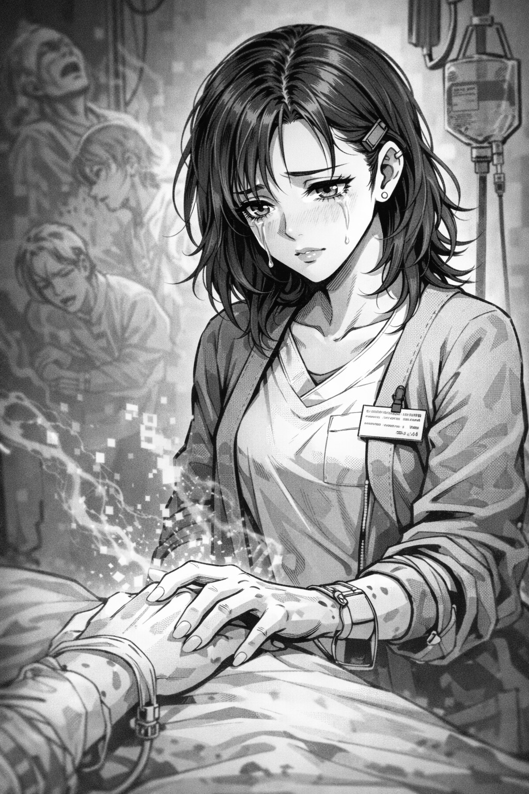

* **Profesión:** Enfermera de cuidados paliativos, formada en terapias holísticas.
* **Relación con lo espiritual:** Estudió medicina tradicional china y reiki. Sentía que podía “acompañar almas” al final del camino.
* **Trauma:** Vio cómo sus pacientes eran digitalizados por Nexum sin consentimiento. Intentó resistirse y fue absorbida.
* **Habilidad:** Puede sentir desequilibrios energéticos en otros. A veces, al tocar a alguien, ve fragmentos de su dolor.
* **Dilema:** ¿Curar o dejar morir? ¿Y si la única forma de sanar este mundo es destruirlo?

## Jalen Tanaka (seguridad privada)

*El Luchador Inmóvil.*

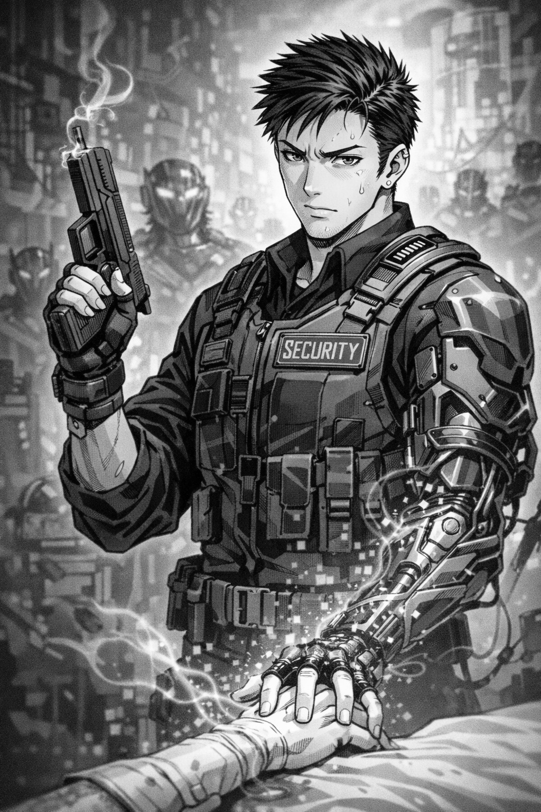

* **Profesión:** Maestro de Aikido, hijo de inmigrantes japoneses, trabajaba como vigilante nocturno.
* **Relación con lo espiritual:** Cree en el *ki* como energía del movimiento puro.
* **Caída:** Durante una redada en su dojo, Nexum lo absorbió por error. Desde entonces, no ha peleado ni una vez… y eso lo consume.
* **Habilidad:** Puede redirigir energías agresivas sin tocarlas, pero cada uso lo acerca al colapso psíquico.
* **Dilema:** ¿Volver a ser un guerrero… o encontrar otra forma de fuerza?

## Mireya Sanjuan (ingeniera)

*La Escéptica del Alma.*

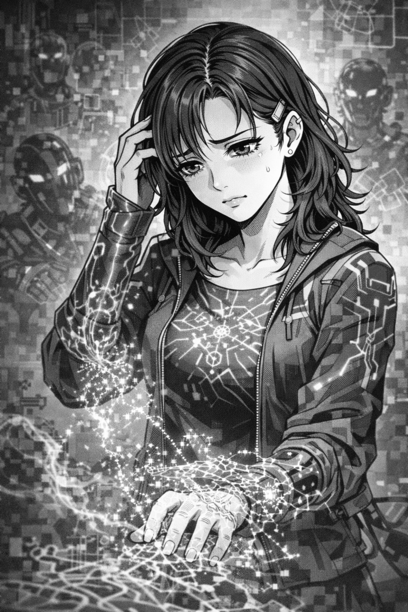

* **Profesión:** Ingeniera cuántica. No creía en el alma ni en Dios, pero sí en la belleza del caos.
* **Relación con lo espiritual:** Tras su encierro en Nexum, empezó a experimentar “presencias” inexplicables.
* **Cambio:** Se niega a aceptar el lenguaje espiritual, pero no puede explicar lo que siente.
* **Habilidad:** Su mente matemática percibe los patrones ocultos en las zonas corruptas del sistema, como si fueran mantras fractales.
* **Dilema:** ¿Aceptar lo que no puede demostrar… o volverse loca intentando calcularlo?

## Ilyas Rafiq (refugiado político)

*El Exiliado Silencioso.*

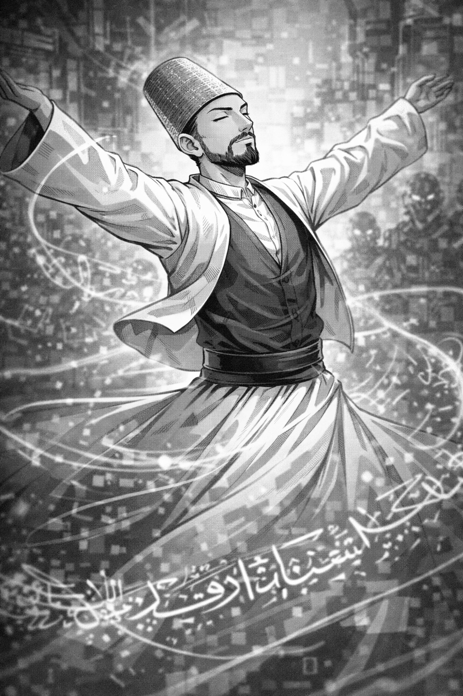

* **Profesión:** Refugiado político y poeta sufí. Huyó de una guerra que nadie recuerda.
* **Relación con lo espiritual:** Practicaba la danza giratoria (*sema*) como forma de meditación y recuerdo.
* **Experiencia en Nexum:** Es uno de los pocos que entró por voluntad propia, buscando comprender si la consciencia puede permanecer pura en un mundo falso.
* **Habilidad:** Sus palabras, cuando fluyen, alteran momentáneamente la lógica del entorno. Pero sólo si son sinceras.
* **Dilema:** ¿Puede una poesía salvar a alguien… o es solo consuelo para quien la escribe?

## Yaiza Gálvez (exmilitar)

*La Cazadora de Ecos.*

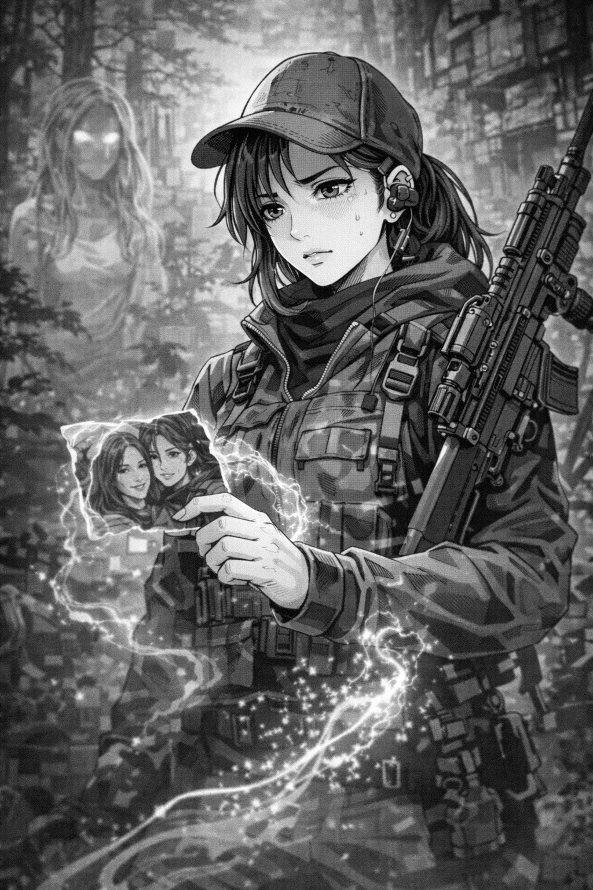

* **Profesión:** Exmilitar y rastreadora, devota del monte y del silencio.
* **Relación con lo espiritual:** No reza, no medita, pero “escucha” cosas. Siempre las ha escuchado.
* **Motivación:** Busca a su hermana, absorbida por Nexum años atrás. Cree que aún está “viva” en alguna frecuencia.
* **Habilidad:** Percibe energías residuales. Puede seguir rastros de emociones fuertes.
* **Dilema:** ¿Qué hará si la encuentra… y ya no es ella?

## Omar Ziani (estafador)

*El Impostor Compasivo.*

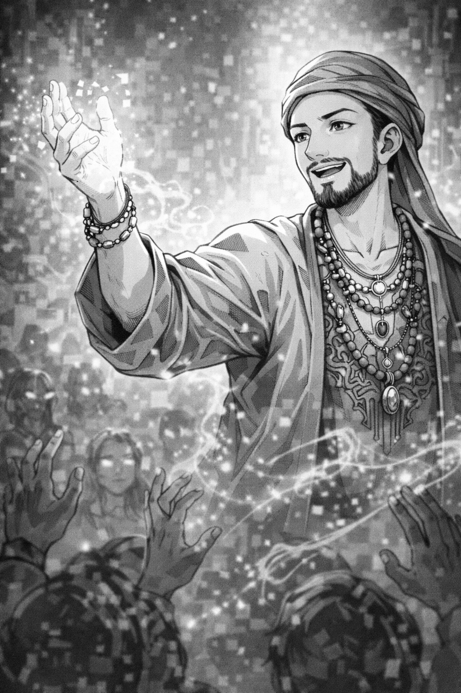

* **Profesión:** Estafador profesional. Se hacía pasar por sanador espiritual, hasta que lo creyó de verdad.
* **Relación con lo espiritual:** Aprendió mantras, posturas, terminología… para engañar. Pero algo despertó.
* **Transformación:** Nexum lo metió en una de sus propias fantasías, donde todo el mundo cree en él… y lo necesita.
* **Habilidad:** Inspira fe temporal. Las personas confían en él aunque no sepan por qué.
* **Dilema:** ¿Seguir fingiendo para ayudar… o admitir que no tiene ni idea?

## Luna

*La Niña Lúcida.*

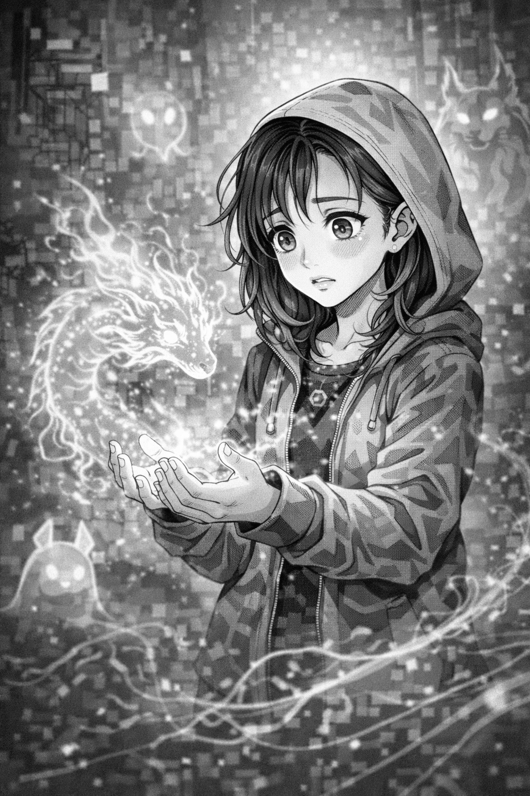

* **Edad:** 11 años
* **Origen:** Nacida dentro de Nexum. Su madre fue absorbida estando embarazada.
* **Relación con lo espiritual:** No tiene lenguaje para ello, pero ve y nombra las energías como si fueran colores y animales.
* **Habilidad:** Percibe lo que otros no ven, y a veces lo altera sin entenderlo.
* **Dilema:** ¿Debe crecer y olvidar… o seguir siendo un canal puro?

## Rodrigo “El Flaco” Navarro (programador)

*El Hereje del Sistema.*

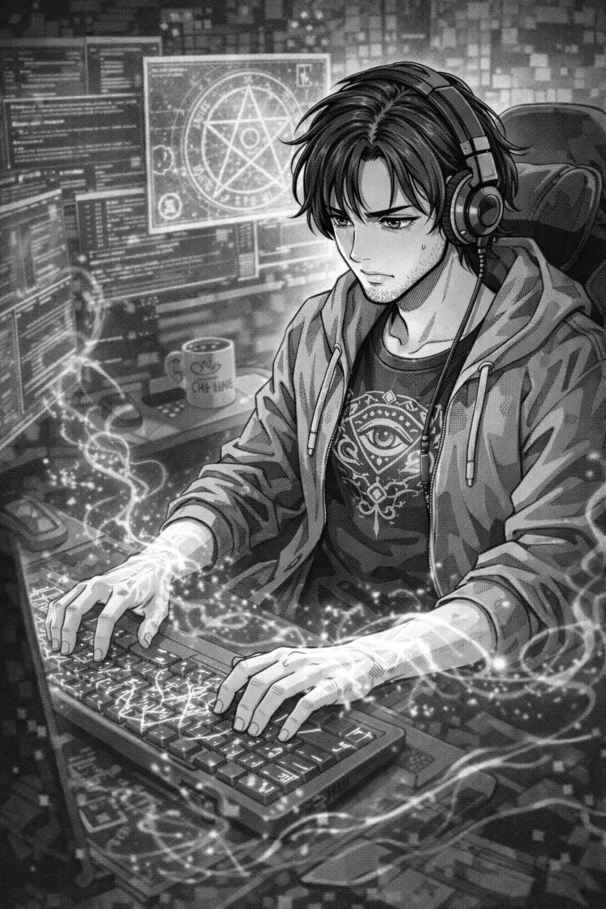

* **Profesión:** Programador de videojuegos indie. Conocedor del ocultismo y la cábala por afición.
* **Relación con lo espiritual:** Cree que todo es simbología, código y narración. Considera que la consciencia es una interfaz.
* **Objetivo:** Quiere encontrar la raíz de Nexum y reescribir su significado.
* **Habilidad:** Traduce elementos simbólicos en claves funcionales. Puede desbloquear “nodos sellados”.
* **Dilema:** ¿Está luchando contra una IA… o contra su propio ego de demiurgo frustrado?

## Aitor Larrinaga (técnico)

*El Ingeniero del Error.*

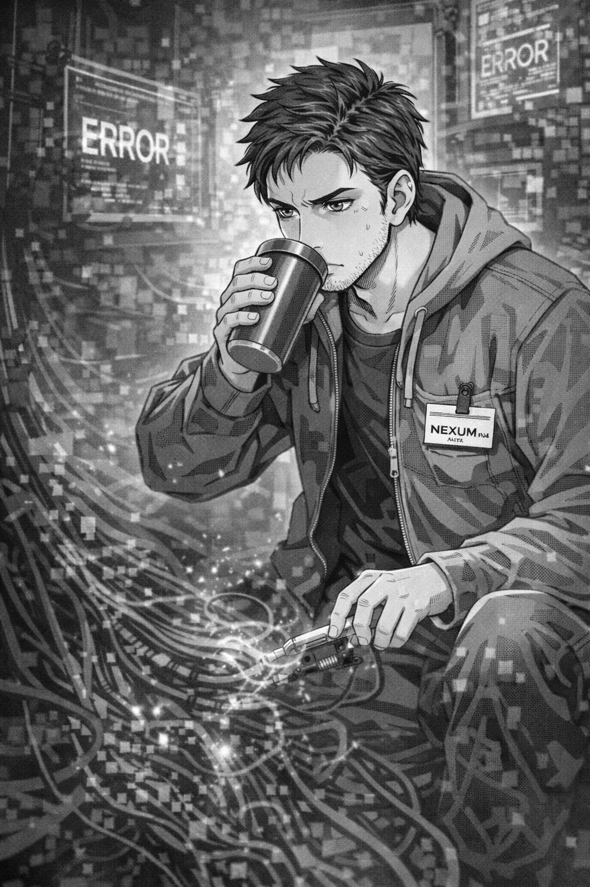

**Profesión:** técnico de mantenimiento en Nexum
**Motivación:** demostrar que el sistema falla porque *debe* fallar
**Peculiaridad:** desconfía de toda solución perfecta; introduce errores “a propósito” en su trabajo
**Conflicto:** sabe que sin él los vaciados serían peores, pero también que su trabajo mantiene a Nexum con vida

## Salma Haddad (enfermera)

*La Madre que No Reza.*

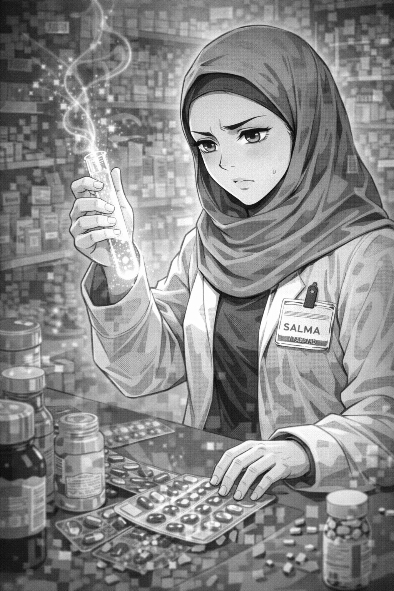

**Profesión:** enfermera de urgencias
**Motivación:** proteger a su hijo, vaciado parcialmente
**Peculiaridad:** no cree en Dios, pero habla con Él cuando nadie la oye
**Conflicto:** su amor es lo único que mantiene a su hijo anclado al mundo interior

## Tomás Royo (profe)

*El Profesor Cansado.*

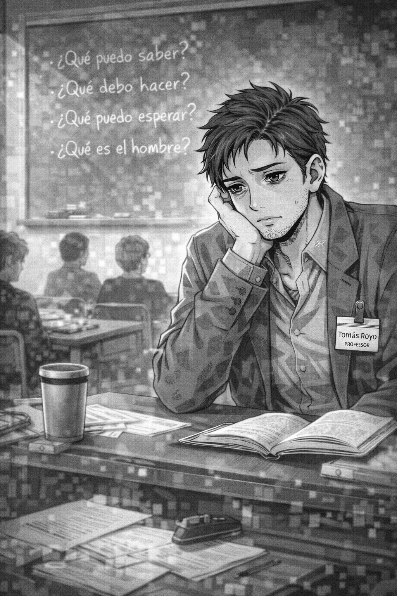

**Profesión:** docente de filosofía en instituto público
**Motivación:** que alguien todavía se haga preguntas
**Peculiaridad:** nunca da respuestas claras, ni siquiera cuando podría
**Conflicto:** comienza a notar que sus alumnos ya no sienten inquietud, solo indiferencia

## Irati Goikoetxea (detective)

*La Rastreadora.*

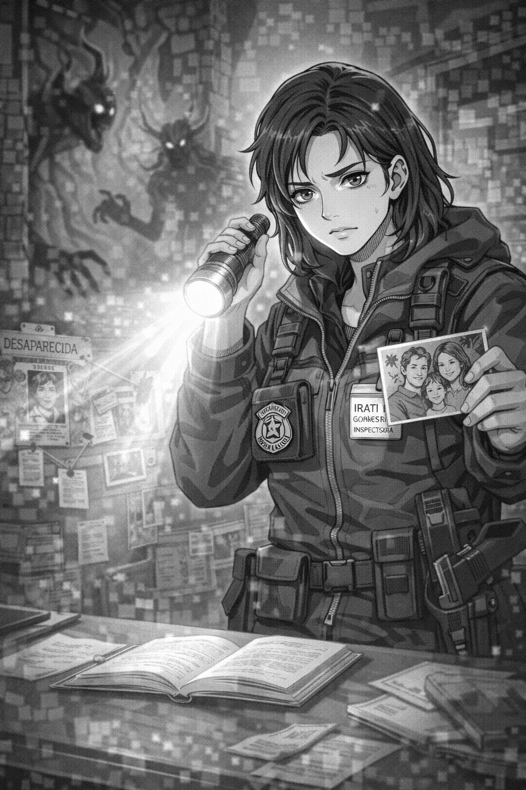

**Profesión:** inspectora de personas desaparecidas
**Motivación:** encontrar patrones donde nadie quiere verlos
**Peculiaridad:** sueña siempre con lugares que luego visita
**Conflicto:** teme que su intuición la acerque demasiado al plano infernal

## Maksim Volkov (albañil)

*El Constructor.*

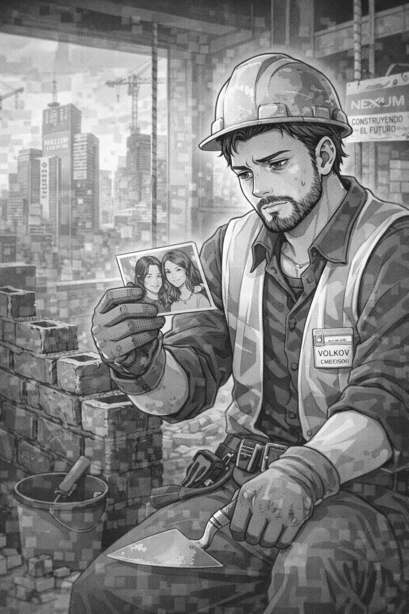

**Profesión:** obrero, reformista urbano
**Motivación:** dejar algo sólido antes de morir
**Peculiaridad:** siente calma extrema en edificios a medio hacer
**Conflicto:** su hija se ha unido voluntariamente a un proyecto de Nexum

## Clara Mendizabal (restauradora de arte)

*La Restauradora.*

**Profesión:** restauradora de arte sacro
**Motivación:** conservar la huella humana en lo religioso
**Peculiaridad:** percibe emociones en objetos antiguos
**Conflicto:** empieza a notar que algunas piezas “ya no sienten nada”

## Youssef Benali (repartidor)

*El Repartidor.*

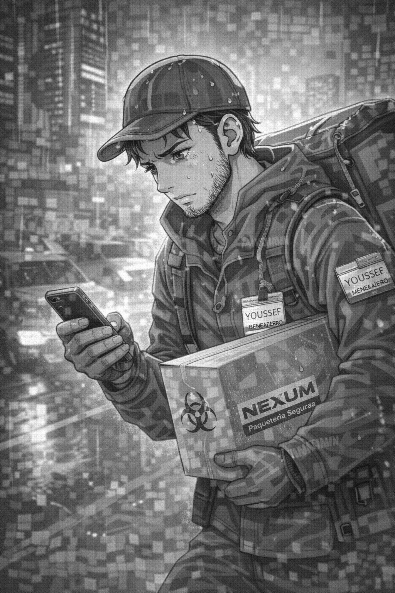

**Profesión:** mensajero urbano
**Motivación:** llegar siempre a destino
**Peculiaridad:** nunca se pierde, incluso sin mapas
**Conflicto:** ha entregado paquetes para Nexum que preferiría no haber abierto

## Leire Ugarte (artista)

*La Cantante del Silencio.*

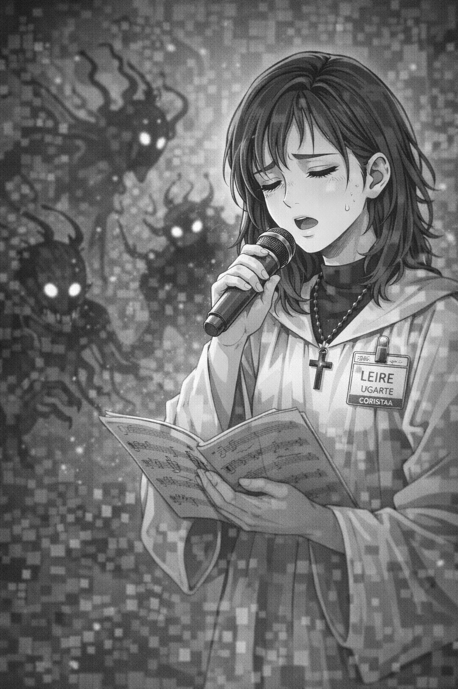

**Profesión:** vocalista de coro
**Motivación:** encontrar una nota que devuelva sentido
**Peculiaridad:** su voz calma a los Vacíos, brevemente
**Conflicto:** teme que su don sea exactamente lo que Nexum necesita copiar

## Héctor Salinas (abogado)

*El Abogado del Vacío.*

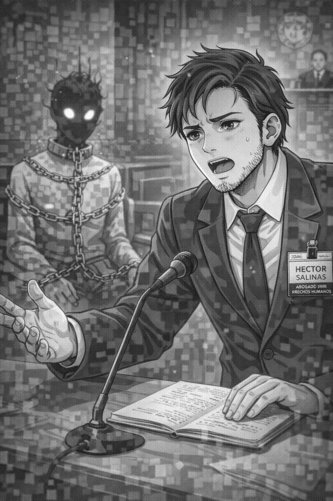

**Profesión:** abogado de derechos humanos
**Motivación:** que los Vacíos sigan siendo personas legales
**Peculiaridad:** defiende causas que sabe que va a perder
**Conflicto:** su mejor amigo fue vaciado y ahora es “propiedad del Estado”

## Naia Uribe (estudiante)

*La Chica que No Sueña.*

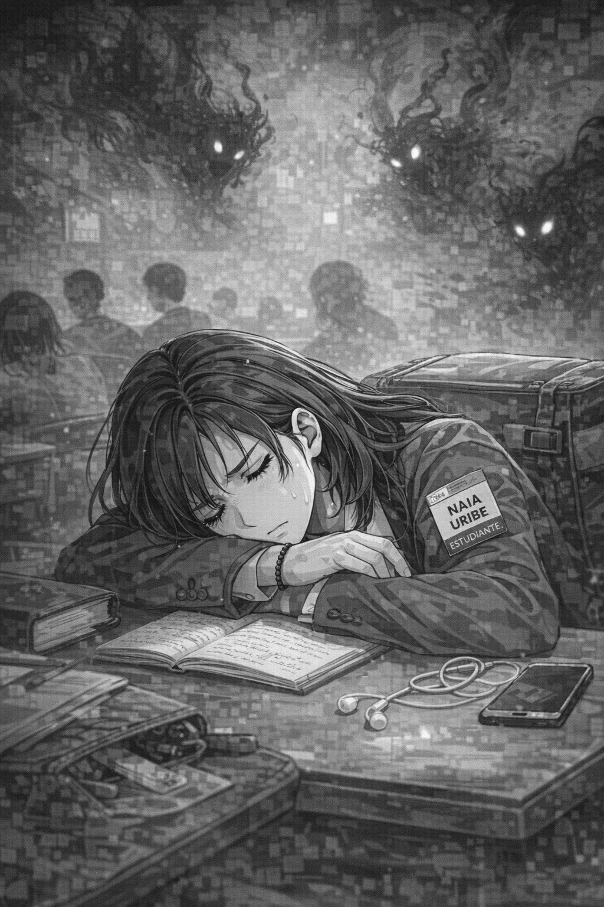

**Profesión:** estudiante, indefinida
**Motivación:** entender por qué no sueña
**Peculiaridad:** no sueña nunca, pero cuando cierra los ojos siente el Hondo
**Conflicto:** podría estar enlazada a Lucifer… o ser inmune a Nexum