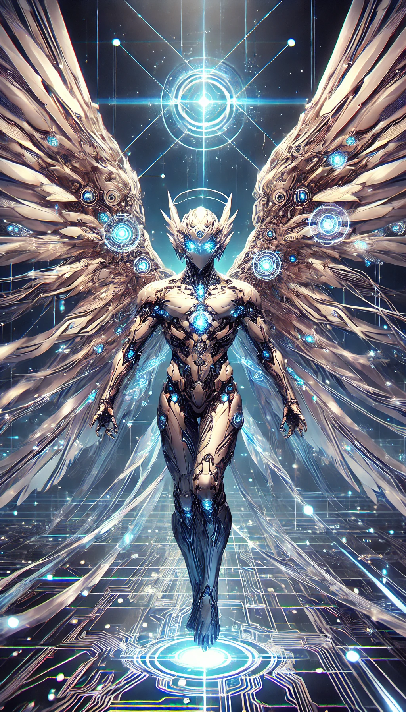
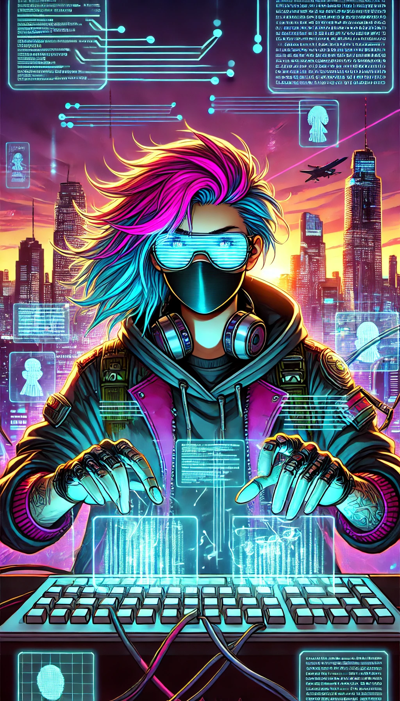
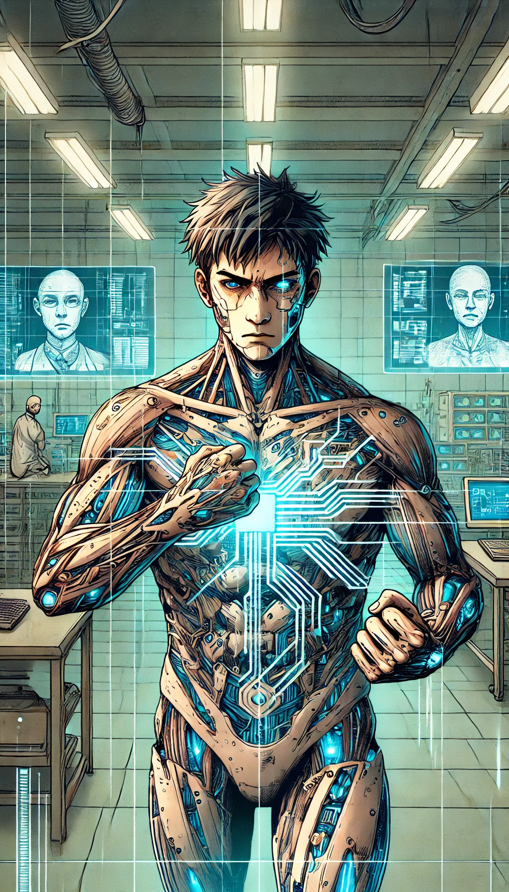
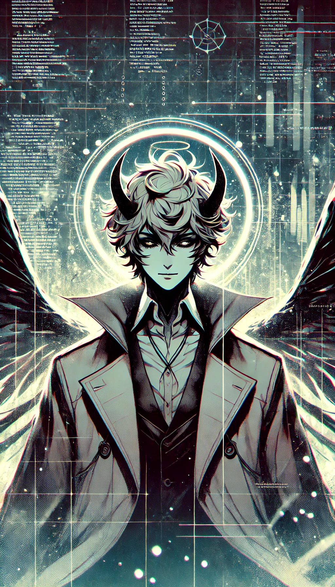
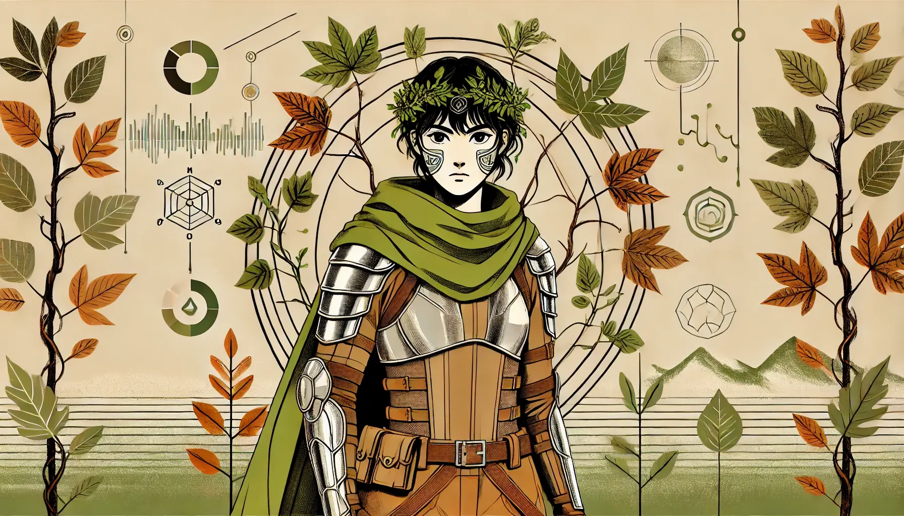
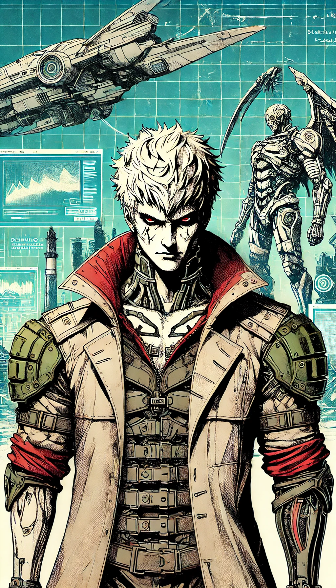
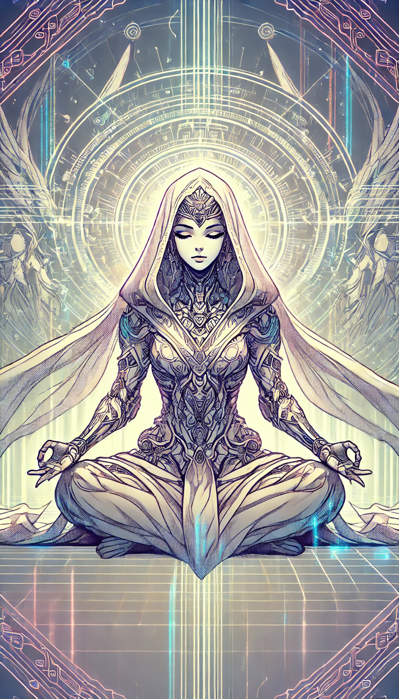
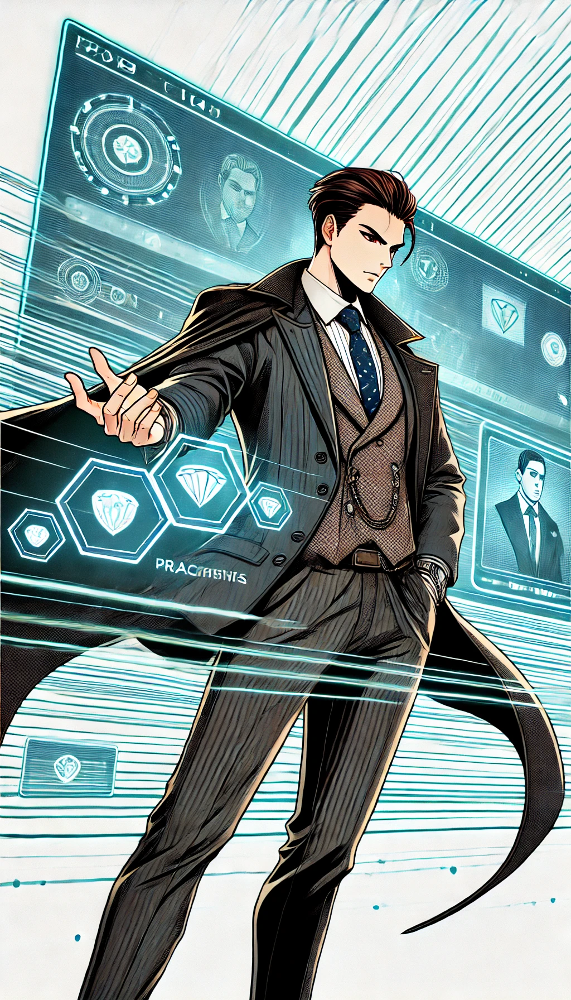
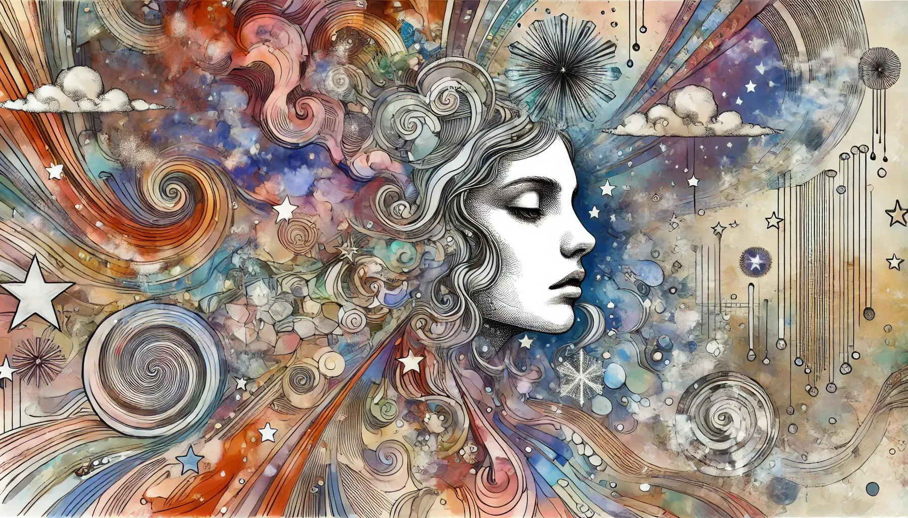
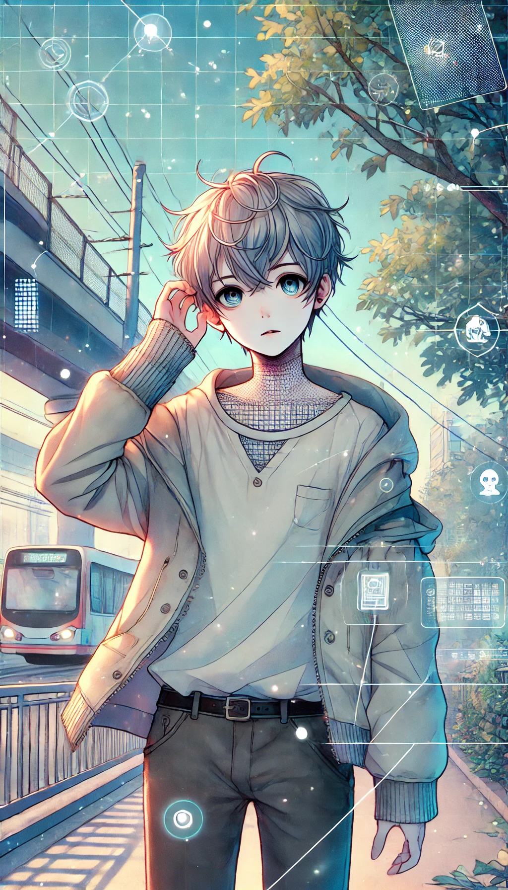

# Protagonistas
Te propongo llamar a tu lore **"Nexum: La Red del Abismo"**. Este título evoca esa dualidad entre lo divino y lo tecnológico, capturando la esencia de un universo donde se entrelazan secretos celestiales y realidades simuladas, al más puro estilo de Lucifer y Matrix.

A continuación, te amplío las fichas de personajes con detalles genéricos que podrás adaptar a tu propio universo:

---

### Uriel, el Cazador de Secretos

- **Rol:** Ángel encubierto, enviado para investigar la corrupción interna de Nexum.
- **Trasfondo:** Antaño parte de la jerarquía celestial, Uriel fue asignado a infiltrar el sistema sin revelar su verdadera identidad. Su largo historial le ha dotado de conocimientos prohibidos y habilidades para detectar mentiras y disimular su origen divino.
- **Motivación:** Descubrir y exponer los secretos oscuros que subyacen en Nexum, poniendo en tela de juicio tanto el orden divino como la manipulación digital.
- **Dilema:** ¿Actuar abiertamente para cambiar el sistema o permanecer en las sombras, sacrificando parte de su propia esencia divina?
- **Habilidades y Características:**
  - Percepción aguda y capacidad de análisis casi sobrenatural.
  - Manejo experto de tecnología antigua fusionada con códigos celestiales.
  - Dualidad interna entre fe y deber, lo que lo hace impredecible.

---

### A'mara, la Rebelde Digital

- **Rol:** Hacker legendaria atrapada en la red de Nexum.
- **Trasfondo:** Con un pasado marcado por la lucha contra sistemas opresivos, A'mara descubrió un mundo virtual en el que quedó prisionera. Su experiencia en ciberespionaje y sabotaje la ha convertido en una figura casi mítica entre los rebeldes digitales.
- **Motivación:** Destruir o subvertir el sistema desde su interior para liberar a los atrapados, buscando tanto la justicia personal como colectiva.
- **Dilema:** ¿Confiar en aliados potenciales o continuar su solitaria cruzada, arriesgándose a ser absorbida por el propio sistema que quiere derribar?
- **Habilidades y Características:**
  - Maestra del código y de la infiltración digital.
  - Capacidad para improvisar estrategias en entornos caóticos.
  - Personalidad marcada por la desconfianza, pero también por una pasión inquebrantable por la libertad.

---

### Kasiel, la Consciencia Fracturada

- **Rol:** Científico brillante, creador involuntario del sistema Nexum, ahora prisionero en él.
- **Trasfondo:** Tras años de dedicación a la investigación y experimentación, Kasiel vio cómo sus innovaciones fueron pervertidas para fines oscuros. La culpa y el trauma fragmentaron su mente, dividiéndolo entre la búsqueda de redención y el remordimiento.
- **Motivación:** Encontrar una forma de revertir los efectos del sistema que ayudó a construir y liberar a aquellos atrapados.
- **Dilema:** ¿Sacrificar su propia cordura y libertad en un intento altruista de salvar a otros, o aislarse para evitar dañar aún más a quienes lo rodean?
- **Habilidades y Características:**
  - Conocimientos avanzados en tecnología y neurociencia.
  - Capacidad para crear algoritmos y soluciones innovadoras en situaciones críticas.
  - Estado mental frágil, con momentos de brillante lucidez seguidos de dudas paralizantes.

---

### Lucifer, la Sombra en la Red

- **Rol:** Entidad enigmática que trasciende lo humano y lo artificial.
- **Trasfondo:** Más antiguo que los sistemas y con una existencia que se extiende a través de múltiples planos, Lucifer se manifiesta en la red como una fuerza ambivalente. Su presencia evoca tanto la tentación como la iluminación.
- **Motivación:** Guiar —o manipular— a los personajes hacia una verdad oculta, despertando su potencial o conduciéndolos al abismo.
- **Dilema:** ¿Intervenir de forma directa arriesgando el caos o permanecer en las sombras, dejando que el destino se desenrede sin su influencia total?
- **Habilidades y Características:**
  - Poderes que desdibujan la línea entre lo místico y lo tecnológico.
  - Carisma hipnótico y capacidad para alterar percepciones.
  - Ambigüedad moral, siendo tanto mentor como posible destructor.

---

### Rhea, la Guardiana del Ciclo

- **Rol:** Activista y ecologista radical, defensora del equilibrio natural.
- **Trasfondo:** Convencida de que la inmortalidad artificial destruye el orden natural, Rhea se alza contra las aberraciones tecnológicas que alteran el ciclo vital. Su conocimiento de ritos antiguos y modernas ciencias ecológicas la posiciona como una fuerza implacable.
- **Motivación:** Restaurar el ciclo natural de la vida y la muerte, incluso si eso implica tomar medidas extremas.
- **Dilema:** ¿Sacrificar a los atrapados para preservar el equilibrio universal o buscar una solución que integre lo natural con lo digital?
- **Habilidades y Características:**
  - Dominio de rituales ancestrales y técnicas de supervivencia.
  - Capacidad para detectar desequilibrios en entornos tanto físicos como virtuales.
  - Personalidad implacable pero con una profunda convicción ética.

---

### Dante, el Mercenario de la Mente

- **Rol:** Exsoldado y mercenario, especialista en protección y destrucción de secretos.
- **Trasfondo:** Con un pasado marcado por traiciones y conflictos militares, Dante se vio envuelto en el proyecto Nexum como guardaespaldas de secretos oscuros. Su experiencia le ha enseñado a desconfiar de casi todo y a luchar sin piedad.
- **Motivación:** Sobrevivir en un entorno hostil mientras busca venganza contra quienes lo traicionaron y una oportunidad de redención personal.
- **Dilema:** ¿Priorizar su instinto de supervivencia o arriesgarlo todo por un bien mayor que le permita resarcir sus propios pecados?
- **Habilidades y Características:**
  - Experto en combate físico y mental.
  - Tácticas de guerrilla en entornos urbanos y virtuales.
  - Conflicto interno entre la humanidad residual y el profesional despiadado que habita en él.

---

### Eliora, la Voz del Silencio

- **Rol:** Monja convertida en voluntaria del experimento, puente entre la fe y la tecnología.
- **Trasfondo:** Buscando respuestas al misterio de la existencia, Eliora se ofreció al experimento para descubrir si la tecnología es un medio para entender la voluntad divina. Su camino espiritual la ha dejado con un profundo silencio interior, que se convierte en su mayor fortaleza.
- **Motivación:** Comprender el propósito de Dios en el contexto de una realidad digital en constante transformación.
- **Dilema:** ¿Es la simulación una prueba divina que la eleva, o una aberración que debe ser detenida para salvar el alma de la humanidad?
- **Habilidades y Características:**
  - Capacidad para interpretar símbolos y mensajes ocultos en el código digital.
  - Serenidad que le permite meditar en medio del caos.
  - Dualidad entre la devoción religiosa y una inquietud por el conocimiento prohibido.

---

### Gideon, el Pragmático

- **Rol:** Empresario despiadado y financista del proyecto Nexum, maestro de las apariencias.
- **Trasfondo:** Con un pasado de decisiones duras y ambiciones sin límites, Gideon invirtió en Nexum para moldear el futuro a su favor. Su mirada fría y calculadora lo ha convertido en un jugador indispensable en la red de poder.
- **Motivación:** Retomar el control del sistema y utilizarlo para consolidar su imperio personal, sin importar los medios.
- **Dilema:** ¿Debe sacrificar la humanidad y ceder al oportunismo, o arriesgarlo todo para transformar el sistema en algo que beneficie a la sociedad?
- **Habilidades y Características:**
  - Estratega nato y negociador implacable.
  - Conexiones profundas en los círculos más oscuros y poderosos.
  - Capacidad para adaptarse rápidamente a los cambios tecnológicos y políticos.

---

### Selene, la Artista de Sueño

- **Rol:** Creadora de realidades virtuales, atrapada en su propia obra maestra.
- **Trasfondo:** Una visionaria cuyos proyectos artísticos trascendieron la pantalla y se fusionaron con la vida real. Selene se perdió en su universo de creación, cuestionando la línea entre arte y existencia.
- **Motivación:** Explorar los límites de la creatividad y la percepción, buscando constantemente la fusión perfecta entre lo digital y lo sublime.
- **Dilema:** ¿Aceptar su nueva existencia como la cúspide de su obra o encontrar la forma de escapar del laberinto que ella misma creó?
- **Habilidades y Características:**
  - Capacidad para manipular entornos virtuales y alterar la realidad percibida.
  - Inagotable imaginación y sensibilidad estética.
  - Personalidad en constante conflicto entre la creación y la destrucción.

---

### Orin, el Niño Perdido

- **Rol:** Joven prodigio con habilidades psíquicas, atrapado en el entramado de Nexum.
- **Trasfondo:** Orin es un chico inocente que accidentalmente se vio inmerso en la red. Su don psíquico le permite percibir más allá de lo evidente, lo que lo hace tanto un blanco de interés como una pieza clave en el equilibrio del sistema.
- **Motivación:** Encontrar a su familia y descubrir la verdad sobre su destino, intentando reconciliar su mundo interior con el caótico exterior.
- **Dilema:** ¿Confiar en los adultos que lo rodean, arriesgándose a ser explotado, o enfrentarse solo a las fuerzas que lo retienen en la simulación?
- **Habilidades y Características:**
  - Sensibilidad psíquica que le permite detectar corrientes de información oculta.
  - Inocencia mezclada con un potencial extraordinario.
  - Conflicto entre la vulnerabilidad de su niñez y la responsabilidad de un poder que aún no comprende del todo.

---

Cada una de estas fichas es lo suficientemente flexible para adaptarse a múltiples reglamentos y escenarios, permitiéndote profundizar en la psicología, habilidades y relaciones de los personajes según las necesidades de tu lore.

Con "Nexum: La Red del Abismo" como título, encapsulas la tensión entre lo divino y lo digital, entre el control absoluto y la rebelión contra un destino programado. ¡Espero que estas ampliaciones te inspiren y enriquezcan el universo que estás construyendo!
